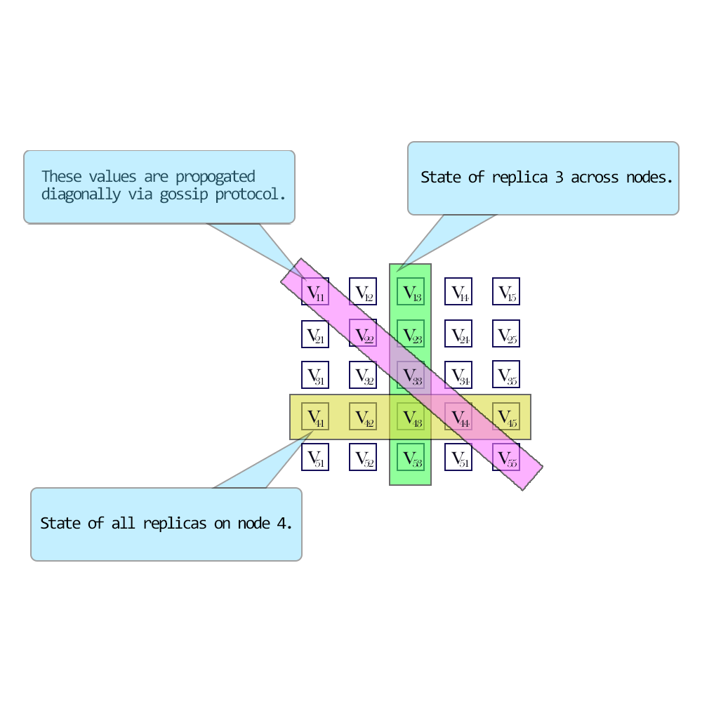
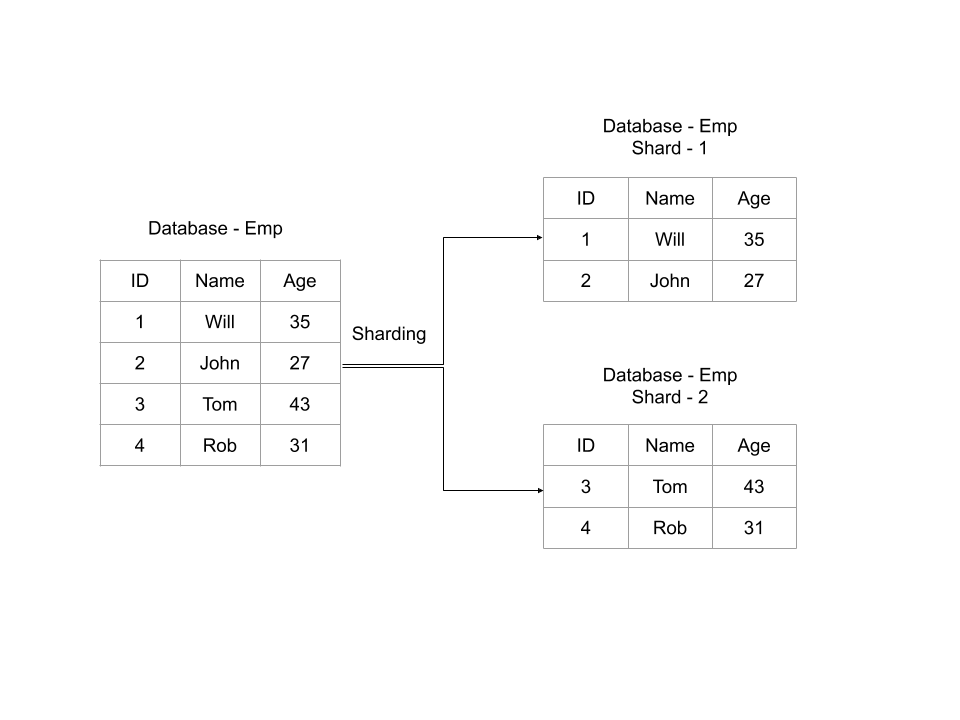
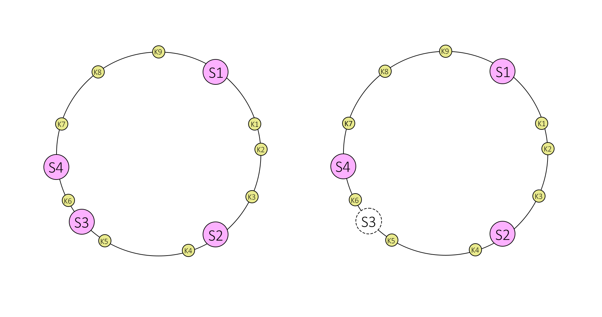

# Key Concepts

Lets looks at some of the key concepts when we talk about NoSQL or distributed systems

### CAP Theorem			

					

In a keynote titled “[Towards Robust Distributed Systems](https://sites.cs.ucsb.edu/~rich/class/cs293b-cloud/papers/Brewer_podc_keynote_2000.pdf)” at ACM’s PODC symposium in 2000 Eric Brewer came up with the so-called CAP-theorem which is widely adopted today by large web companies as well as in the NoSQL community. The CAP acronym stands for **C**onsistency, **A**vailability & **P**artition Tolerance.

*   **Consistency**

    It refers to how consistent a system is after an execution. A distributed system is called consistent when a write made by a source is available for all readers of that shared data. Different NoSQL systems support different levels of consistency.

*   **Availability**

    It refers to how a system responds to loss of functionality of different systems due to hardware and software failures. A high availability implies that a system is still available to handle operations (reads and writes) when a certain part of the system is down due to a failure or upgrade.

*   **Partition Tolerance**

    It is the ability of the system to continue operations in the event of a network partition. A network partition occurs when a failure causes two or more islands of networks where the systems can’t talk to each other across the islands temporarily or permanently. 

Brewer alleges that one can at most choose two of these three characteristics in a shared-data system. The CAP-theorem states that a choice can only be made for two options out of consistency, availability and partition tolerance. A growing number of use cases in large scale applications tend to value reliability implying that availability & redundancy are more valuable than consistency. As a result these systems struggle to meet ACID properties. They attain this by loosening on the consistency requirement i.e Eventual Consistency. 					

**Eventual Consistency **means that all readers will see writes, as time goes on: “In a steady state, the system will eventually return the last written value”. Clients therefore may face an inconsistent state of data as updates are in progress. For instance, in a replicated database updates may go to one node which replicates the latest version to all other nodes that contain a replica of the modified dataset so that the replica nodes eventually will have the latest version. 

NoSQL systems support different levels of eventual consistency models. For example:

*   Read Your Own Writes Consistency

    A client will see his updates immediately after they are written. The reads can hit nodes other than the one where it was written. However he might not see updates by other clients immediately. 

*   Session Consistency:

    A client will see the updates to his data within a session scope. This generally indicates that reads & writes occur on the same server. Other clients using the same nodes will receive the same updates. 

*   Casual Consistency

    A system provides causal consistency if the following condition holds: write operations that are related by potential causality are seen by each process of the system in order. Different processes may observe concurrent writes in different orders 

				

Eventual consistency is useful if concurrent updates of the same partitions of data are unlikely and if clients do not immediately depend on reading updates issued by themselves or by other clients.

Depending on what consistency model was chosen for the system (or parts of it), determines where the requests are routed, ex: replicas. 

CAP alternatives illustration

<table>
  <tr>
   <td>Choice
   </td>
   <td>Traits
   </td>
   <td>Examples
   </td>
  </tr>
  <tr>
   <td>Consistency + Availability

(Forfeit Partitions)
   </td>
   <td>2-phase commits

Cache invalidation protocols
   </td>
   <td>Single-site databases Cluster databases 

LDAP

xFS file system 
   </td>
  </tr>
  <tr>
   <td>Consistency + Partition tolerance

 (Forfeit Availability)
   </td>
   <td>Pessimistic locking

Make minority partitions unavailable
   </td>
   <td>Distributed databases Distributed locking Majority protocols
   </td>
  </tr>
  <tr>
   <td>Availability + Partition tolerance (Forfeit Consistency)
   </td>
   <td>expirations/leases 

conflict resolution optimistic
   </td>
   <td>DNS

Web caching
   </td>
  </tr>
</table>

### Versioning of Data in distributed systems

When data is distributed across nodes, it can be modified on different nodes at the same time (assuming strict consistency is enforced). Questions arise on conflict resolution for concurrent updates. Some of the popular conflict resolution mechanism are

*   **Timestamps**

    This is the most obvious solution. You sort updates based on chronological order and choose the latest update. However this relies on clock synchronization across different parts of the infrastructure. This gets even more complicated when parts of systems are spread across different geographic locations. 

*   **Optimistic Locking**

    You associate a unique value like a clock or counter with every data update. When a client wants to update data, it has to specify which version of data needs to be updated. This would mean you need to keep track of history of the data versions. 

*   **Vector Clocks**

    A vector clock is defined as a tuple of clock values from each node. In a distributed environment, each node maintains a tuple of such clock values which represent the state of the nodes itself and its peers/replicas. A clock value may be real timestamps derived from local clock or version no.  

 

                

Vector clocks illustration

Vector clocks have the following advantages over other conflict resolution mechanism

1. No dependency on synchronized clocks
2. No total ordering of revision nos required for casual reasoning 

No need to store and maintain multiple versions of the data on different nodes.**     **

### Partitioning

When the amount of data crosses the capacity of a single node, we need to think of splitting data, creating replicas for load balancing & disaster recovery. Depending on how dynamic the infrastructure is, we have a few approaches that we can take.

1. **Memory cached**

    These are partitioned in-memory databases that are primarily used for transient data. These databases are generally used as a front for traditional RDBMS. Most frequently used data is replicated from a rdbms into a memory database to facilitate fast queries and to take the load off from backend DB’s. A very common example is memcached or couchbase. 

2. **Clustering**

    Traditional cluster mechanisms abstract away the cluster topology from clients. A client need not know where the actual data is residing and which node it is talking to. Clustering is very commonly used in traditional RDBMS where it can help scaling the persistent layer to a certain extent. 

3. **Separating reads from writes**

    In this method, you will have multiple replicas hosting the same data. The incoming writes are typically sent to a single node (Leader) or multiple nodes (multi-Leader), while the rest of the replicas (Follower) handle reads requests. The leader replicates writes asynchronously to all followers. However the write lag can’t be completely avoided. Sometimes a leader can crash before it replicates all the data to a follower. When this happens, a follower with the most consistent data can be turned into a leader. As you can realize now, it is hard to enforce full consistency in this model. You also need to consider the ratio of read vs write traffic. This model won’t make sense when writes are higher than reads. The replication methods can also vary widely. Some systems do a complete transfer of state periodically, while others use a delta state transfer approach. You could also transfer the state by transferring the operations in order. The followers can then apply the same operations as the leader to catch up.

4. **Sharding**

    Sharing refers to dividing data in such a way that data is distributed evenly (both in terms of storage & processing power) across a cluster of nodes. It can also imply data locality, which means similar & related data is stored together to facilitate faster access. A shard in turn can be further replicated to meet load balancing or disaster recovery requirements. A single shard replica might take in all writes (single leader) or multiple replicas can take writes (multi-leader). Reads can be distributed across multiple replicas. Since data is now distributed across multiple nodes, clients should be able to consistently figure out where data is hosted. We will look at some of the common techniques below. The downside of sharding is that joins between shards is not possible. So an upstream/downstream application has to aggregate the results from multiple shards.

Sharding example 

### Hashing

A hash function is a function that maps one piece of data—typically describing some kind of object, often of arbitrary size—to another piece of data, typically an integer, known as _hash code_, or simply _hash_. In a partitioned database, it is important to consistently map a key to a server/replica. 

For ex: you can use a very simple hash as a modulo function.

    _p = k mod n_

Where 

    p -> partition,

    k -> primary key

    n -> no of nodes

The downside of this simple hash is that, whenever the cluster topology changes, the data distribution also changes. When you are dealing with memory caches, it will be easy to distribute partitions around. Whenever a node joins/leaves a topology, partitions can reorder themselves, a cache miss can be re-populated from backend DB. However when you look at persistent data, it is not possible as the new node doesn’t have the data needed to serve it. This brings us to consistent hashing.

#### Consistent Hashing

Consistent hashing is a distributed hashing scheme that operates independently of the number of servers or objects in a distributed _hash table_ by assigning them a position on an abstract circle, or _hash ring_. This allows servers and objects to scale without affecting the overall system.

Say that our hash function h() generates a 32-bit integer. Then, to determine to which server we will send a key k, we find the server s whose hash h(s) is the smallest integer that is larger than h(k). To make the process simpler, we assume the table is circular, which means that if we cannot find a server with a hash larger than h(k), we wrap around and start looking from the beginning of the array.

 

Consistent hashing illustration

In consistent hashing when a server is removed or added then only the keys from that server are relocated. For example, if server S3 is removed then, all keys from server S3 will be moved to server S4 but keys stored on server S4 and S2 are not relocated. But there is one problem, when server S3 is removed then keys from S3 are not equally distributed among remaining servers S4 and S2. They are only assigned to server S4 which increases the load on server S4.

To evenly distribute the load among servers when a server is added or removed, it creates a fixed number of replicas ( known as virtual nodes) of each server and distributes it along the circle. So instead of server labels S1, S2 and S3, we will have S10 S11…S19, S20 S21…S29 and S30 S31…S39. The factor for a number of replicas is also known as _weight_, depending on the situation.

          

All keys which are mapped to replicas Sij are stored on server Si. To find a key we do the same thing, find the position of the key on the circle and then move forward until you find a server replica. If the server replica is Sij then the key is stored in server Si.

Suppose server S3 is removed, then all S3 replicas with labels S30 S31 … S39 must be removed. Now the objects keys adjacent to S3X labels will be automatically re-assigned to S1X, S2X and S4X. All keys originally assigned to S1, S2 & S4 will not be moved.   

Similar things happen if we add a server. Suppose we want to add a server S5 as a replacement of S3 then we need to add labels S50 S51 … S59. In the ideal case, one-fourth of keys from S1, S2 and S4 will be reassigned to S5.

When applied to persistent storages, further issues arise: if a node has left the scene, data stored on this node becomes unavailable, unless it has been replicated to other nodes before; in the opposite case of a new node joining the others, adjacent nodes are no longer responsible for some pieces of data which they still store but not get asked for anymore as the corresponding objects are no longer hashed to them by requesting clients. In order to address this issue, a replication factor (r) can be introduced.         

Introducing replicas in a partitioning scheme—besides reliability benefits—also makes it possible to spread workload for read requests that can go to any physical node responsible for a requested piece of data. Scalability doesn’t work if the clients have to decide between multiple versions of the dataset, because they need to read from a quorum of servers which in turn reduces the efficiency of load balancing. 

        

### Quorum

Quorum is the minimum number of nodes in a cluster that must be online and be able to communicate with each other. If any additional node failure occurs beyond this threshold, the cluster will stop running.

    

      

To attain a quorum, you need a majority of the nodes. Commonly it is (N/2 + 1), where N is the total no of nodes in the system. For ex, 

In a 3 node cluster, you need 2 nodes for a majority,

In a 5 node cluster, you need 3 nodes for a majority,

In a 6 node cluster, you need 4 nodes for a majority. 

 

 Quorum example 

Network problems can cause communication failures among cluster nodes. One set of nodes might be able to communicate together across a functioning part of a network but not be able to communicate with a different set of nodes in another part of the network. This is known as split brain in cluster or cluster partitioning.

Now the partition which has quorum is allowed to continue running the application. The other partitions are removed from the cluster.

Eg: In a 5 node cluster, consider what happens if nodes 1, 2, and 3 can communicate with each other but not with nodes 4 and 5. Nodes 1, 2, and 3 constitute a majority, and they continue running as a cluster. Nodes 4 and 5, being a minority, stop running as a cluster. If node 3 loses communication with other nodes, all nodes stop running as a cluster. However, all functioning nodes will continue to listen for communication, so that when the network begins working again, the cluster can form and begin to run.

Below diagram demonstrates Quorum selection on a cluster partitioned into two sets.

 

**
Cluster Quorum example
**

