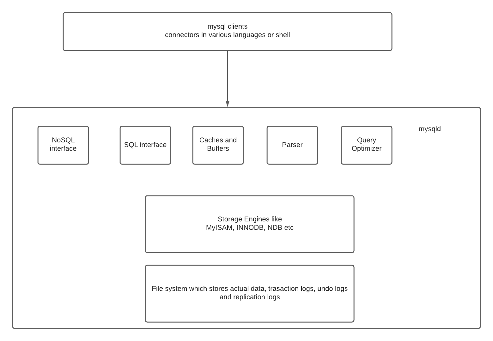

### MySQL architecture

MySQL architecture enables you to select the right storage engine for your needs, and abstracts away all implementation details from the end users (application engineers and [DBA](https://en.wikipedia.org/wiki/Database_administrator)) who only need to know a consistent stable API.

Application layer:

*   Connection handling - each client gets its own connection which is cached for the duration of access)
*   Authentication - server checks (username,password,host) info of client and allows/rejects connection
*   Security: server determines whether the client has privileges to execute each query (check with _show privileges_ command)

Server layer:

*   Services and utilities - backup/restore, replication, cluster etc
*   SQL interface - clients run queries for data access and manipulation
*   SQL parser - creates a parse tree from the query (lexical/syntactic/semantic analysis and code generation)
*   Optimizer - optimizes queries using various algorithms and data available to it(table level stats), modifies queries, order of scanning, indexes to use etc. (check with explain command)
*   Caches and buffers - cache stores query results, buffer pool(InnoDB) stores table and index data in [LRU](https://en.wikipedia.org/wiki/Cache_replacement_policies#Least_recently_used_(LRU)) fashion

Storage engine options:

*   InnoDB: most widely used, transaction support, ACID compliant, supports row-level locking, crash recovery and multi-version concurrency control. Default since MySQL 5.5+.
*   MyISAM: fast, does not support transactions, provides table-level locking, great for read-heavy workloads, mostly in web and data warehousing. Default upto MySQL 5.1.
*   Archive: optimised for high speed inserts, compresses data as it is inserted, does not support transactions, ideal for storing and retrieving large amounts of seldom referenced historical, archived data
*   Memory: tables in memory. Fastest engine, supports table-level locking, does not support transactions, ideal for creating temporary tables or quick lookups, data is lost after a shutdown
*   CSV: stores data in CSV files, great for integrating into other applications that use this format
*   … etc.

It is possible to migrate from one storage engine to another. But this migration locks tables for all operations and is not online, as it changes the physical layout of the data. It takes a long time and is generally not recommended. Hence, choosing the right storage engine at the beginning is important.

General guideline is to use InnoDB unless you have a specific need for one of the other storage engines.

Running `mysql> SHOW ENGINES; `shows you the supported engines on your MySQL server.