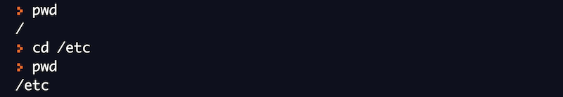
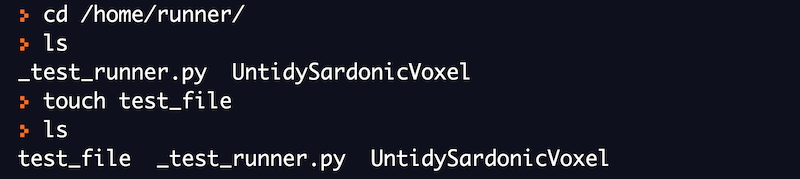
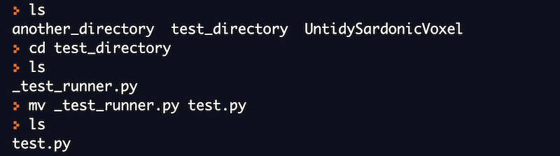

# コマンドラインの基礎

## ラボ環境のセットアップ

オンラインのbashインタープリタを使って、このコースで例として提供されているすべてのコマンドを実行することができます。また、様々なLinuxコマンドを実際にハンズオンで体験することができます。

[REPL](https://repl.it/languages/bash)は、Linuxのコマンドを実行するための人気のあるオンラインbashインタープリタのひとつです。このコースで紹介するすべてのコマンドを実行するために使用していきます。

## コマンドとは

コマンドとは、オペレーティングシステムに特定の作業を行うよう指示するプログラムです。Linuxではプログラムはファイルとして保存されます。したがって、コマンドもまたディスク上のどこかに保存されるファイルです。

コマンドは、ユーザーからの入力として、追加の引数を取ることもできます。これらの引数は、コマンドライン引数と呼ばれます。コマンドの使用方法を知ることは重要であり、Linuxにおいては、特にコマンドについて、ヘルプを得る方法はたくさんあります。
ほとんどのコマンドでは、コマンドライン引数「-h」または「\--help」を使えば、何からの形のドキュメントが表示されます。しかし、Linuxで最も普及しているドキュメントシステムはmanページと呼ばれるもので、マニュアルページの略です。

lsコマンドのドキュメントを表示するために、\--helpを使用しています。


## ファイルシステムの構成

Linuxのファイルシステムは、ルートと呼ばれる最上位のディレクトリ（/で示されます）を持つ、階層（またはツリー）状の構造になっています。
ルートディレクトリ内にあるディレクトリは、システムに関連するファイルが格納されています。
これらのディレクトリには、システムファイル、アプリケーションファイルやユーザー関連ファイルが格納されています。


  
  bin｜一般的に使用されるコマンドの実行プログラムは、binディレクトリに格納されます。 
  
  sbin｜システム管理のためのプログラムが格納されているディレクトリです。
  
  home｜ユーザー関連のファイルやディレクトリが格納されています。
  
  lib｜すべてのライブラリファイルが格納されています。
  
  etc｜すべてのシステム設定ファイルが格納されています。
  
  proc｜システム上で実行中のプロセスに関連するファイルが格納されています。
  
  dev｜システム上のデバイスに関連するファイルが格納されるディレクトリです。
  
  mnt｜システム上にマウントされたデバイスに関するファイルが格納されているディレクトリです。
  
  tmp｜システム上の一時的なファイルを保存するためのディレクトリです。
  
  usr｜システム上のアプリケーションプログラムを格納するためのディレクトリです。

## ファイルシステムを操作するためのコマンド

ファイルシステムを操作するためによく使われる3つの基本的なコマンドがあります。

- ls

- pwd

- cd

ここでは、それぞれのコマンドが何をするのか、またこれらのコマンドをどのように使うのかを理解しましょう。また、オンラインbashシェルで練習してみましょう。

### pwd (作業ディレクトリの表示)

どんなときであっても、ユーザーはどこかのディレクトリにいます。今いるディレクトリの名前を知るには、Linuxのpwdコマンドを使います。


それでは、cdコマンドを使って別のディレクトリに移動し、作業ディレクトリを表示します。


### cd (ディレクトリの変更)

cdコマンドは、作業ディレクトリを変更するために使用できます。このコマンドを使うと、あるディレクトリから別のディレクトリに移動することができます。

以下の例では、最初はルートディレクトリにいます。その後、cdコマンドを使ってディレクトリを変更しています。



### ls（ファイルとディレクトリの一覧）

lsコマンドは、ディレクトリの内容を一覧表示するためのコマンドです。ディレクトリ内に存在するすべてのファイルとディレクトリをリストアップします。
シェルでlsと入力すると、そのディレクトリにあるすべてのファイルとディレクトリが表示されます。


lsコマンドの引数にディレクトリ名を指定することもできます。これにより、指定されたディレクトリ内のすべてのファイルとディレクトリを一覧表示します。


## ファイルを操作するためのコマンド

ファイルを操作するためによく使われる基本的なコマンドは次の5つです。

- touch

- mkdir

- cp

- mv

- rm

ここからは、それぞれのコマンドが何をするものなのか、これらのコマンドをどのように使うのかを理解していきましょう。また、オンラインbashシェルで練習してみましょう。

### touch (新規ファイルの作成)

touchコマンドは、空の新規ファイルを作成するために使用します。このコマンドは他にもさまざまな用途に使えますが、ここでは最も簡単な新規ファイルの作成について説明します。

touchコマンドの一般的な構文:

```
touch <ファイル名>
```



### mkdir (新しいディレクトリの作成)

mkdirコマンドは、ディレクトリを作成するためのコマンドです。lsコマンドを使用して、新しいディレクトリが作成されたことを確認できます。

mkdirコマンドの一般的な構文:

```
mkdir <ディレクトリ名>
```


### rm (ファイルとディレクトリの削除)

rmコマンドは、ファイルやディレクトリを削除するコマンドです。このコマンドは、ファイルやディレクトリを完全に削除することに注意してください。一度rmコマンドを実行してしまうと、これらのファイルやディレクトリを復元することはほぼ不可能です。このコマンドは慎重に実行してください。

rmコマンドの一般的な構文:

```
rm <ファイル名>
```

rmコマンドを理解するために、例を挙げてみましょう。ここではtouchとmkdirコマンドで作成したファイルとディレクトリをそれぞれ削除してみます。


### cp (ファイルやディレクトリのコピー)

cp コマンドは、ファイルやディレクトリをある場所から別の場所にコピーするために使用します。元のファイルやディレクトリには一切変更を加えません。cpコマンドが正常に実行されると、元のファイルやディレクトリとそのコピーが共存します。

cpコマンドの一般的な構文:

```
cp <コピー元のパス> <コピー先のパス>
```

現在、私たちは「/home/runner」ディレクトリにいます。ここで、mkdirコマンドを使って、「test_directory」という名前の新しいディレクトリを作成します。それでは、先ほど作成したディレクトリに「\_test_runner.py」ファイルをコピーしてみましょう。


元の「\_test_runner.py」ファイルには何も起こらないことに注意してください。カレントディレクトリに残っています。このファイルの新しいコピーが「test_directory」の中に作成されています。


cpコマンドを使って、ディレクトリ全体をある場所から別の場所にコピーすることもできます。例を挙げて理解してみましょう。


再びmkdirコマンドを使って、「another_directory」という新しいディレクトリを作成しました。続いて、cpコマンドに引数「-r」を加えて「test_directory」をコピーしました。

**mv（ファイルとディレクトリの移動）**

mvコマンドは、ファイルやディレクトリをある場所から別の場所に移動したり、ファイルやディレクトリの名前を変更したりするのに使用します。ただしファイルの移動はコピーとは大きく異なりますのでご注意ください。ファイルやディレクトリを移動すると、元のコピーは失われます。

mvコマンドの一般的な構文:

```
mv <移動元のパス> <移動先のパス>
```

この例では、mvコマンドを使って「test_directory」に「test_runner.py」ファイルを移動します。今回のケースでは、このファイルすでに「test_directory」に存在しています。mvコマンドは単にそれを置き換えます。
**mvコマンドが正常に実行された後、元のファイルは現在のディレクトリには存在しないことに注意してください。**


また、mvコマンドは、ディレクトリをある場所から別の場所に移動する際にも使用できます。この場合、cpコマンドのときに使った「-r」フラグは必要ありません。mvコマンドを使用すると、元のディレクトリは存在しなくなることに注意してください。

mvコマンドの重要な用途のひとつは、ファイルやディレクトリの名前を変更することです。ここでは、このコマンドを使ってどのように名前を変更するかを説明します。

まず、場所を「test_directory」に変更します。次に、mvコマンドを使って、「\_test_runner.py」のファイル名を 「test.py」に変更します。



## ファイルを閲覧するためのコマンド

ファイルを閲覧する際によく使う基本的なコマンドは5つあります。

- cat

- head

- tail

- more

- less

ここからは、それぞれのコマンドが何をするものなのか、これらのコマンドをどのように使うのかを理解していきましょう。また、オンラインのbashシェルを使って練習してみましょう。

「numbers.txt」という新しいファイルを作成し、1から100までの数字を挿入します。それぞれの数字は別の行にします。


上のコマンドは、今は気にしないでください。これは、数字を生成するための高度なコマンドです。そして、リダイレクト演算子を使って、この数字をファイルに書き込んでいます。I/Oのリダイレクトについては、後のセクションで説明します。

### cat

cat コマンドの最も簡単な使い方は、ファイルの内容を出力画面に表示することです。このコマンドは非常に便利で、他にもさまざまな用途に使用できます。他の使用例については後で勉強します。


上のコマンドを実行してみると、画面に1から100までの数字が表示されます。すべての数字を見るには、上にスクロールする必要があります。

### head

head コマンドは、デフォルトではファイルの最初の 10 行を表示します。また追加の引数を指定して、必要な行数を先頭から表示することができます。

この例では、headコマンドを使用した場合、ファイルの最初の10行のみが表示されます。


デフォルトでは、headコマンドは最初の10行のみを表示します。もし先頭から表示する行数を指定したい場合は、「-n」引数を使用します。


### tail

tailコマンドは、デフォルトでは、ファイルの最後の10行を表示します。また追加の引数を指定することで、ファイルの最後から必要な行数だけ表示することができます。


デフォルトでは、tailコマンドは最後の10行のみを表示します。もし最後から何行目まで表示するかを指定したい場合は、「-n」引数で入力します。


この例では、-nオプションを指定してtailコマンドを実行して、ファイルの最後の5行だけを見ることができます。

### more

moreコマンドは、ファイルの内容やコマンドの出力を表示します。ファイルのサイズが大きい場合 (例: ログファイル)、一画面分を表示します。また、ファイルの前方への移動と限定的な後方への移動が可能です。


moreコマンドは、現在の画面に収まるだけの情報を表示し、ユーザーの入力を待って進みます。前方へのナビゲーションは、エンターキーを押すと出力が1行進み、スペースキーを押すと出力が1画面進みます。

### less

less コマンドは、more の改良版です。ファイルやコマンド出力の内容を 1 ページずつ表示し、ファイル内を前方だけでなく後方にも移動でき、検索オプションも備えています。矢印キーを使って、1行ずつ後ろに進んだり、前に進んだりすることができます。1ページ進むにはキーボードのスペースキーを、1ページ戻るにはbキーを押します。
ファイルの最初と最後に瞬時に移動することができます。

## Linuxのechoコマンド

echoコマンドは、シェルで使われる最もシンプルなコマンドのひとつです。このコマンドは、他のプログラミング言語でいうところの「print」に相当します。

echoコマンドは、与えられた入力文字列を画面に表示します。


## テキスト処理コマンド

前のセクションでは、ファイルの内容を表示する方法を学びました。
多くの場合、以下のような操作を行いたいと思うでしょう。

- 特定の単語を含む行だけを表示する

- ファイル内の特定の単語を別の単語で置き換える

- 行を特定の順序でソートする

テキスト処理によく使われる基本的なコマンドが3つあります。

- grep

- sed

- sort

それぞれのコマンドが何をするものなのか、どのように使うのかを理解しておきましょう。
また、オンラインbashシェルで練習してみましょう。

「numbers.txt」という新しいファイルを作成し、1から100までの数字を挿入します。それぞれの数字は別の行にします。


### grep

grep コマンドは、テキストファイル内の特定の単語を検索するための最も単純なコマンドです。ファイル内の特定の入力を含む行をすべて表示します。検索したい単語はgrepコマンドの入力として与えられます。

grepコマンドの一般的な構文:

```
grep <検索したい単語> <ファイル名>
```

この例では、このファイルの中から文字列「1」を検索しようとしています。
grepコマンドは、この文字列を見つけた行を出力します。


### sed

sedコマンドは、ファイル内のテキストを置き換えるために使用します。

sedコマンドの一般的な構文:

```
sed 's/<置換したい文字列>/<置換文字列>/' <ファイル名>
```

それでは、sedコマンドを使って、ファイル中の「1」の各出現箇所を「3」に置き換えてみましょう。


上記の例では、ファイルの内容は変わりません。そのためには、追加の引数「-i」を使用して、変更がファイルに反映されるようにします。

### sort

sort コマンドは、引数として与えられた入力を並べ替えるコマンドです。デフォルトでは、昇順でソートされます。

並べ替えを行う前に、まずファイルの内容を見てみましょう。


それでは、sortコマンドを使ってファイルをソートしてみましょう。sortコマンドは、内容を辞書順に並べ替えます。


上記の例では、ファイルの内容は変わりません。

## I/Oリダイレクション

開いているファイルには、それぞれファイルディスクリプタが割り当てられます。ファイルディスクリプタとは、システム内で開いているファイルの一意の識別子です。常に開かれているファイルは3つあり、stdin(キーボード)、stdout(画面)、stderr(画面に出力されるエラーメッセージ)です。これらのファイルはリダイレクトすることができます。

Linuxではすべてがファイルです。[https://unix.stackexchange.com/questions/225537/everything-is-a-file](https://unix.stackexchange.com/questions/225537/everything-is-a-file)

これまでは、すべての出力を標準出力である画面に表示してきました。いくつかの特殊な演算子を使って、コマンドの出力をファイルや他の入力にリダイレクトすることができます。
I/Oリダイレクションは非常に強力な機能です。

以下の例では、>演算子を使って、lsコマンドの出力を output.txtにリダイレクトしています。


下の例では、echoコマンドの出力をファイルにリダイレクトしています。


また、あるコマンドの出力を別のコマンドの入力としてリダイレクトすることもできます。これは、パイプの助けを借りることで可能になります。

以下の例では、catコマンドの出力をパイプ演算子（\|）を使って、catコマンドの出力をgrepコマンドの入力として渡しています。


下の例では、sortコマンドの出力をパイプ演算子（\|）でuniqコマンドの入力として渡しています。
uniqコマンドは、入力された数字の中から入力された数字の中からユニークなものだけを表示します。


I/Oリダイレクション
[https://tldp.org/LDP/abs/html/io-redirection.html](https://tldp.org/LDP/abs/html/io-redirection.html)
