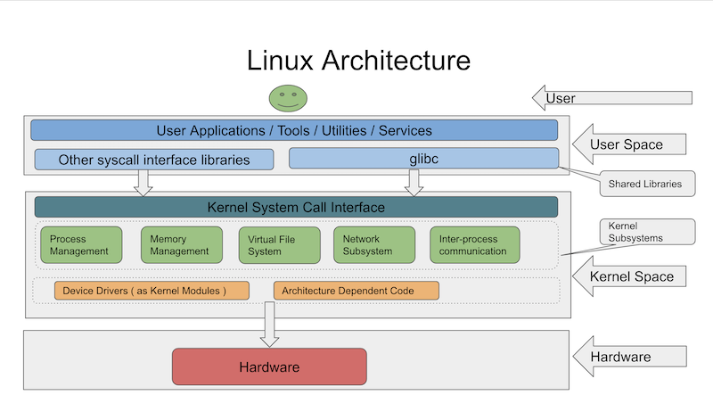

# Linuxの基礎知識

## はじめに
### 前提条件

- Windows、Linux、Macなどのオペレーティングシステムを使い慣れていること
- オペレーティングシステムの基礎知識を持っていること

## このコースに期待すること

本コースは3つのパートに分かれています。第1部では、Linuxオペレーティングシステムの基礎をカバーします。Linux アーキテクチャ、Linux ディストリビューション、Linuxオペレーティングシステムの用途について説明します。また、GUIとCLIの違いについても説明します。

第2部では、Linuxで使われる基本的なコマンドを取り上げます。
ファイルシステムの操作、ファイルの表示と操作、I/Oリダイレクトなどに使用されるコマンドに焦点を当てます。

第3部では、Linuxのシステム管理について説明します。ここでは、ユーザー/グループの管理、ファイルのパーミッションの管理、システムのパフォーマンスの監視、ログファイルなど、Linux管理者が行う日常的な作業が含まれます。

第2部と第3部では、例題を取り上げて概念を理解していきます。

## このコースで扱わないこと

このコースでは、Linuxの高度なコマンドやbashスクリプトは扱いません。また、Linuxの内部についても扱いません。

## コース内容

本コースでは、以下のトピックをカバーしています。

- [Linux入門](https://linkedin.github.io/school-of-sre/linux_basics/intro/)
    - [Linuxオペレーティングシステムとは](https://linkedin.github.io/school-of-sre/linux_basics/intro/#what-are-linux-operating-systems)
    - [人気のLinuxディストリビューション](https://linkedin.github.io/school-of-sre/linux_basics/intro/#what-are-popular-linux-distributions)
    - [Linuxオペレーティングシステムの用途](https://linkedin.github.io/school-of-sre/linux_basics/intro/#uses-of-linux-operating-systems)
    - [Linux のアーキテクチャ](https://linkedin.github.io/school-of-sre/linux_basics/intro/#linux-architecture)
    - [グラフィカルユーザーインターフェース(GUI) vs コマンドラインインターフェース(CLI)](https://linkedin.github.io/school-of-sre/linux_basics/intro/#graphical-user-interface-gui-vs-command-line-interface-cli)
- [コマンドラインの基本](https://linkedin.github.io/school-of-sre/linux_basics/command_line_basics/)
    - [実験室の環境設定](https://linkedin.github.io/school-of-sre/linux_basics/command_line_basics/#lab-environment-setup)
    - [コマンドとは](https://linkedin.github.io/school-of-sre/linux_basics/command_line_basics/#what-is-a-command)
    - [ファイルシステムの構成](https://linkedin.github.io/school-of-sre/linux_basics/command_line_basics/#file-system-organization)
    - [ファイルシステムの操作](https://linkedin.github.io/school-of-sre/linux_basics/command_line_basics/#commands-for-navigating-the-file-system)
    - [ファイルの操作](https://linkedin.github.io/school-of-sre/linux_basics/command_line_basics/#commands-for-manipulating-files)
    - [ファイルの閲覧](https://linkedin.github.io/school-of-sre/linux_basics/command_line_basics/#commands-for-viewing-files)
    - [echoコマンド](https://linkedin.github.io/school-of-sre/linux_basics/command_line_basics/#echo-command)
    - [テキスト処理コマンド](https://linkedin.github.io/school-of-sre/linux_basics/command_line_basics/#text-processing-commands)
    - [I/Oリダイレクト](https://linkedin.github.io/school-of-sre/linux_basics/command_line_basics/#io-redirection)
- [Linuxシステム管理](https://linkedin.github.io/school-of-sre/linux_basics/linux_server_administration/)
    - [実験環境の設定](https://linkedin.github.io/school-of-sre/linux_basics/linux_server_administration/#lab-environment-setup)
    - [ユーザー/グループ管理](https://linkedin.github.io/school-of-sre/linux_basics/linux_server_administration/#usergroup-management)
    - [スーパーユーザー](https://linkedin.github.io/school-of-sre/linux_basics/linux_server_administration/#becoming-a-superuser)
    - [ファイルのパーミッション](https://linkedin.github.io/school-of-sre/linux_basics/linux_server_administration/#file-permissions)
    - [SSHコマンド](https://linkedin.github.io/school-of-sre/linux_basics/linux_server_administration/#ssh-command)
    - [パッケージ管理](https://linkedin.github.io/school-of-sre/linux_basics/linux_server_administration/#package-management)
    - [プロセス管理](https://linkedin.github.io/school-of-sre/linux_basics/linux_server_administration/#process-management)
    - [メモリ管理](https://linkedin.github.io/school-of-sre/linux_basics/linux_server_administration/#memory-management)
    - [デーモンとSystemd](https://linkedin.github.io/school-of-sre/linux_basics/linux_server_administration/#daemons)
    - [ログ](https://linkedin.github.io/school-of-sre/linux_basics/linux_server_administration/#logs)
- [まとめ](https://linkedin.github.io/school-of-sre/linux_basics/conclusion)
    - [SREの役割におけるアプリケーション](https://linkedin.github.io/school-of-sre/linux_basics/conclusion/#applications-in-sre-role)
    - [有用なコースとチュートリアル](https://linkedin.github.io/school-of-sre/linux_basics/conclusion/#useful-courses-and-tutorials)

## Linuxオペレーティングシステムとは

75%以上のパソコンに採用されているWindowsオペレーティングシステムをご存知の方も多いと思います。
Windowsオペレーティングシステムは、Windows NTカーネルをベースにしています。

カーネルはオペレーティングシステムの最も重要な部分で、プロセス管理、メモリ管理、ファイルシステム管理などの重要な機能を実行します。

Linuxオペレーティングシステムは、Linuxカーネルをベースにしています。Linuxベースのオペレーティングシステムは、Linuxカーネル、GUI/CLI、システム・ライブラリーおよびシステムユーティリティで構成されています。Linuxカーネルは、Linus Torvalds氏が独自に開発・公開しました。Linuxカーネルは無料でオープンソースです。[https://github.com/torvalds/linux](https://github.com/torvalds/linux)

Linuxはカーネルであり、完全なオペレーティングシステムではありません。LinuxカーネルはGNUシステムと組み合わされ、完全なオペレーティングシステムとなります。したがって、Linuxベースのオペレーティングシステムは、GNU/Linuxシステムとも呼ばれています。GNUは、コンパイラ、デバッガ、Cライブラリなどのフリーソフトウェアの集合体です。[Linux and the GNU System](https://www.gnu.org/gnu/linux-and-gnu.en.html)

Linuxの歴史 [https://ja.wikipedia.org/wiki/Linux%E3%81%AE%E6%AD%B4%E5%8F%B2](https://ja.wikipedia.org/wiki/Linux%E3%81%AE%E6%AD%B4%E5%8F%B2)

## 人気のLinuxディストリビューション
Linuxディストリビューション（ディストロ）は、Linuxカーネルとパッケージ管理システムをベースにしたオペレーティングシステムです。パッケージ管理システムは、ソフトウェアのインストール、アップグレード、設定、削除を支援するツールで構成されています。
パッケージ管理システムは、オペレーティングシステム上のソフトウェアのインストール、アップグレード、設定、削除を支援するツールで構成されています。

ソフトウェアは通常、ディストリビューションに採用され、ディストリビューション固有の形式でパッケージ化されます。これらのパッケージは、ディストロのリポジトリから入手できます。パッケージはオペレーティングシステムにインストールされ、パッケージマネージャによって管理されます。

**人気のあるLinuxディストリビューションの一覧：**

- Fedora

- Ubuntu

- Debian

- CentOS

- Red Hat Enterprise Linux

- Suse

- Arch Linux

| パッケージングシステム | ディストリビューション | パッケージマネージャ
| ---------------------- | ------------------------------------------ | -----------------
| Debian スタイル (.deb) | Debian, Ubuntu | APT
| Red Hat style (.rpm) | Fedora, Centオペレーティングシステム, Red Hat Enterprise Linux | YUM

## Linuxアーキテクチャ

- Linuxカーネルはモノリシックな構造になっています。

- システムコールは、Linuxカーネル空間と対話するために使用されます。

- カーネルコードは、カーネルモードでのみ実行できます。カーネル以外のコードはユーザーモードで実行されます。

- デバイスドライバは、ハードウェアデバイスとの通信に使用されます。

## Linuxオペレーティングシステムの用途

Linuxカーネルをベースにしたオペレーティングシステムは、以下のような用途に広く使われています。

- パーソナルコンピューター

- サーバー

- 携帯電話 - AndroidはLinuxオペレーティングシステムをベースにしています。

- 組み込み機器 - 時計、テレビ、信号機など

- 人工衛星

- ネットワーク機器 - ルーター、スイッチなど

## グラフィカルユーザーインターフェース(GUI) vs コマンドラインインターフェース(CLI)

ユーザーは、ユーザーインターフェースの助けを借りて、コンピュータと対話します。ユーザーインターフェースには、GUIとCLIがあります。

グラフィカルユーザー・インターフェースを使うと、アイコンや画像などのグラフィックを使ってユーザーがコンピュータを操作できます。ユーザーがアイコンをクリックしてアプリケーションを開くとき、実際に使用しているのがGUIです。GUIを使って作業を行うのは簡単です。

コマンドラインインターフェースを使うと、コマンドを使ってコンピュータを操作できます。ユーザーがターミナルにコマンドを入力すると、システムがそのコマンドの実行を支援します。特定の操作を行うためのコマンドを知っている必要があるため、GUIの経験しかないユーザーはCLIの操作が難しいと感じるかもしれません。

## シェルとターミナル

シェルは、ユーザーからコマンドを受け取り、それをオペレーティングシステムに渡して処理させるプログラムです。シェルはCLI（コマンドラインインターフェース）の一例です。Bashは、Linuxサーバーで利用できる最も一般的なシェルプログラムの一つです。他の人気のあるシェルプログラムにはzsh、ksh、tcshなどがあります。

ターミナルは、ウィンドウを開いてシェルと対話するためのプログラムです。ターミナルの代表的なものには、gnome-terminal、xterm、konsoleなどがあります。

Linuxユーザーは、シェル、ターミナル、プロンプト、コンソールなどの用語を同じ意味で使用します。簡単に言えば、これらはすべてユーザーからコマンドを受け取る方法を指します。
