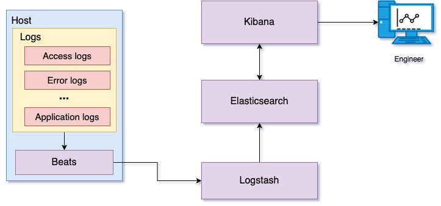
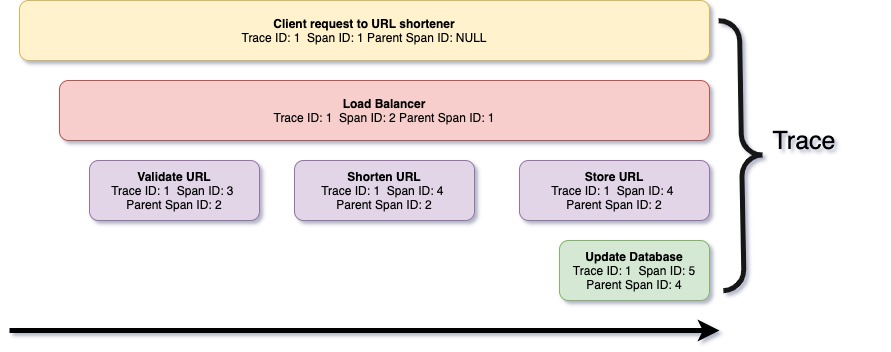
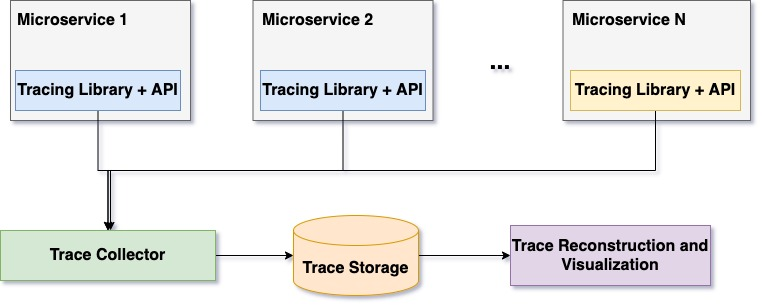

##

# Observability

Engineers often use observability when referring to building reliable
systems. *Observability* is a term derived from control theory, It is a
measure of how well internal states of a system can be inferred from
knowledge of its external outputs. Service infrastructures used on a
daily basis are becoming more and more complex; proactive monitoring
alone is not sufficient to quickly resolve issues causing application
failures. With monitoring, you can keep known past failures from
recurring, but with a complex service architecture, many unknown factors
can cause potential problems. To address such cases, you can make the
service observable. An observable system provides highly granular
insights into the implicit failure modes. In addition, an observable
system furnishes ample context about its inner workings, which unlocks
the ability to uncover deeper systemic issues.

Monitoring enables failure detection; observability helps in gaining a
better understanding of the system. Among engineers, there is a common
misconception that monitoring and observability are two different
things. Actually, observability is the superset to monitoring; that is,
monitoring improves service observability. The goal of observability is
not only to detect problems, but also to understand where the issue is
and what is causing it. In addition to metrics, observability has two
more pillars: logs and traces, as shown in Figure 9. Although these
three components do not make a system 100 percent observable, these are
the most important and powerful components that give a better
understanding of the system. Each of these pillars has its flaws, which
are described in [Three Pillars with Zero
Answers](https://medium.com/lightstephq/three-pillars-with-zero-answers-2a98b36358b8).

 
 Figure 9: 
Three pillars of observability 

Because we have covered metrics already, let's look at the other two
pillars (logs and traces).

#### Logs 

Logs (often referred to as *events*) are a record of activities
performed by a service during its run time, with a corresponding
timestamp. Metrics give abstract information about degradations in a
system, and logs give a detailed view of what is causing these
degradations. Logs created by the applications and infrastructure
components help in effectively understanding the behavior of the system
by providing details on application errors, exceptions, and event
timelines. Logs help you to go back in time to understand the events
that led to a failure. Therefore, examining logs is essential to
troubleshooting system failures.

Log processing involves the aggregation of different logs from
individual applications and their subsequent shipment to central
storage. Moving logs to central storage helps to preserve the logs, in
case the application instances are inaccessible, or the application
crashes due to a failure. After the logs are available in a central
place, you can analyze the logs to derive sensible information from
them. For audit and compliance purposes, you archive these logs on the
central storage for a certain period of time. Log analyzers fetch useful
information from log lines, such as request user information, request
URL (feature), and response headers (such as content length) and
response time. This information is grouped based on these attributes and
made available to you through a visualization tool for quick
understanding.

You might be wondering how this log information helps. This information
gives a holistic view of activities performed on all the involved
entities. For example, let's say someone is performing a DoS (denial of
service) attack on a web application. With the help of log processing,
you can quickly look at top client IPs derived from access logs and
identify where the attack is coming from.

Similarly, if a feature in an application is causing a high error rate
when accessed with a particular request parameter value, the results of
log analysis can help you to quickly identify the misbehaving parameter
value and take further action.

 

 Figure 10: Log processing and analysis using ELK stack 

Figure 10 shows a log processing platform using ELK (Elasticsearch,
Logstash, Kibana), which provides centralized log processing. Beats is a
collection of lightweight data shippers that can ship logs, audit data,
network data, and so on over the network. In this use case specifically,
we are using filebeat as a log shipper. Filebeat watches service log
files and ships the log data to Logstash. Logstash parses these logs and
transforms the data, preparing it to store on Elasticsearch. Transformed
log data is stored on Elasticsearch and indexed for fast retrieval.
Kibana searches and displays log data stored on Elasticsearch. Kibana
also provides a set of visualizations for graphically displaying
summaries derived from log data.

Storing logs is expensive. And extensive logging of every event on the
server is costly and takes up more storage space. With an increasing
number of services, this cost can increase proportionally to the number
of services.

#### Tracing

So far, we covered the importance of metrics and logging. Metrics give
an abstract overview of the system, and logging gives a record of events
that occurred. Imagine a complex distributed system with multiple
microservices, where a user request is processed by multiple
microservices in the system. Metrics and logging give you some
information about how these requests are being handled by the system,
but they fail to provide detailed information across all the
microservices and how they affect a particular client request. If a slow
downstream microservice is leading to increased response times, you need
to have detailed visibility across all involved microservices to
identify such microservice. The answer to this need is a request tracing
mechanism.

A trace is a series of spans, where each span is a record of events
performed by different microservices to serve the client's request. In
simple terms, a trace is a log of client-request serving derived from
various microservices across different physical machines. Each span
includes span metadata such as trace ID and span ID, and context, which
includes information about transactions performed.

 

 Figure 11: Trace and spans for a URL shortener request 

Figure 11 is a graphical representation of a trace captured on the [URL
shortener](https://linkedin.github.io/school-of-sre/python_web/url-shorten-app/)
example we covered earlier while learning Python.

Similar to monitoring, the tracing infrastructure comprises a few
modules for collecting traces, storing them, and accessing them. Each
microservice runs a tracing library that collects traces in the
background, creates in-memory batches, and submits the tracing backend.
The tracing backend normalizes received trace data and stores it on
persistent storage. Tracing data comes from multiple different
microservices; therefore, trace storage is often organized to store data
incrementally and is indexed by trace identifier. This organization
helps in the reconstruction of trace data and in visualization. Figure
12 illustrates the anatomy of the distributed system.

 Figure 12: Anatomy of distributed tracing 

Today a set of tools and frameworks are available for building
distributed tracing solutions. Following are some of the popular tools:

-   [OpenTelemetry](https://opentelemetry.io/): Observability
     framework for cloud-native software

-   [Jaeger](https://www.jaegertracing.io/): Open-source
     distributed tracing solution

-   [Zipkin](https://zipkin.io/): Open-source distributed tracing
     solution
