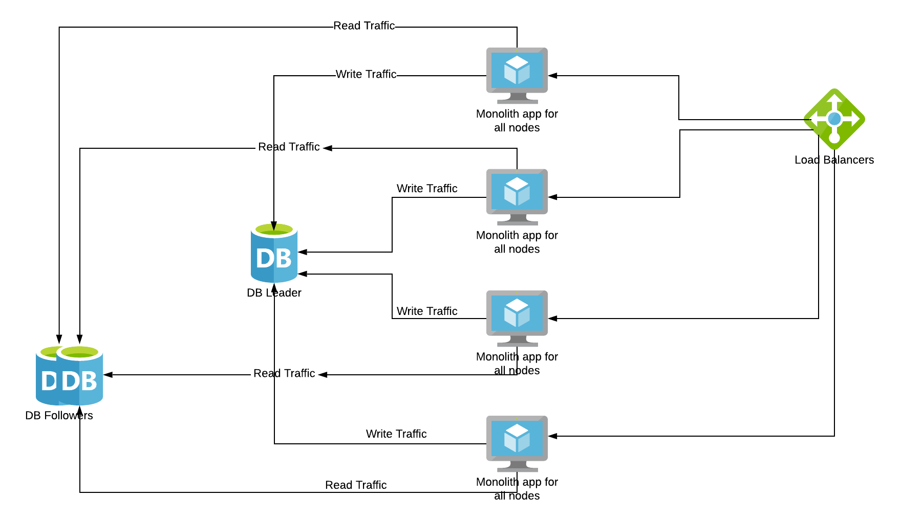
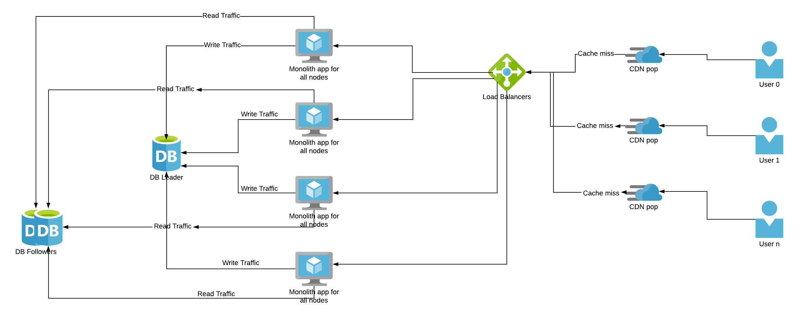
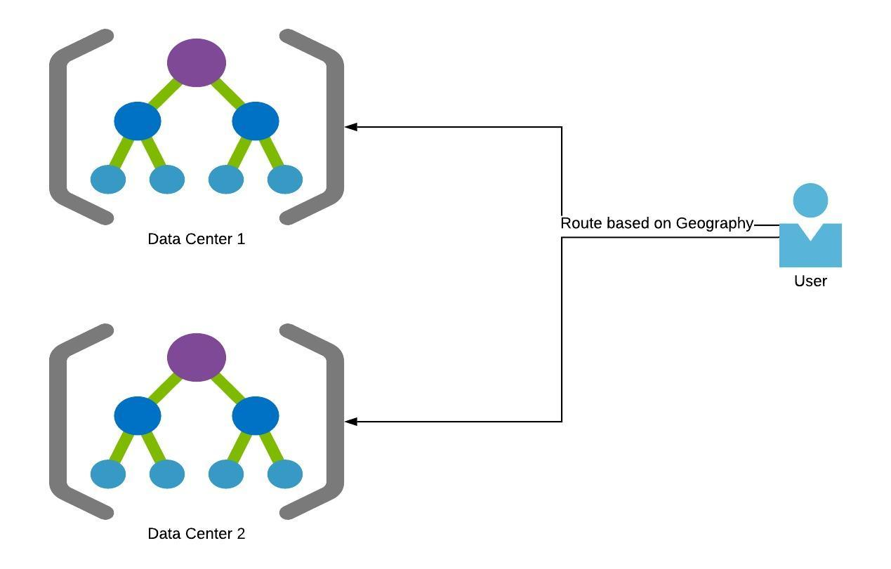

# Scalability
What does scalability mean for a system/service? A system is composed of services/components, each service/component scalability needs to be tackled separately, and the scalability of the system as a whole.

A service is said to be scalable if, as resources are added to the system, it results in increased performance in a manner proportional to resources added

An always-on service is said to be scalable if adding resources to facilitate redundancy does not result in a loss of performance

## Refer
- [https://www.allthingsdistributed.com/2006/03/a_word_on_scalability.html](https://www.allthingsdistributed.com/2006/03/a_word_on_scalability.html)

## Scalability - AKF Scale Cube

The [Scale Cube](https://akfpartners.com/growth-blog/scale-cube) is a model for segmenting services, defining microservices, and scaling products. It also creates a common language for teams to discuss scale related options in designing solutions. The following section talks about certain scaling patterns based on our inferences from the AKF cube

## Scalability - Horizontal scaling

Horizontal scaling stands for cloning of an application or service such that work can easily be distributed across instances with absolutely no bias.

Let's see how our monolithic application improves with this principle

Here DB is scaled separately from the application. This is to let you know each component’s scaling capabilities can be different. Usually, web applications can be scaled by adding resources unless there is state stored inside the application. But DBs can be scaled only for Reads by adding more followers but Writes have to go to only one leader to make sure data is consistent. There are some DBs that support multi-leader writes but we are keeping them out of scope at this point.

Apps should be able to differentiate between Reads and Writes to choose appropriate DB servers. Load balancers can split traffic between identical servers transparently.

**WHAT:**  Duplication of services or databases to spread transaction load.

**WHEN TO USE:**  Databases with a very high read-to-write ratio (5:1 or greater—the higher the better). Because only read replicas of DBs can be scaled, not the Leader.

**HOW TO USE:** Simply clone services and implement a load balancer. For databases, ensure that the accessing code understands the difference between a read and a write.

**WHY:** Allows for the fast scale of transactions at the cost of duplicated data and functionality.

**KEY TAKEAWAYS:** This is fast to implement, is a low cost from a developer effort perspective, and can scale transaction volumes nicely. However, they tend to be high cost from the perspective of the operational cost of data. The cost here means if we have 3 followers and 1 Leader DB, the same database will be stored as 4 copies in the 4 servers. Hence added storage cost

### Refer   
- [https://learning.oreilly.com/library/view/the-art-of/9780134031408/ch23.html](https://learning.oreilly.com/library/view/the-art-of/9780134031408/ch23.html) 

### Scalability Pattern - Load Balancing

Improves the distribution of workloads across multiple computing resources, such as computers, a computer cluster, network links, central processing units, or disk drives. A commonly used technique is load balancing traffic across identical server clusters. A similar philosophy is used to load balance traffic across network links by [ECMP](https://en.wikipedia.org/wiki/Equal-cost_multi-path_routing), disk drives by [RAID](https://en.wikipedia.org/wiki/RAID),etc

Aims to optimize resource use, maximize throughput, minimize response time, and avoid overload of any single resource.
Using multiple components with load balancing instead of a single component may increase reliability and availability through redundancy. In our updated architecture diagram we have 4 servers to handle app traffic instead of a single server

The device or system that performs load balancing is called a load balancer, abbreviated as LB.

#### Refer  
- [https://en.wikipedia.org/wiki/Load_balancing_(computing)](https://en.wikipedia.org/wiki/Load_balancing_(computing))
- [https://blog.envoyproxy.io/introduction-to-modern-network-load-balancing-and-proxying-a57f6ff80236](https://blog.envoyproxy.io/introduction-to-modern-network-load-balancing-and-proxying-a57f6ff80236)
- [https://learning.oreilly.com/library/view/load-balancing-in/9781492038009/](https://learning.oreilly.com/library/view/load-balancing-in/9781492038009/)
- [https://learning.oreilly.com/library/view/practical-load-balancing/9781430236801/](https://learning.oreilly.com/library/view/practical-load-balancing/9781430236801/)
- [http://shop.oreilly.com/product/9780596000509.do](http://shop.oreilly.com/product/9780596000509.do)

### Scalability Pattern - LB Tasks

What does an LB do?

#### Service discovery: 
What backends are available in the system? In our architecture, 4 servers are available to serve App traffic. LB acts as a single endpoint that clients can use transparently to reach one of the 4 servers.

#### Health checking: 
What backends are currently healthy and available to accept requests? If one out of the 4 App servers turns bad, LB should automatically short circuit the path so that clients don’t sense any application downtime

#### Load balancing: 
What algorithm should be used to balance individual requests across the healthy backends? There are many algorithms to distribute traffic across one of the four servers. Based on observations/experience, SRE can pick the algorithm that suits their pattern

### Scalability Pattern - LB Methods
Common Load Balancing Methods

#### Least Connection Method 
directs traffic to the server with the fewest active connections. Most useful when there are a large number of persistent connections in the traffic unevenly distributed between the servers. Works if clients maintain long-lived connections

#### Least Response Time Method 
directs traffic to the server with the fewest active connections and the lowest average response time. Here response time is used to provide feedback of the server’s health

#### Round Robin Method 
rotates servers by directing traffic to the first available server and then moves that server to the bottom of the queue. Most useful when servers are of equal specification and there are not many persistent connections.

#### IP Hash 
the IP address of the client determines which server receives the request. This can sometimes cause skewness in distribution but is useful if apps store some state locally and need some stickiness

More advanced client/server-side example techniques 
- https://docs.nginx.com/nginx/admin-guide/load-balancer/
- http://cbonte.github.io/haproxy-dconv/2.2/intro.html#3.3.5
- https://twitter.github.io/finagle/guide/Clients.html#load-balancing

### Scalability Pattern - Caching - Content Delivery Networks (CDN)

CDNs are added closer to the client’s location. If the app has static data like images,  Javascript, CSS which don’t change very often, they can be cached. Since our example is a content sharing site, static content can be cached in CDNs with a suitable expiry.

**WHAT:** Use CDNs (content delivery networks) to offload traffic from your site.

**WHEN TO USE:** When speed improvements and scale warrant the additional cost.

**HOW TO USE:** Most CDNs leverage DNS to serve content on your site’s behalf. Thus you may need to make minor DNS changes or additions and move content to be served from new subdomains.

Eg
media-exp1.licdn.com is a domain used by Linkedin to serve static content

Here a CNAME points the domain to the DNS of the CDN provider

dig media-exp1.licdn.com +short

2-01-2c3e-005c.cdx.cedexis.net.

**WHY:** CDNs help offload traffic spikes and are often economical ways to scale parts of a site’s traffic. They also often substantially improve page download times.

**KEY TAKEAWAYS:** CDNs are a fast and simple way to offset the spikiness of traffic as well as traffic growth in general. Make sure you perform a cost-benefit analysis and monitor the CDN usage. If CDNs have a lot of cache misses, then we don’t gain much from CDN and are still serving requests using our compute resources. 

## Scalability - Microservices

This pattern represents the separation of work by service or function within the application. Microservices are meant to address the issues associated with growth and complexity in the code base and data sets. The intent is to create fault isolation as well as to reduce response times.

Microservices can scale transactions, data sizes, and codebase sizes. They are most effective in scaling the size and complexity of your codebase. They tend to cost a bit more than horizontal scaling because the engineering team needs to rewrite services or, at the very least, disaggregate them from the original monolithic application.

**WHAT:** Sometimes referred to as scale through services or resources, this rule focuses on scaling by splitting data sets, transactions, and engineering teams along verb (services) or noun (resources) boundaries.

**WHEN TO USE:** Very large data sets where relations between data are not necessary. Large, complex systems where scaling engineering resources requires specialization.

**HOW TO USE:**  Split up actions by using verbs, or resources by using nouns, or use a mix. Split both the services and the data along the lines defined by the verb/noun approach.

**WHY:** Allows for efficient scaling of not only transactions but also very large data sets associated with those transactions. It also allows for the efficient scaling of teams.

**KEY TAKEAWAYS:** Microservices allow for efficient scaling of transactions, large data sets, and can help with fault isolation.  It helps reduce the communication overhead of teams. The codebase becomes less complex as disjoint features are decoupled and spun as new services thereby letting each service scale independently specific to its requirement.

### Refer   
- https://learning.oreilly.com/library/view/the-art-of/9780134031408/ch23.html 

## Scalability - Sharding

This pattern represents the separation of work based on attributes that are looked up to or determined at the time of the transaction. Most often, these are implemented as splits by requestor, customer, or client.

Very often, a lookup service or deterministic algorithm will need to be written for these types of splits.

Sharding aids in scaling transaction growth, scaling instruction sets, and decreasing processing time (the last by limiting the data necessary to perform any transaction). This is more effective at scaling growth in customers or clients. It can aid with disaster recovery efforts, and limit the impact of incidents to only a specific segment of customers.

Here the auth data is sharded based on user names so that DBs can respond faster as the amount of data DBs have to work on has drastically reduced during queries.

There can be other ways to split 

Here the whole data center is split and replicated and clients are directed to a data center based on their geography. This helps in improving performance as clients are directed to the closest data center and performance increases as we add more data centers. There are some replication and consistency overhead with this approach one needs to be aware of.  This also gives fault tolerance by rolling out test features to one site and rollback if there is an impact to that geography

**WHAT:** This is very often a split by some unique aspect of the customer such as customer ID, name, geography, and so on.

**WHEN TO USE:** Very large, similar data sets such as large and rapidly growing customer bases or when the response time for a geographically distributed customer base is important.

**HOW TO USE:** Identify something you know about the customer, such as customer ID, last name, geography, or device, and split or partition both data and services based on that attribute.

**WHY:** Rapid customer growth exceeds other forms of data growth, or you have the need to perform fault isolation between certain customer groups as you scale.

**KEY TAKEAWAYS:** Shards are effective at helping you to scale customer bases but can also be applied to other very large data sets that can’t be pulled apart using the microservices methodology.

### Refer
- https://learning.oreilly.com/library/view/the-art-of/9780134031408/ch23.html

## Applications in SRE role

1. SREs in coordination with the network team work on how to map users' traffic to a particular site.
https://engineering.linkedin.com/blog/2017/05/trafficshift--load-testing-at-scale
2. SREs work closely with the Dev team to split monoliths to multiple microservices that are easy to run and manage
3. SREs work on improving Load Balancers' reliability, service discovery, and performance
4. SREs work closely to split Data into shards and manage data integrity and consistency. 
https://engineering.linkedin.com/espresso/introducing-espresso-linkedins-hot-new-distributed-document-store
5. SREs work to set up, configure, and improve the CDN cache hit rate.

