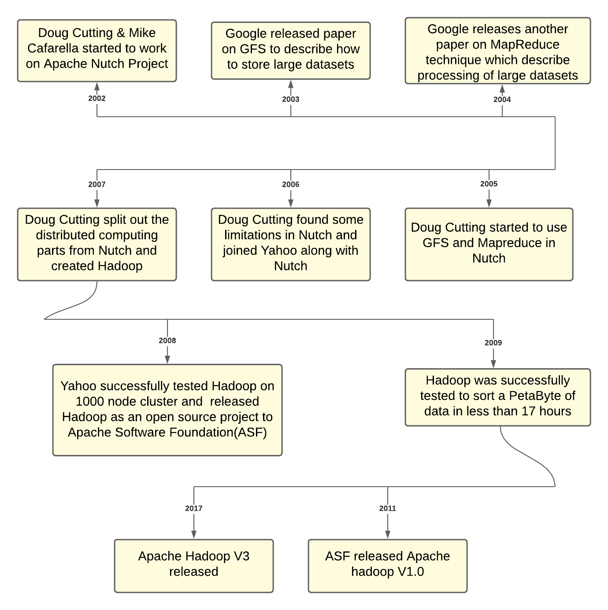

# Evolution of Hadoop

# Architecture of Hadoop

1. **HDFS**
    1. The Hadoop Distributed File System (HDFS) is a distributed file system designed to run on commodity hardware. It has many similarities with existing distributed file systems. However, the differences from other distributed file systems are significant.
    2. HDFS is highly fault-tolerant and is designed to be deployed on low-cost hardware. HDFS provides high throughput access to application data and is suitable for applications that have large datasets.
    3. HDFS is part of the [Apache Hadoop Core project](https://github.com/apache/hadoop).

    

    The main components of HDFS include:
    1. NameNode: is the arbitrator and central repository of file namespace in the cluster. The NameNode executes the operations such as opening, closing, and renaming files and directories.
    2. DataNode: manages the storage attached to the node on which it runs. It is responsible for serving all the read and writes requests. It performs operations on instructions on NameNode such as creation, deletion, and replications of blocks.
    3. Client: Responsible for getting the required metadata from the NameNode and then communicating with the DataNodes for reads and writes.    

2. **YARN**
    YARN stands for “Yet Another Resource Negotiator“. It was introduced in Hadoop 2.0 to remove the bottleneck on Job Tracker which was present in Hadoop 1.0. YARN was described as a “Redesigned Resource Manager” at the time of its launching, but it has now evolved to be known as a large-scale distributed operating system used for Big Data processing.

    
    
    The main components of YARN architecture include:
    1. Client: It submits map-reduce (MR) jobs to the resource manager.
    2. Resource Manager: It is the master daemon of YARN and is responsible for resource assignment and management among all the applications. Whenever it receives a processing request, it forwards it to the corresponding node manager and allocates resources for the completion of the request accordingly. It has two major components:
        1. Scheduler: It performs scheduling based on the allocated application and available resources. It is a pure scheduler, which means that it does not perform other tasks such as monitoring or tracking and does not guarantee a restart if a task fails. The YARN scheduler supports plugins such as Capacity Scheduler and Fair Scheduler to partition the cluster resources.
        2. Application manager: It is responsible for accepting the application and negotiating the first container from the resource manager. It also restarts the Application Manager container if a task fails.
    3. Node Manager: It takes care of individual nodes on the Hadoop cluster and manages application and workflow and that particular node. Its primary job is to keep up with the Node Manager. It monitors resource usage, performs log management, and also kills a container based on directions from the resource manager. It is also responsible for creating the container process and starting it at the request of the Application master.
    4. Application Master: An application is a single job submitted to a framework. The application manager is responsible for negotiating resources with the resource manager, tracking the status, and monitoring the progress of a single application. The application master requests the container from the node manager by sending a Container Launch Context (CLC) which includes everything an application needs to run. Once the application is started, it sends the health report to the resource manager from time-to-time.
    5. Container: It is a collection of physical resources such as RAM, CPU cores, and disk on a single node. The containers are invoked by Container Launch Context (CLC) which is a record that contains information such as environment variables, security tokens, dependencies, etc.  

# MapReduce framework

1. The term MapReduce represents two separate and distinct tasks Hadoop programs perform&mdash;Map Job and Reduce Job. Map jobs take datasets as input and process them to produce key-value pairs. Reduce job takes the output of the Map job i.e. the key-value pairs and aggregates them to produce desired results.
2. Hadoop MapReduce (Hadoop Map/Reduce) is a software framework for distributed processing of large datasets on computing clusters. MapReduce helps to split the input dataset into a number of parts and run a program on all data parts parallel at once.
3. Please find the below Word count example demonstrating the usage of the MapReduce framework:

  

# Other tooling around Hadoop

1. [**Hive**](https://hive.apache.org/)
    1. Uses a language called HQL which is very SQL like. Gives non-programmers the ability to query and analyze data in Hadoop. Is basically an abstraction layer on top of map-reduce.
    2. Ex. HQL query:
        1. `SELECT pet.name, comment FROM pet JOIN event ON (pet.name = event.name);`
    3. In mysql:
        1. `SELECT pet.name, comment FROM pet, event WHERE pet.name = event.name;`
2. [**Pig**](https://pig.apache.org/)
    1. Uses a scripting language called Pig Latin, which is more workflow driven. Don't need to be an expert Java programmer but need a few coding skills. Is also an abstraction layer on top of map-reduce.
    2. Here is a quick question for you:
    What is the output of running the Pig queries in the right column against the data present in the left column in the below image?

    

    Output:
    <pre><code>
    7,Komal,Nayak,24,9848022334,trivendram
    8,Bharathi,Nambiayar,24,9848022333,Chennai
    5,Trupthi,Mohanthy,23,9848022336,Bhuwaneshwar
    6,Archana,Mishra,23,9848022335,Chennai
    </code></pre>

3. [**Spark**](https://spark.apache.org/)
    1. Spark provides primitives for in-memory cluster computing that allows user programs to load data into a cluster’s memory and query it repeatedly, making it well-suited to machine learning algorithms.
4. [**Presto**](https://prestodb.io/)
    1. Presto is a high performance, distributed SQL query engine for Big Data.
    2. Its architecture allows users to query a variety of data sources such as Hadoop, AWS S3, Alluxio, MySQL, Cassandra, Kafka, and MongoDB.
    3. Example Presto query:
    <pre><code>
    USE studentDB;
    SHOW TABLES;
    SELECT roll_no, name FROM studentDB.studentDetails WHERE section=’A’ LIMIT 5;
    </code></pre>   
    
 

# Data Serialisation and storage

1. In order to transport the data over the network or to store on some persistent storage, we use the process of translating data structures or objects state into binary or textual form. We call this process serialization.
2. Avro data is stored in a container file (a `.avro` file) and its schema (the `.avsc` file) is stored with the data file.
3. Apache Hive provides support to store a table as Avro and can also query data in this serialisation format.
