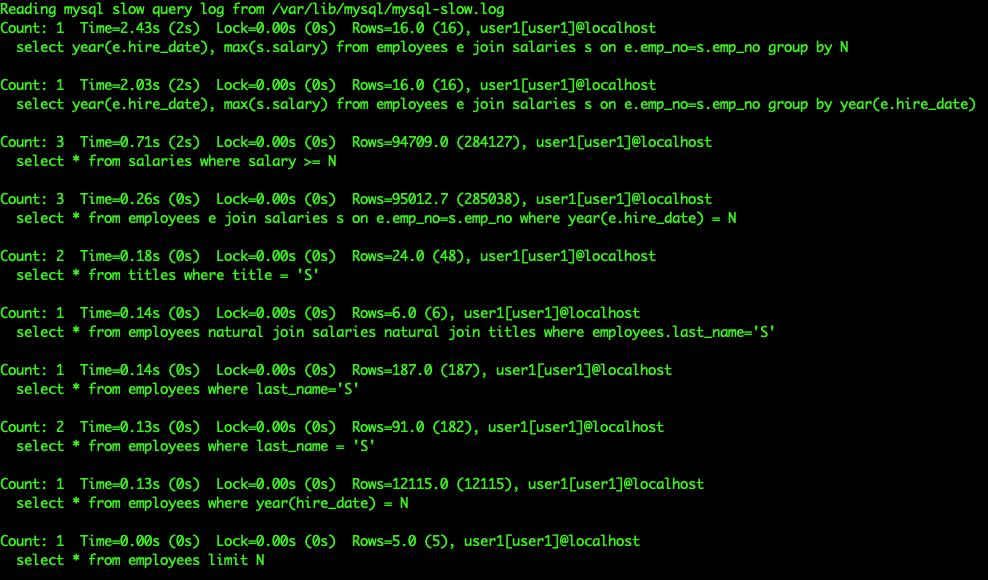

### Query Performance Improvement
Query Performance is a very crucial aspect of relational databases. If not tuned correctly, the select queries can become slow and painful for the application, and for the MySQL server as well. The important task is to identify the slow queries and try to improve their performance by either rewriting them or creating proper indexes on the tables involved in it.

#### The Slow Query Log
The slow query log contains SQL statements that take a longer time to execute than set in the config parameter `long_query_time`. These queries are the candidates for optimization. There are some good utilities to summarize the slow query logs like, `mysqldumpslow` (provided by MySQL itself), `pt-query-digest` (provided by Percona), etc. Following are the config parameters that are used to enable and effectively catch slow queries

| Variable | Explanation | Example value |
| --- | --- | --- |
| slow_query_log | Enables or disables slow query logs | ON |
| slow_query_log_file | The location of the slow query log | /var/lib/mysql/mysql-slow.log |
| long_query_time | Threshold time. The query that takes longer than this time is logged in slow query log | 5 |
| log_queries_not_using_indexes | When enabled with the slow query log, the queries which do not make use of any index are also logged in the slow query log even though they take less time than long_query_time. | ON |

So, for this section, we will be enabling `slow_query_log`, `long_query_time` will be kept to **0.3 (300 ms)**, and `log_queries_not_using` index will be enabled as well.

Below are the queries that we will execute on the `employees` database.

1. 
    ```
    SELECT * FROM employees WHERE last_name = 'Koblick'
    ```
1. 
    ```
    SELECT * FROM salaries WHERE salary >= 100000
    ```
1. 
    ```
    SELECT * FROM titles WHERE title = 'Manager'
    ```
1. 
    ```
    SELECT * FROM employees WHERE year(hire_date) = 1995
    ```
1. 
    ```
    SELECT year(e.hire_date), max(s.salary) FROM employees e JOIN salaries s ON e.emp_no=s.emp_no GROUP BY year(e.hire_date)
    ```

Now, queries **1**, **3** and **4** executed under 300ms but if we check the slow query logs, we will find these queries logged as they are not using any of the index. Queries **2** and **5** are taking longer than 300ms and also not using any index.

Use the following command to get the summary of the slow query log:

```shell
mysqldumpslow /var/lib/mysql/mysql-slow.log
```



There are some more queries in the snapshot that were along with the queries mentioned. `mysqldumpslow` replaces actual values that were used by _N_ (in case of numbers) and _S_ (in case of strings). That can be overridden by `-a` option, however, that will increase the output lines if different values are used in similar queries.

#### The EXPLAIN Plan
The `EXPLAIN` command is used with any query that we want to analyze. It describes the query execution plan, how MySQL sees and executes the query. `EXPLAIN` works with `SELECT`, `INSERT`, `UPDATE` and `DELETE` statements. It tells about different aspects of the query like, how tables are joined, indexes used or not, etc. The important thing here is to understand the basic `EXPLAIN` plan output of a query to determine its performance. 

Let's take the following query as an example,

```shell
mysql> EXPLAIN SELECT * FROM salaries WHERE salary = 100000;
+----+-------------+----------+------------+------+---------------+------+---------+------+---------+----------+-------------+
| id | select_type | table    | partitions | type | possible_keys | key  | key_len | ref  | rows    | filtered | Extra       |
+----+-------------+----------+------------+------+---------------+------+---------+------+---------+----------+-------------+
|  1 | SIMPLE      | salaries | NULL       | ALL  | NULL          | NULL | NULL    | NULL | 2838426 |    10.00 | Using where |
+----+-------------+----------+------------+------+---------------+------+---------+------+---------+----------+-------------+
1 row in set, 1 warning (0.00 sec)
```

The key aspects to understand in the above output are:

- **Partitions** - the number of partitions considered while executing the query. It is only valid if the table is partitioned.
- **Possible_keys** - the list of indexes that were considered during creation of the execution plan.
- **Key** - the index that will be used while executing the query.
- **Rows** - the number of rows examined during the execution.
- **Filtered** - the percentage of rows that were filtered out of the rows examined. The maximum and most optimized result will have 100 in this field. 
- **Extra** - this tells some extra information on how MySQL evaluates, whether the query is using only `WHERE` clause to match target rows, any index or temporary table, etc.

So, for the above query, we can determine that there are no partitions, there are no candidate indexes to be used and so no index is used at all, over 2M rows are examined and only 10% of them are included in the result, and lastly, only a `WHERE` clause is used to match the target rows.

#### Creating an Index
Indexes are used to speed up selecting relevant rows for a given column value. Without an index, MySQL starts with the first row and goes through the entire table to find matching rows. If the table has too many rows, the operation becomes costly. With indexes, MySQL determines the position to start looking for the data without reading the full table.

A primary key is also an index which is also the fastest and is stored along with the table data. Secondary indexes are stored outside of the table data and are used to further enhance the performance of SQL statements. Indexes are mostly stored as B-Trees, with some exceptions like spatial indexes use R-Trees and memory tables use hash indexes.

There are 2 ways to create indexes:

- While creating a table - if we know beforehand the columns that will drive the most number of `WHERE` clauses in `SELECT` queries, then we can put an index over them while creating a table.
- Altering a Table - To improve the performance of a troubling query, we create an index on a table which already has data in it using `ALTER` or `CREATE INDEX` command. This operation does not block the table but might take some time to complete depending on the size of the table.

Let’s look at the query that we discussed in the previous section. It’s clear that scanning over 2M records is not a good idea when only 10% of those records are actually in the resultset. 

Hence, we create an index on the salary column of the salaries table.

```SQL
CREATE INDEX idx_salary ON salaries(salary)
```
OR

```SQL
ALTER TABLE salaries ADD INDEX idx_salary(salary)
```

And the same explain plan now looks like this:

```shell
mysql> EXPLAIN SELECT * FROM salaries WHERE salary = 100000;
+----+-------------+----------+------------+------+---------------+------------+---------+-------+------+----------+-------+
| id | select_type | table    | partitions | type | possible_keys | key        | key_len | ref   | rows | filtered | Extra |
+----+-------------+----------+------------+------+---------------+------------+---------+-------+------+----------+-------+
|  1 | SIMPLE      | salaries | NULL       | ref  | idx_salary    | idx_salary | 4       | const |   13 |   100.00 | NULL  |
+----+-------------+----------+------------+------+---------------+------------+---------+-------+------+----------+-------+
1 row in set, 1 warning (0.00 sec)
```

Now the index used is `idx_salary`, the one we recently created. The index actually helped examine only 13 records and all of them are in the resultset. Also, the query execution time is also reduced from over 700ms to almost negligible. 

Let’s look at another example. Here, we are searching for a specific combination of `first_name` and `last_name`. But, we might also search based on `last_name` only.

```shell
mysql> EXPLAIN SELECT * FROM employees WHERE last_name = 'Dredge' AND first_name = 'Yinghua';
+----+-------------+-----------+------------+------+---------------+------+---------+------+--------+----------+-------------+
| id | select_type | table     | partitions | type | possible_keys | key  | key_len | ref  | rows   | filtered | Extra       |
+----+-------------+-----------+------------+------+---------------+------+---------+------+--------+----------+-------------+
|  1 | SIMPLE      | employees | NULL       | ALL  | NULL          | NULL | NULL    | NULL | 299468 |     1.00 | Using where |
+----+-------------+-----------+------------+------+---------------+------+---------+------+--------+----------+-------------+
1 row in set, 1 warning (0.00 sec)
```

Now only 1% record out of almost 300K is the resultset. Although the query time is particularly quick as we have only 300K records, this will be a pain if the number of records are over millions. In this case, we create an index on `last_name` and `first_name`, not separately, but a composite index including both the columns. 

```SQL
CREATE INDEX idx_last_first ON employees(last_name, first_name)
```

```shell
mysql> EXPLAIN SELECT * FROM employees WHERE last_name = 'Dredge' AND first_name = 'Yinghua';
+----+-------------+-----------+------------+------+----------------+----------------+---------+-------------+------+----------+-------+
| id | select_type | table     | partitions | type | possible_keys  | key            | key_len | ref         | rows | filtered | Extra |
+----+-------------+-----------+------------+------+----------------+----------------+---------+-------------+------+----------+-------+
|  1 | SIMPLE      | employees | NULL       | ref  | idx_last_first | idx_last_first | 124     | const,const |    1 |   100.00 | NULL  |
+----+-------------+-----------+------------+------+----------------+----------------+---------+-------------+------+----------+-------+
1 row in set, 1 warning (0.00 sec)
```

We chose to put `last_name` before `first_name` while creating the index as the optimizer starts from the leftmost prefix of the index while evaluating the query. For example, if we have a 3-column index like `idx(c1, c2, c3)`, then the search capability of the index follows - (c1), (c1, c2) or (c1, c2, c3) i.e. if your `WHERE` clause has only `first_name`, this index won’t work.

```shell
mysql> EXPLAIN SELECT * FROM employees WHERE first_name = 'Yinghua';
+----+-------------+-----------+------------+------+---------------+------+---------+------+--------+----------+-------------+
| id | select_type | table     | partitions | type | possible_keys | key  | key_len | ref  | rows   | filtered | Extra       |
+----+-------------+-----------+------------+------+---------------+------+---------+------+--------+----------+-------------+
|  1 | SIMPLE      | employees | NULL       | ALL  | NULL          | NULL | NULL    | NULL | 299468 |    10.00 | Using where |
+----+-------------+-----------+------------+------+---------------+------+---------+------+--------+----------+-------------+
1 row in set, 1 warning (0.00 sec)
```

But, if you have only the `last_name` in the `WHERE` clause, it will work as expected.

```shell
mysql> EXPLAIN SELECT * FROM employees WHERE last_name = 'Dredge';
+----+-------------+-----------+------------+------+----------------+----------------+---------+-------+------+----------+-------+
| id | select_type | table     | partitions | type | possible_keys  | key            | key_len | ref   | rows | filtered | Extra |
+----+-------------+-----------+------------+------+----------------+----------------+---------+-------+------+----------+-------+
|  1 | SIMPLE      | employees | NULL       | ref  | idx_last_first | idx_last_first | 66      | const |  200 |   100.00 | NULL  |
+----+-------------+-----------+------------+------+----------------+----------------+---------+-------+------+----------+-------+
1 row in set, 1 warning (0.00 sec)
```

For another example, use the following queries:

```SQL
CREATE TABLE employees_2 LIKE employees;
CREATE TABLE salaries_2 LIKE salaries;
ALTER TABLE salaries_2 DROP PRIMARY KEY;
```

We made copies of `employees` and `salaries` tables without the Primary Key of `salaries` table to understand an example of `SELECT` with `JOIN`.

When you have queries like the below, it becomes tricky to identify the pain point of the query.

```shell
mysql> SELECT e.first_name, e.last_name, s.salary, e.hire_date FROM employees_2 e JOIN salaries_2 s ON e.emp_no=s.emp_no WHERE e.last_name='Dredge';
1860 rows in set (4.44 sec)
```

This query is taking about 4.5 seconds to complete with 1860 rows in the resultset. Let’s look at the Explain plan. There will be 2 records in the Explain plan as 2 tables are used in the query.

```shell
mysql> EXPLAIN SELECT e.first_name, e.last_name, s.salary, e.hire_date FROM employees_2 e JOIN salaries_2 s ON e.emp_no=s.emp_no WHERE e.last_name='Dredge';
+----+-------------+-------+------------+--------+------------------------+---------+---------+--------------------+---------+----------+-------------+
| id | select_type | table | partitions | type   | possible_keys          | key     | key_len | ref                | rows    | filtered | Extra       |
+----+-------------+-------+------------+--------+------------------------+---------+---------+--------------------+---------+----------+-------------+
|  1 | SIMPLE      | s     | NULL       | ALL    | NULL                   | NULL    | NULL    | NULL               | 2837194 |   100.00 | NULL        |
|  1 | SIMPLE      | e     | NULL       | eq_ref | PRIMARY,idx_last_first | PRIMARY | 4       | employees.s.emp_no |       1 |     5.00 | Using where |
+----+-------------+-------+------------+--------+------------------------+---------+---------+--------------------+---------+----------+-------------+
2 rows in set, 1 warning (0.00 sec)
```

These are in order of evaluation, i.e. `salaries_2` will be evaluated first and then `employees_2` will be joined to it. As it looks like, it scans almost all the rows of `salaries_2` table and tries to match the `employees_2` rows as per the `JOIN` condition. Though `WHERE` clause is used in fetching the final resultset, but the index corresponding to the `WHERE` clause is not used for the `employees_2` table. 

If the join is done on two indexes which have the same data-types, it will always be faster. So, let’s create an index on the `emp_no` column of `salaries_2` table and analyze the query again.

```SQL
CREATE INDEX idx_empno ON salaries_2(emp_no)
```

```shell
mysql> EXPLAIN SELECT e.first_name, e.last_name, s.salary, e.hire_date FROM employees_2 e JOIN salaries_2 s ON e.emp_no=s.emp_no WHERE e.last_name='Dredge';
+----+-------------+-------+------------+------+------------------------+----------------+---------+--------------------+------+----------+-------+
| id | select_type | table | partitions | type | possible_keys          | key            | key_len | ref                | rows | filtered | Extra |
+----+-------------+-------+------------+------+------------------------+----------------+---------+--------------------+------+----------+-------+
|  1 | SIMPLE      | e     | NULL       | ref  | PRIMARY,idx_last_first | idx_last_first | 66      | const              |  200 |   100.00 | NULL  |
|  1 | SIMPLE      | s     | NULL       | ref  | idx_empno              | idx_empno      | 4       | employees.e.emp_no |    9 |   100.00 | NULL  |
+----+-------------+-------+------------+------+------------------------+----------------+---------+--------------------+------+----------+-------+
2 rows in set, 1 warning (0.00 sec)
```

Now, not only did the index help the optimizer to examine only a few rows in both tables, it reversed the order of the tables in evaluation. The `employees_2` table is evaluated first and rows are selected as per the index respective to the `WHERE` clause. Then, the records are joined to `salaries_2` table as per the index used due to the `JOIN` condition. The execution time of the query came down **from 4.5s to 0.02s**.

```shell
mysql> SELECT e.first_name, e.last_name, s.salary, e.hire_date FROM employees_2 e JOIN salaries_2 s ON e.emp_no=s.emp_no WHERE e.last_name='Dredge'\G
1860 rows in set (0.02 sec)
```