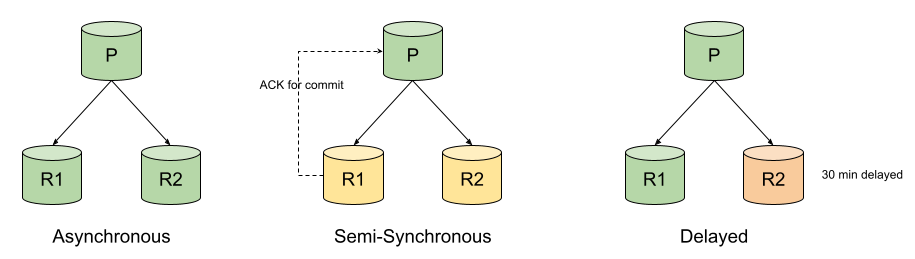
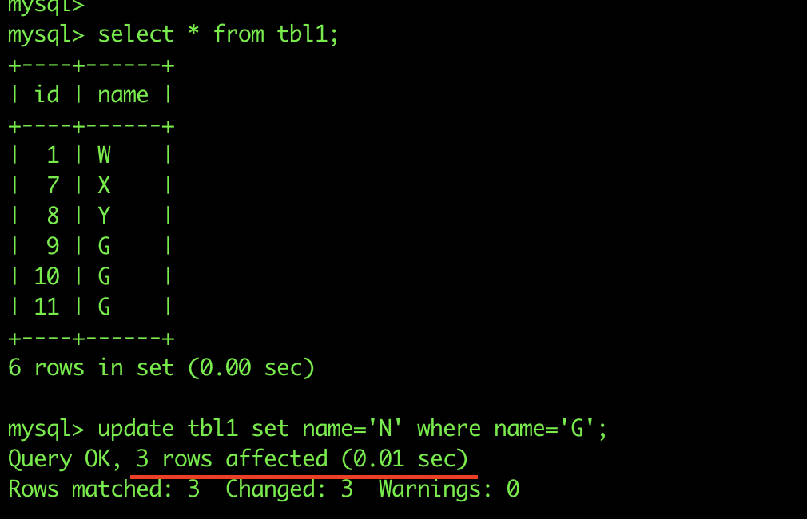
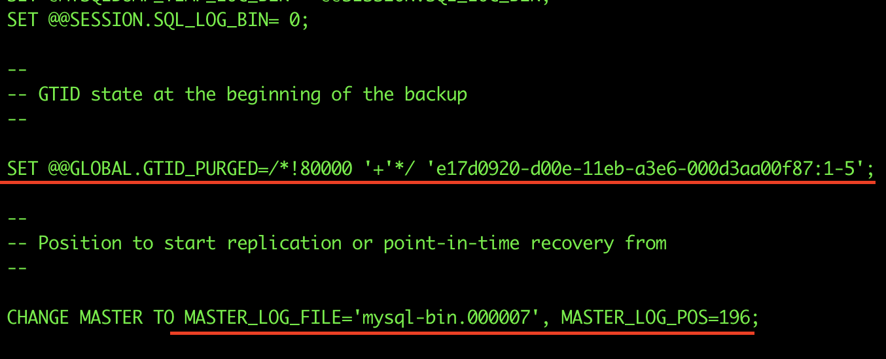

### MySQL Replication
Replication enables data from one MySQL host (termed as Primary) to be copied to another MySQL host (termed as Replica). MySQL Replication is asynchronous in nature by default, but it can be changed to semi-synchronous with some configurations.

Some common applications of MySQL replication are:-

- **Read-scaling** - as multiple hosts can replicate the data from a single primary host, we can set up as many replicas as we need and scale reads through them, i.e. application writes will go to a single primary host and the reads can balance between all the replicas that are there. Such a setup can improve the write performance as well, as the primary is dedicated to only updates and not reads.
- **Backups using replicas** - the backup process can sometimes be a little heavy. But if we have replicas configured, then we can use one of them to get the backup without affecting the primary data at all.
- **Disaster Recovery** - a replica in some other geographical region paves a proper path to configure disaster recovery.

MySQL supports different types of synchronizations as well:-

- **Asynchronous** - this is the default synchronization method. It is one-way, i.e. one host serves as primary and one or more hosts as replica. We will discuss this method throughout the replication topic.



- **Semi-Synchronous** - in this type of synchronization, a commit performed on the primary host is blocked until at least one replica acknowledges it. Post the acknowledgement from any one replica, the control is returned to the session that performed the transaction. This ensures strong consistency but the replication is slower than asynchronous.
- **Delayed** - we can deliberately lag the replica in a typical MySQL replication by the number of seconds desired by the use case. This type of replication safeguards from severe human errors of dropping or corrupting the data on the primary, for example, in the above diagram for Delayed Replication, if a DROP DATABASE is executed by mistake on the primary, we still have 30 minutes to recover the data from R2 as that command has not been replicated on R2 yet.

**Pre-Requisites**

Before we dive into setting up replication, we should know about the binary logs. Binary logs play a very important role in MySQL replication. Binary logs, or commonly known as *binlogs* contain events about the changes done to the database, like table structure changes, data changes via DML operations, etc. They are not used to log SELECT statements. For replication, the primary sends the information to the replicas using its binlogs about the changes done to the database, and the replicas make the same data changes. 

With respect to MySQL replication, the binary log format can be of two types that decides the main type of replication:-
- Statement-Based Replication or SBR
- Row-Based Replication or RBR

**Statement Based Binlog Format**

Originally, the replication in MySQL was based on SQL statements getting replicated and executed on the replica from the primary. This is called statement based logging. The binlog contains the exact SQL statement run by the session. 


So If we run the above statements to insert 3 records and the update 3 in a single update statement, they will be logged exactly the same as when we executed them.


**Row Based Binlog Format**

The Row based is the default one in the latest MySQL releases. This is a lot different from the Statement format as here, row events are logged instead of statements. By that we mean, in the above example one update statement affected 3 records, but binlog had only one update statement; if it is a row based format, binlog will have an event for each record updated.




**Statement Based v/s Row Based binlogs**

Let’s have a look at the operational differences between statement-based and row-based binlogs. 

| Statement Based | Row Based |
|---|---|
| Logs SQL statements as executed | Logs row events based on SQL statements executed |
| Takes lesser disk space | Takes more disk space | 
| Restoring using binlogs is faster | Restoring using binlogs is slower |
| When used for replication, if any statement has a predefined function that has its own value, like sysdate(), uuid() etc, the output could be different on the replica which makes it inconsistent. | Whatever is executed becomes a row event with values, so there will be no problem if such functions are used in SQL statements. |
| Only statements are logged so no other row events are generated. | A lot of events are generated when a table is copied into another using INSERT INTO SELECT. |

**Note** - There is another type of binlog format called **Mixed**. With mixed logging, statement based is used by default but it switches to row based in certain cases. If MySQL cannot guarantee that statement based logging is safe for the statements executed, it issues a warning and switches to row based for those statements.

We will be using binary log format as Row for the entire replication topic.

**Replication in Motion**


The above figure indicates how a typical MySQL replication works.

1. Replica_IO_Thread is responsible to fetch the binlog events from the primary binary logs to the replica
2. On the Replica host, relay logs are created which are exact copies of the binary logs. If the binary logs on primary are in row format, the relay logs will be the same.
3. Replica_SQL_Thread applies the relay logs on the replica MySQL server.
4. If log-bin is enabled on the replica, then the replica will have its own binary logs as well. If log-slave-updates is enabled, then it will have the updates from the primary logged in the binlogs as well.

#### Setting up Replication
In this section, we will set up a simple asynchronous replication. The binlogs will be in row based format. The replication will be set up on two fresh hosts with no prior data present. There are two different ways in which we can set up replication. 

- **Binlog based** - Each replica keeps a record of the binlog coordinates on the primary - current binlog and position in the binlog till where it has read and processed. So, at a time different replicas might be reading different parts of the same binlog.
- **GTID based** - Every transaction gets an identifier called global transaction identifier or GTID. There is no need to keep the record of binlog coordinates, as long as the replica has all the GTIDs executed on the primary, it is consistent with the primary. A typical GTID is the server_uuid:# positive integer.

We will set up a GTID based replication in the following section but will also discuss binlog based replication setup as well.

**Primary Host Configurations**

The following config parameters should be present in the primary my.cnf file for setting up GTID based replication.
```
server-id - a unique ID for the mysql server
log-bin - the binlog location
binlog-format - ROW | STATEMENT (we will use ROW)
gtid-mode - ON
enforce-gtid-consistency - ON (allows execution of only those statements which can be logged using GTIDs)
```
**Replica Host Configurations**

The following config parameters should be present in the replica my.cnf file for setting up replication.
```
server-id - different than the primary host
log-bin - (optional, if you want replica to log its own changes as well)
binlog-format - depends on the above
gtid-mode - ON
enforce-gtid-consistency - ON
log-slave-updates - ON (if binlog is enabled, then we can enable this. This enables the replica to log the changes coming from the primary along with its own changes. Helps in setting up chain replication)
```
**Replication User**

Every replica connects to the primary using a mysql user for replicating. So there must be a mysql user account for the same on the primary host. Any user can be used for this purpose provided it has REPLICATION SLAVE privilege. If the sole purpose is replication then we can have a user with only the required privilege.

On the primary host
```
mysql> create user repl_user@<replica_IP> identified by 'xxxxx';

mysql> grant replication slave on *.* to repl_user@'<replica_IP>';
```
**Obtaining Starting position from Primary**

Run the following command on the primary host
```
mysql> show master status\G
*************************** 1. row ***************************
             File: mysql-bin.000001
         Position: 73
     Binlog_Do_DB:
 Binlog_Ignore_DB:
Executed_Gtid_Set: e17d0920-d00e-11eb-a3e6-000d3aa00f87:1-3
1 row in set (0.00 sec)
```
If we are working with binary log based replication, the top two output lines are the most important ones. That tells the current binlog on the primary host and till what position it has written. For fresh hosts we know that no data is written so we can directly set up replication using the very first binlog file and position 4. If we are setting up a replication from a backup, then that changes the way we obtain the starting position. For GTIDs, the executed_gtid_set is the value where primary is right now. Again, for a fresh setup, we don’t have to specify anything about the starting point and it will start from the transaction id 1, but when we set up from a backup, the backup will contain the GTID positions till where backup has been taken.

**Setting up Replica**

The replication setup must know about the primary host, the user and password to connect, the binlog coordinates (for binlog based replication) or the GTID auto-position parameter.
The following command is used for setting up
```
change master to
master_host = '<primary host IP>',
master_port = <primary host port - default=3306>,
master_user = 'repl_user',
master_password = 'xxxxx',
master_auto_position = 1;
```
**Note** - the *Change Master To* command has been replaced with *Change Replication Source To* from Mysql 8.0.23 onwards, also all the *master* and *slave* keywords are replaced with *source* and *replica*.

If it is binlog based replication, then instead of master_auto_position, we need to specify the binlog coordinates.
```
master_log_file = 'mysql-bin.000001',
master_log_pos = 4
```
**Starting Replication and Check Status**

Now that everything is configured, we just need to start the replication on the replica via the following command

`start slave;`

OR from MySQL 8.0.23 onwards,

`start replica;`

Whether or not the replication is running successfully, we can determine by running the following command

`show slave status\G`

OR from MySQL 8.0.23 onwards,

`show replica status\G`
```
mysql> show replica status\G
*************************** 1. row ***************************
             Replica_IO_State: Waiting for master to send event
                  Source_Host: <primary IP>
                  Source_User: repl_user
                  Source_Port: <primary port>
                Connect_Retry: 60
              Source_Log_File: mysql-bin.000001
          Read_Source_Log_Pos: 852
               Relay_Log_File: mysql-relay-bin.000002
                Relay_Log_Pos: 1067
        Relay_Source_Log_File: mysql-bin.000001
           Replica_IO_Running: Yes
          Replica_SQL_Running: Yes
              Replicate_Do_DB:
          Replicate_Ignore_DB:
           Replicate_Do_Table:
       Replicate_Ignore_Table:
      Replicate_Wild_Do_Table:
  Replicate_Wild_Ignore_Table:
                   Last_Errno: 0
                   Last_Error:
                 Skip_Counter: 0
          Exec_Source_Log_Pos: 852
              Relay_Log_Space: 1283
              Until_Condition: None
               Until_Log_File:
                Until_Log_Pos: 0
           Source_SSL_Allowed: No
           Source_SSL_CA_File:
           Source_SSL_CA_Path:
              Source_SSL_Cert:
            Source_SSL_Cipher:
               Source_SSL_Key:
        Seconds_Behind_Source: 0
Source_SSL_Verify_Server_Cert: No
                Last_IO_Errno: 0
                Last_IO_Error:
               Last_SQL_Errno: 0
               Last_SQL_Error:
  Replicate_Ignore_Server_Ids:
             Source_Server_Id: 1
                  Source_UUID: e17d0920-d00e-11eb-a3e6-000d3aa00f87
             Source_Info_File: mysql.slave_master_info
                    SQL_Delay: 0
          SQL_Remaining_Delay: NULL
    Replica_SQL_Running_State: Slave has read all relay log; waiting for more updates
           Source_Retry_Count: 86400
                  Source_Bind:
      Last_IO_Error_Timestamp:
     Last_SQL_Error_Timestamp:
               Source_SSL_Crl:
           Source_SSL_Crlpath:
           Retrieved_Gtid_Set: e17d0920-d00e-11eb-a3e6-000d3aa00f87:1-3
            Executed_Gtid_Set: e17d0920-d00e-11eb-a3e6-000d3aa00f87:1-3
                Auto_Position: 1
         Replicate_Rewrite_DB:
                 Channel_Name:
           Source_TLS_Version:
       Source_public_key_path:
        Get_Source_public_key: 0
            Network_Namespace:
1 row in set (0.00 sec)
```
Some of the parameters are explained below:-

- **Relay_Source_Log_File** - the primary’s file where replica is currently reading from
- **Execute_Source_Log_Pos** - for the above file on which position is the replica reading currently from. These two parameters are of utmost importance when binlog based replication is used.
- **Replica_IO_Running** - IO thread of replica is running or not
- **Replica_SQL_Running** - SQL thread of replica is running or not
- **Seconds_Behind_Source** - the difference of seconds when a statement was executed on Primary and then on Replica. This indicates how much replication lag is there.
- **Source_UUID** - the uuid of the primary host
- **Retrieved_Gtid_Set** - the GTIDs fetched from the primary host by the replica to be executed.
- **Executed_Gtid_Set** - the GTIDs executed on the replica. This set remains the same for the entire cluster if the replicas are in sync.
- **Auto_Position** - it directs the replica to fetch the next GTID automatically

**Create a Replica for the already setup cluster**

The steps discussed in the previous section talks about the setting up replication on two fresh hosts. When we have to set up a replica for a host which is already serving applications, then the backup of the primary is used, either fresh backup taken for the replica (should only be done if the traffic it is serving is less) or use a recently taken backup.

If the size of the databases on the MySQL primary server is small, less than 100G recommended, then mysqldump can be used to take backup along with the following options.

`mysqldump -uroot -p -hhost_ip -P3306 --all-databases --single-transaction --master-data=1 > primary_host.bkp`

- `--single-transaction` - this option starts a transaction before taking the backup which ensures it is consistent. As transactions are isolated from each other, so no other writes affect the backup.
- `--master-data` - this option is required if binlog based replication is desired to be set up. It includes the binary log file and log file position in the backup file.

When GTID mode is enabled and **mysqldump** is executed, it includes the GTID executed to be used to start the replica after the backup position. The contents of the mysqldump output file will have the following



It is recommended to comment these before restoring otherwise they could throw errors. Also, using master-data=2 will automatically comment the master\_log\_file line.

Similarly, when taking backup of the host using **xtrabackup**, the file *xtrabckup_info* file contains the information about binlog file and file position, as well as the GTID executed set.
```
server_version = 8.0.25
start_time = 2021-06-22 03:45:17
end_time = 2021-06-22 03:45:20
lock_time = 0
binlog_pos = filename 'mysql-bin.000007', position '196', GTID of the last change 'e17d0920-d00e-11eb-a3e6-000d3aa00f87:1-5'
innodb_from_lsn = 0
innodb_to_lsn = 18153149
partial = N
incremental = N
format = file
compressed = N
encrypted = N
```
Now, after setting MySQL server on the desired host, restore the backup taken from any one of the above methods. If the intended way is binlog based replication, then use the binlog file and position info in the following command
```
change Replication Source to 
source_host = ‘primary_ip’,
source_port = 3306,
source_user = ‘repl_user’,
source_password = ‘xxxxx’,
source_log_file = ‘mysql-bin.000007’,
source_log_pos = ‘196’;
```
If the replication needs to be set via GITDs, then run the below command to tell the replica about the GTIDs already executed. On the Replica host, run th following commands
```
reset master;

set global gtid_purged = ‘e17d0920-d00e-11eb-a3e6-000d3aa00f87:1-5’

change replication source to
source_host = ‘primary_ip’,
source_port = 3306,
source_user = ‘repl_user’,
source_password = ‘xxxxx’,
source_auto_position = 1
```
The reset master command resets the position of the binary log to initial. It can be skipped if the host is a freshly installed MySQL, but we restored a backup so it is necessary. The gtid_purged global variable lets the replica know the GTIDs that have already been executed, so that the replication can start after that. Then in the change source command, we set the auto-position to 1 which automatically gets the next GTID to proceed.

#### Further Reading

- [More applications of Replication](https://dev.mysql.com/doc/refman/8.0/en/replication-solutions.html)
- [Automtaed Failovers using MySQL Orchestrator](https://github.com/openark/orchestrator/tree/master/docs)