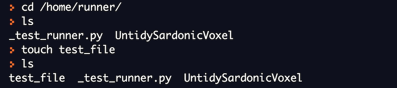
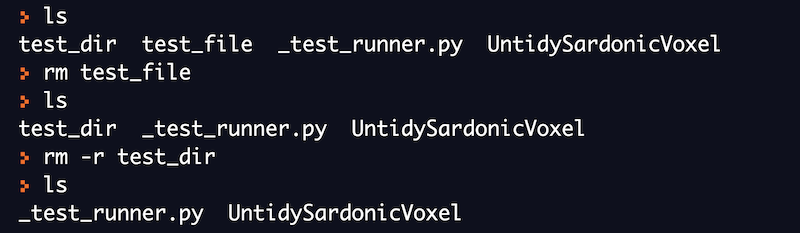

# Command Line Basics

## Lab Environment Setup

One can use an online bash interpreter to run all the commands that are provided as examples in this course. This will also help you in getting a hands-on experience of various linux commands.

[REPL](https://repl.it/languages/bash) is one of the popular online bash interpreters for running linux commands. We will be using it for running all the commands mentioned in this course.

## What is a Command

A command is a program that tells the operating system to perform
specific work. Programs are stored as files in linux. Therefore, a
command is also a file which is stored somewhere on the disk.

Commands may also take additional arguments as input from the user.
These arguments are called command line arguments. Knowing how to use
the commands is important and there are many ways to get help in Linux,
especially for commands. Almost every command will have some form of
documentation, most commands will have a command-line argument -h or
\--help that will display a reasonable amount of documentation. But the
most popular documentation system in Linux is called man pages - short
for manual pages.

Using \--help to show the documentation for ls command.


## File System Organization

The linux file system has a hierarchical (or tree-like) structure with
its highest level directory called root ( denoted by / ). Directories
present inside the root directory stores file related to the system.
These directories in turn can either store system files or application
files or user related files.


  
  bin   | The executable program of most commonly used commands reside in bin directory

  dev   | This directory contains files related to devices on the system  

  etc   | This directory contains all the system configuration files

  home  | This directory contains user related files and directories.

  lib   | This directory contains all the library files

  mnt   | This directory contains files related to mounted devices on the system

  proc  | This directory contains files related to the running processes on the system
  
  root  | This directory contains root user related files and directories.
  
  sbin  | This directory contains programs used for system administration.
  
  tmp   | This directory is used to store temporary files on the system
  
  usr   |  This directory is used to store application programs on the system

## Commands for Navigating the File System

There are three basic commands which are used frequently to navigate the
file system:

- ls

- pwd

- cd

We will now try to understand what each command does and how to use
these commands. You should also practice the given examples on the
online bash shell.

### pwd (print working directory)

At any given moment of time, we will be standing in a certain directory.
To get the name of the directory in which we are standing, we can use
the pwd command in linux.


We will now use the cd command to move to a different directory and then
print the working directory.


### cd (change directory)

The cd command can be used to change the working directory. Using the
command, you can move from one directory to another.

In the below example, we are initially in the root directory. we have
then used the cd command to change the directory.


### ls (list files and directories)**

The ls command is used to list the contents of a directory. It will list
down all the files and folders present in the given directory.

If we just type ls in the shell, it will list all the files and
directories present in the current directory.


We can also provide the directory name as argument to ls command. It
will then list all the files and directories inside the given directory.


## Commands for Manipulating Files

There are five basic commands which are used frequently to manipulate
files:

- touch

- mkdir

- cp

- mv

- rm

We will now try to understand what each command does and how to use
these commands. You should also practice the given examples on the
online bash shell.

### touch (create new file)

The touch command can be used to create an empty new file.
This command is very useful for many other purposes but we will discuss
the simplest use case of creating a new file.

General syntax of using touch command

```
touch <file_name>
```



### mkdir (create new directories)

The mkdir command is used to create directories.You can use ls command
to verify that the new directory is created.

General syntax of using mkdir command

```
mkdir <directory_name>
```


### rm (delete files and directories)

The rm command can be used to delete files and directories. It is very
important to note that this command permanently deletes the files and
directories. It's almost impossible to recover these files and
directories once you have executed rm command on them successfully. Do
run this command with care.

General syntax of using rm command:

```
rm <file_name>
```

Let's try to understand the rm command with an example. We will try to
delete the file and directory we created using touch and mkdir command
respectively.



### cp (copy files and directories)

The cp command is used to copy files and directories from one location
to another. Do note that the cp command doesn't do any change to the
original files or directories. The original files or directories and
their copy both co-exist after running cp command successfully.

General syntax of using cp command:

```
cp <source_path> <destination_path>
```

We are currently in the '/home/runner' directory. We will use the mkdir
command to create a new directory named "test_directory". We will now
try to copy the "\_test_runner.py" file to the directory we created just
now.


Do note that nothing happened to the original "\_test_runner.py" file.
It's still there in the current directory. A new copy of it got created
inside the "test_directory".


We can also use the cp command to copy the whole directory from one
location to another. Let's try to understand this with an example.


We again used the mkdir command to create a new directory called
"another_directory". We then used the cp command along with an
additional argument '-r' to copy the "test_directory".

**mv (move files and directories)**

The mv command can either be used to move files or directories from one
location to another or it can be used to rename files or directories. Do
note that moving files and copying them are very different. When you
move the files or directories, the original copy is lost.

General syntax of using mv command:

```
mv <source_path> <destination_path>
```

In this example, we will use the mv command to move the
"\_test_runner.py" file to "test_directory". In this case, this file
already exists in "test_directory". The mv command will just replace it.
**Do note that the original file doesn't exist in the current directory
after mv command ran successfully.**


We can also use the mv command to move a directory from one location to
another. In this case, we do not need to use the '-r' flag that we did
while using the cp command. Do note that the original directory will not
exist if we use mv command.

One of the important uses of the mv command is to rename files and
directories. Let's see how we can use this command for renaming.

We have first changed our location to "test_directory". We then use the
mv command to rename the ""\_test_runner.py" file to "test.py".


## Commands for Viewing Files

There are five basic commands which are used frequently to view the
files:

- cat

- head

- tail

- more

- less

We will now try to understand what each command does and how to use
these commands. You should also practice the given examples on the
online bash shell.

We will create a new file called "numbers.txt" and insert numbers from 1
to 100 in this file. Each number will be in a separate line.


Do not worry about the above command now. It's an advanced command which
is used to generate numbers. We have then used a redirection operator to
push these numbers to the file. We will be discussing I/O redirection in the
later sections.


### cat

The most simplest use of cat command is to print the contents of the file on
your output screen. This command is very useful and can be used for many
other purposes. We will study about other use cases later.


You can try to run the above command and you will see numbers being
printed from 1 to 100 on your screen. You will need to scroll up to view
all the numbers.

### head

The head command displays the first 10 lines of the file by default. We
can include additional arguments to display as many lines as we want
from the top.

In this example, we are only able to see the first 10 lines from the
file when we use the head command.


By default, head command will only display the first 10 lines. If we
want to specify the number of lines we want to see from start, use the
'-n' argument to provide the input.


### tail

The tail command displays the last 10 lines of the file by default. We
can include additional arguments to display as many lines as we want
from the end of the file.


By default, the tail command will only display the last 10 lines. If we
want to specify the number of lines we want to see from the end, use '-n'
argument to provide the input.


In this example, we are only able to see the last 5 lines from the file
when we use the tail command with explicit -n option.


### more

More command displays the contents of a file or a command output, 
displaying one screen at a time in case the file is large (Eg: log files).
It also allows forward navigation and limited backward navigation in the file.


More command displays as much as can fit on the current screen and waits for user input to advance. Forward navigation can be done by pressing Enter, which advances the output by one line and Space, which advances the output by one screen.

### less

Less command is an improved version of more. It displays the contents of a file or a command output, one page at a time.
It allows backward navigation as well as forward navigation in the file and also has search options. We can use arrow keys for advancing backward or forward by one line. For moving forward by one page, press Space and for moving backward by one page, press b on your keyboard.
You can go to the beginning and the end of a file instantly.


## Echo Command in Linux

The echo command is one of the simplest commands that is used in the
shell. This command is equivalent to what we have <print> in other
programming languages.

The echo command prints the given input string on the screen.


## Text Processing Commands

In the previous section, we learned how to view the content of a file.
In many cases, we will be interested in performing the below operations:

- Print only the lines which contain a particular word(s)

- Replace a particular word with another word in a file

- Sort the lines in a particular order

There are three basic commands which are used frequently to process
texts:

- grep

- sed

- sort

We will now try to understand what each command does and how to use
these commands. You should also practice the given examples on the
online bash shell.

We will create a new file called "numbers.txt" and insert numbers from 1
to 10 in this file. Each number will be in a separate line.


### grep

The grep command in its simplest form can be used to search particular
words in a text file. It will display all the lines in a file that
contains a particular input. The word we want to search is provided as
an input to the grep command.

General syntax of using grep command:

```
grep <word_to_search> <file_name>
```

In this example, we are trying to search for a string "1" in this file.
The grep command outputs the lines where it found this string.


### sed

The sed command in its simplest form can be used to replace a text in a
file.

General syntax of using the sed command for replacement:

```
sed 's/<text_to_replace>/<replacement_text>/' <file_name>
```

Let's try to replace each occurrence of "1" in the file with "3" using
sed command.


The content of the file will not change in the above
example. To do so, we have to use an extra argument '-i' so that the
changes are reflected back in the file.

### sort

The sort command can be used to sort the input provided to it as an
argument. By default, it will sort in increasing order.

Let's first see the content of the file before trying to sort it.


Now, we will try to sort the file using the sort command. The sort
command sorts the content in lexicographical order.


The content of the file will not change in the above
example.

## I/O Redirection

Each open file gets assigned a file descriptor. A file descriptor is an
unique identifier for open files in the system. There are always three
default files open, stdin (the keyboard), stdout (the screen), and
stderr (error messages output to the screen). These files can be
redirected.

Everything is a file in linux -
[https://unix.stackexchange.com/questions/225537/everything-is-a-file](https://unix.stackexchange.com/questions/225537/everything-is-a-file)

Till now, we have displayed all the output on the screen which is the
standard output. We can use some special operators to redirect the
output of the command to files or even to the input of other commands.
I/O redirection is a very powerful feature.

In the below example, we have used the '>' operator to redirect the
output of ls command to output.txt file.


In the below example, we have redirected the output from echo command to
a file.


We can also redirect the output of a command as an input to another
command. This is possible with the help of pipes.

In the below example, we have passed the output of cat command as an
input to grep command using pipe(\|) operator.


In the below example, we have passed the output of sort command as an
input to uniq command using pipe(\|) operator. The uniq command only
prints the unique numbers from the input.


I/O redirection -
[https://tldp.org/LDP/abs/html/io-redirection.html](https://tldp.org/LDP/abs/html/io-redirection.html)
