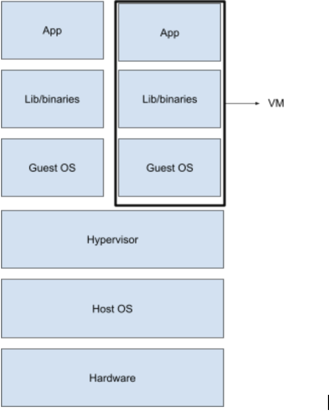
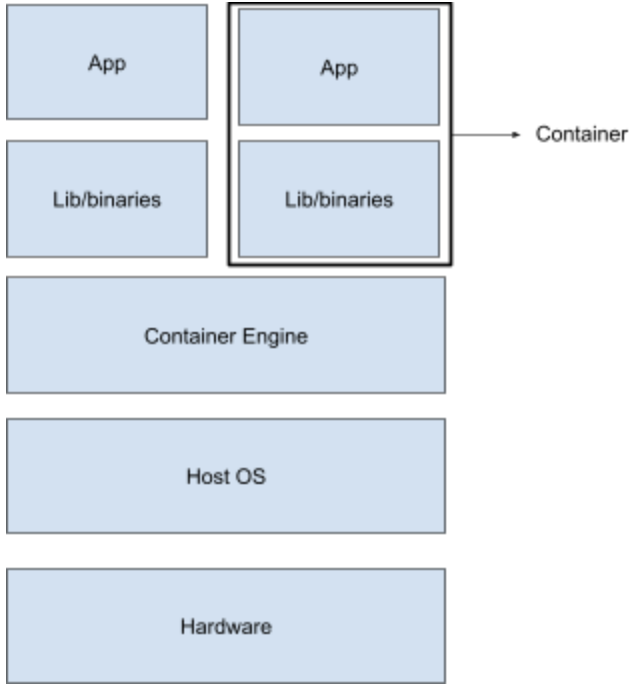

## What are containers

Here's a popular definition of containers according to [Docker](https://www.docker.com/resources/what-container), a popular containerization engine :

> A container is a standard unit of software that packages up code and all its dependencies so the application runs quickly and reliably from one computing environment to another

Let's break this down. A container is your code bundled along with its entire runtime environment. That includes your system libraries, binaries and config files needed for your application to run.

## Why containers

You might wonder why we need to pack your application along with its dependencies. This is where the second part of the definition comes,

> ...so the application runs quickly and reliably from one computing environment to another.

Developers usually write code in their dev environment (or local machine), test it in one or two staging/test environments before pushing their code into production. Ideally, for reliably testing applications before pushing to production, we need all these environments to be uniform to a tee (underlying OS, system libraries etc).

Of course, the ideal is hard to achieve especially when we're using a mix of on-prem (complete control) and cloud  infrastructure providers (more restrictive in terms of control of hardware and security options), a scenario which is more common today.

This is exactly why we need to package not only the code but also the dependencies; so that your application runs reliably irrespective of which infrastructure or environment it runs on.

We can run several containers on a single host. Due to how containers are implemented, each container has its own isolated environment within the same host. This means that a monolithic application can be broken down into micro-services and packaged into containers. Each microservice runs in the host machine in isolated environments. This is another reason why containers are used: _separation of concerns_.

Providing isolated environments does not let the failure of one application in one container affect the other. This is called _fault isolation_. Isolation also gives the added benefit of increased security due to restricted visibility of processes in a container.

Due to how most of the containerization solutions are implemented, we also have the option to cap the amount of resources consumed by applications running within a container. This is called _resource limiting_. Will will discuss this feature in more detail in the section on cgroups.

## Difference between virtual machines and containers

Let's digress a little and go into some history. In the previous section we talked about how containers help us in achieving separation of concerns. Before the wide-spread usage of containers, virtualization was used for running applications in isolated environments in the same host (it’s still being used today in some cases).

In plain terms, virtualization is where we package software along with a copy of the OS on which it runs. This package is called a virtual machine (VM). The image of the OS bundled in the VM is called Guest OS. A component called Hypervisor sits between the Guest and the Host OS and is responsible for facilitating the access of the underlying OS’s hardware to the Guest OS. You can learn more about hypervisors [here](https://searchservervirtualization.techtarget.com/definition/bare-metal-hypervisor).

Similar to how multiple containers can be run in a single host machine, multiple VMs can be run on a single host and in this way, it’s possible to run applications (or each microservice) in a separate VM and achieve separation of concerns. 

The main focus here is on the size of the VMs and containers. VMs come along with a copy of the guest operating system and therefore are heavy-weight compared to containers. If you’re more interested in comparison of VMs and containers, you can check these articles from [Backblaze](https://www.backblaze.com/blog/vm-vs-containers/) and [NetApp](https://blog.netapp.com/blogs/containers-vs-vms/).

While it is possible to run an operating system on a host with an incompatible kernel using hypervisors (e.g Windows 10 VM on CentOS 7), in cases where kernels can be shared (e.g Ubuntu on CentOS 7) containers are preferred over VMs due to the size factor. Sharing kernels, as you will see later, also gives containers many performance benefits over VMs like quicker boot-ups. Let’s look at the diagram of how containers work.

Comparing the two diagrams, we notice two things:

- Containers do not have a separate (guest) OS

- Container engine is the intermediary between containers and Host OS. It is used to facilitate the life-cycle of a container on the Host OS (it is not a necessity, however).

The next section explains in detail how containers share the same operating system (kernel, to be precise) as the host machine and yet provide isolated environments for applications to run.

## How are containers implemented

We’ve talked about how containers, unlike virtual machines, share the same kernel as the host operating system and provide isolated environments for applications to run. This is achieved without the overhead of running a guest operating system on the host OS, thanks to two features of linux kernel called cgroups and kernel namespaces.

Now that we are touching upon the internals of containers, it would be appropriate to give a more technically accurate representation of what they are. A container is a linux process or a group of linux processes which is restricted in
- **visibility** into processes outside the container (implemented using namespace)
- **quantity of resources** it can use (implemented using cgroups)  and 
- **system calls** that can be made from the container. Refer [seccomp](https://docs.docker.com/engine/security/seccomp/), if interested in knowing more.

These restrictions are what make a containerized application remain isolated from other processes running in the same host. 

Now let’s talk about namespaces and cgroup in a little more detail.

## Namespaces

Visibility of processes inside a container should be restricted within itself. This is what linux namespaces do. The idea is that processes within a namespace can’t affect those which it can’t “see”. Processes sharing a single namespace have identities, service and/or interfaces unique to the namespace they exist in. Here’s a list of namespaces in linux:

- *Mount*

Process groups sharing a mount namespace share a separate, private set of mount points and file system view. Any modifications made to these namespaced mount points are not visible outside the namespace. For example it is possible to have a /var within the a mount namespace which is different from /var in the host.

- *PID*

A processes in a pid namespace have process ids which are unique only within the namespace. A process can be a root process (pid 1) in its own pid namespace and have an entire tree of processes under it.

- *Network*

Each network namespace will have its own network device instances that can be configured with individual network addresses. Processes in the same network namespace can have their own ports and route tables.

- *User*

User namespaces can have their own users and group ids. It’s possible for a process using a non-privileged user in the host machine to have a root user identity within a user namespace.

- *Cgroup*

Allows creation of cgroups which can be used only within the cgroup namespace. Cgroups will be covered in more detail in the following section.

- *UTS*

This namespace has its own hostname and domain name
IPC. Each IPC namespace has its own System V and POSIX message queues. 

As complex as it seems, creating namespaces in linux is quite simple. Let’s see a quick demo to create a PID namespace. You’ll need a linux based OS with sudoers permission to follow along.

### DEMO: namespaces

* First we check which processes are running in the host system (output varies from system to system). Note the process with pid 1.

* Let’s create a PID namespace with the unshare command and create a bash process in the namespace

You can see that `ps aux` (which itself is a process launched in the PID namespace so created) can only see processes within its own namespace. Hence, the output shows **only 2 processes** running within the namespace. Also note, the root process (pid 1) in the namespace is not init but it is the bash shell which we specified while creating the namespace.

* Let’s create another process in the same namespace which sleeps for 1000 seconds in the background. In my case the pid of the sleep process is 44 **within the PID namespace**.

* On a separate terminal, check for the process id of the sleep process as seen from the host.

Note the difference in pid (23844 in the host and 44 within the namespace) though both refer to the same process (start time and all other attributes are same).

It’s also possible to nest namespaces i.e create a pid namespace from another pid namespace.
Try out `sudo nsenter -t 23844 --pid -r bash` to reenter the namespace and create another pid namespace within it. It should be fun to do!

## Cgroups
 A cgroup can be defined as a set of processes whose usage of resources is metered and monitored. The resources can be memory pages, disk i/o, CPU etc. In fact, cgroups are classified based on which resource the limit is imposed on and nature of action taken when a limit is violated.

The component in the cgroup which tracks resource utilization and controls the behaviour of processes in a cgroup is called resource-subsystem or resource controller.

Following is the set of resource controllers and their function according to RHEL’s [introduction to cgroups](https://access.redhat.com/documentation/en-us/red_hat_enterprise_linux/6/html/resource_management_guide/ch01):

* _blkio_ — this subsystem sets limits on input/output access to and from block devices such as physical drives (disk, solid state, or USB).
* _cpu_ — this subsystem uses the scheduler to provide cgroup processes access to the CPU.
cpuacct — this subsystem generates automatic reports on CPU resources used by processes in a cgroup.
* _cpuset_ — this subsystem assigns individual CPUs (on a multicore system) and memory nodes to processes in a cgroup.
* _devices_ — this subsystem allows or denies access to devices by processes in a cgroup.
* _freezer_ — this subsystem suspends or resumes processes in a cgroup.
* _memory_ — this subsystem sets limits on memory use by processes in a cgroup and generates automatic reports on memory resources used by those processes.

Cgroups follow a hierarchical, tree-like structure for each resource controller i.e one cgroup exists for each controller. Each cgroup in a hierarchy inherits certain attributes (e.g limits) from its parent cgroup.

Let’s try out a quick demo with memory cgroups to wrap our heads around the above ideas. You’ll need a linux based OS (here, RedHat) with sudo permission to follow along.

### DEMO: cgroups

* Let’s start by checking if cgroup tools are installed in your machine. Execute `mount | grep "^cgroup"`. If you have the tools installed you’ll see a output like this:

If not, install the tools with `sudo yum install libcgroup-tools -y`.

* Now, we create a memory cgroup called mem_group with “root” as the owner of the cgroup.  Command executed `sudo cgcreate -a root -g memory:mem_group`. Verify that cgroup is created. 

`/sys/fs/cgroup/<cgroup type>` is the pseudo filesystem where a newly created cgroup is added as a sub-group.

* Memory cgroup puts a limit on the memory usage of processes in the cgroup. Let’s see what the limits are for mem_group. The file for checking the memory limit is memory.limit_in_bytes([more information here](https://www.kernel.org/doc/Documentation/cgroup-v1/memory.txt) , if you’re interested).

* Note that mem_group has inherited the limit from its parent cgroup

* Now, let’s reduce the memory usage limit to 20KB for the purpose of our demo (the actual limit is rounded off to the nearest power of 2).

This limit is too low and hence most of the processes attached to mem_group should be OOM killed.

* Create a new shell and attach it to the cgroup. We need sudo permissions for this.

The process is OOM killed as expected. You can confirm the same with dmesg logs (mm_fault_error).

If you want to try out a more in-depth exercise on cgroups, check out [this tutorial from Geeks for Geeks](https://geeksforgeeks.org/linux-virtualization-resource-throttling-using-cgroups/).

Let’s come back to containers again. Containers share the same kernel as the underlying host operating system and provide an isolated environment of the application within. Cgroups help in managing resources used by processes within a container and namespaces help isolate network stack, pids, users, group ids and mount points in a container from another container running on the same host.

Of course, there are more components to containers which truly make it fully functional but that discussion is out of scope of this module.
 
 
## Container engine

Container engines ease the process of creating and managing containers in a host machine. How?

* The container creation workflow typically begins with a container image. A container image is a packaged, portable version of the target application bundled with all dependencies for it to run.
* These container images are either available on the host machine (container host) from previous builds or need to be pulled from a remote repository of images. Sometimes the container engine might need to build the container image from a set of instructions.
* Finally once the container image is fetched/built, the container engine unpacks the image and creates an isolated environment for the application as per the image specifications. 
* The files in the container image are then mounted to the isolated environment to get the  application up and running within the container.

There are several container engines available like Docker, RKT, LXC (one of the first container engines) which require different image formats (Docker, LXD). OCI (Open Container Initiative) is a collaborative project started by Docker that aims to standardize container runtime specifications and image formats across vendors. OCI [FAQ section](https://opencontainers.org/faq/) is a good place to start if you’re curious about this project.
We will focus on Docker in the [next section](https://linkedin.github.io/school-of-sre/level102/containerization_and_orchestration/containerization_with_docker/).