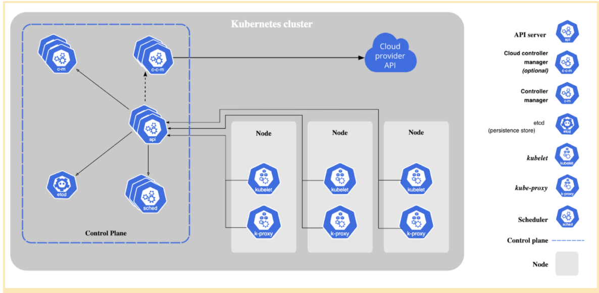
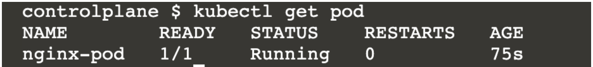
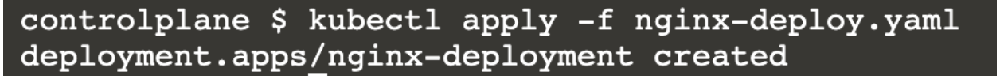
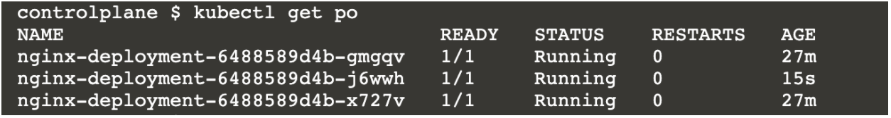
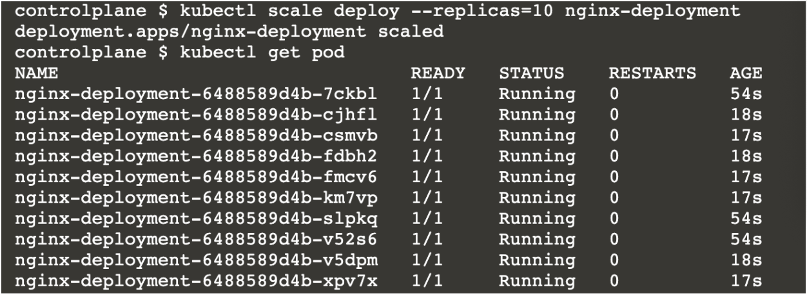

## Introduction

Now we finally arrive at the most awaited part: running and managing containers at scale. So far, we have seen how Docker facilitates managing the life-cycle of containers and provides improved portability of applications. Docker does provide a solution for easing the deployment of containers on a large scale ( you can check out Docker Swarm, if interested) which integrates well with Docker containers. However, Kubernetes has become the de-facto tool for orchestrating the management of microservices (as containers) in large distributed environments. 

Let’s see the points of interest for us, SREs, to use container orchestration tools and Kubernetes in particular.

## Motivation to use Kubernetes

- _Ease of usage_

Though there is a steep learning curve associated with Kubernetes, once learnt , can be used as  a one stop tool to manage your microservices. With a single command it is possible to deploy full fledged production ready environments. The desired state of an application needs to be recorded as a YAML manifest and Kubernetes manages the application for you.

- _Ensure optimum usage of resources_

We can specify limits on resources used by each container in a deployment. We can also specify our choice of nodes where Kubernetes can schedule nodes to be deployed (e.g microservices with high CPU consumption can be instructed to be deployed in high compute nodes).

- _Fault tolerance_

Self-healing is built into basic resource types of Kubernetes. This removes the headache of designing a fault tolerant application system from scratch. This applies especially to stateless applications.

- _Infrastructure agnostic_

Kubernetes does not have vendor lock-in. It can be set up in multiple cloud environments or in on-prem data centers. 

- _Strong community support and documentation_

Kubernetes is open-source and many technologies like operators, service mesh etc. have been built by the community to manage and monitor Kubernetes-orchestrated applications better.

- _Extensible and customisable_

We can build our custom resource definitions which fit our use case for managing applications and use Kubernetes to manage them (with custom controllers).

You can check out [this article](https://hackernoon.com/why-and-when-you-should-use-kubernetes-8b50915d97d8) if you are more interested in this topic.

## Architecture of Kubernetes

Here’s a diagram (from [the official Kubernetes documentation](https://kubernetes.io/docs/concepts/overview/components/)) containing different components which make Kubernetes work:



Kubernetes components can be divided into two parts: [control plane components](https://kubernetes.io/docs/concepts/overview/components/#control-plane-components) and [data plane components](https://kubernetes.io/docs/concepts/overview/components/#node-components). 

A Kubernetes cluster consists of 1 or more host machines (called nodes) where the containers managed by Kubernetes are run. This constitutes the data plane (or node plane). 

The brain of Kuberentes which responds to events from the node plane (e.g create a pod, replicas mismatch) and does the main orchestration is called the control plane. All control plane components are typically installed in a master node. This master node does not run any user containers.

The Kubernetes components themselves are run as containers wrapped in Pods (which is the most basic kubernetes resource object).

- Control plane components:
  - kube-apiserver
  - etcd
  - kube-scheduler
  - kube-controller-manager
- Node plane components
  - kubelet
  - kube-proxy

This workflow might help you understand the working on components better:

- An SRE installs `kubectl` in their local machine. This is the client which interacts with the Kubernetes control plane (and hence the cluster).

- They create a YAML file, called manifest which specifies the desired state of the resource (e.g a deployment names “frontend” needs 3 pods to always be running)

- When they issue a command to create objects based in the YAML file, the kubectl CLI tool sends a rest API request to the `kube-apiserver`.

- If the manifest is valid, it is stored as key value pairs in the `etcd` server on the control plane.

- `kube-scheduler` chooses which nodes to put the containers on (basically schedules them)

- There are controller processes (managed by `kube-controller` manager) which makes sure the current state of the cluster is equivalent to the desired state (here, 3 pods are indeed running in the cluster -> all is fine).

- On the node plane side, `kubelet` makes sure that pods are locally kept in running state.


## LAB

### Prerequisites

The best way to start this exercise is to use a [Play with kubernetes lab](https://labs.play-with-k8s.com/). 

The environment gets torn down after 4 hours. So make sure that you save your files if you want to resume them. For persistent kubernetes clusters, you can set it up either in your local (using [minikube](https://minikube.sigs.k8s.io/docs/start/)) or you can create a [kubernetes cluster in Azure](https://docs.microsoft.com/en-us/azure/aks/kubernetes-walkthrough-portal), GCP or any other cloud provider.

Knowledge of YAML is nice to have for understanding the manifest files.

### Hands-on

#### Lab 1:

We are going to create an object called Pod which is the most basic unit for running a container in Kubernetes. Here, we will create a pod called ‘nginx-pod” which contains an nginx container called “web”. We will also expose port 80 in the container so that we can interact with the nginx container.
Save the below manifest in a file called nginx-pod.yaml

``` yaml
apiVersion: v1                  #[1]
kind: Pod                       #[2]
metadata:                       #[3]
 name: nginx-pod                #[4]
 labels:                        #[5]
   app: nginx      
spec:                           #[6]
 containers:                    #[7]
   - name: web                  #[8]
     image: nginx               #[9]
     ports:                     #[10]
       - name: web              #[11]
         containerPort: 80      #[12]
         protocol: TCP          #[13]
```

Let’s very briefly understand what’s here:

- `#[2]` - kind: The “kind” of object that’s being created. Here it is a Pod
- `#[1]` - apiVersion: The apiVersion of the “Pod” resource. There could be minor changes in the values or keys in the yaml file if the version varies.
- `#[3]` - metadata: The metadata section of the file where pod labels and name is given
- `#[6]` - spec: This is the main part where the things inside the pod are defined

These are not random key value pairs! They have to be interpretable by the kubeapiserver. You can check which key value pairs are optional/mandatory using `kubectl explain pod` command. Do try it out!

* Apply the manifest using the command `kubectl apply -f nginx-pod.yaml`. This creates the “nginx-pod” pod in the kubernetes cluster.


* Verify that the pod is in running state using `kubectl get pod`.



It shows that nginx-pod is in Running state. 1/1 indicates that out of 1 out of 1 container(s) inside the pod is healthy.

* To check if the container running in “nginx-pod” is indeed “web” we do the `kubectl describe pod/nginx-pod` command. This gives a lengthy output with a detailed description of the pod and the events  that happened since the pod was created. This command is very useful for debugging.  The part we are concerned here is this:


You can see “web” under the Containers section with Image as nginx. This is what we are looking for.

* How do we access the welcome page of nginx “web” container? In the describe command you can see the IP address of the pod.  Each pod is assigned an IP address on creation.


Here, this is 10.244.1.3 

* Issue a curl request from the host `curl 10.244.1.3:80`. You will get the welcome page!

* Let’s say we want to use a specific tag of nginx (say 1.20.1) in the same pod i.e we want to modify some property of the pod. You can try editing nginx-pod.yaml (image: nginx:1.20.1 in #[9])and reapplying (step 2.). It will create a new container in the same pod with the new image.

  A container is created within the pod but the pod is the same. You can verify by checking the pod start time in describe command. It would show a much older time.


What if we want to change the image to 1.20.1 for 1000 nginx pods? Stepping a little back, what if we want to create 1000 nginx pods. Of course, we can write a script but Kubernetes already offers a resource type called “deployment” to manage large scale deployments better.
 
---
 
#### Lab 2:

We’ll go a step further to see how we can create more than a single instance of the nginx pod at the same time. 

* We will first create Save the below manifest in a file called _nginx-deploy.yaml_

``` yaml
apiVersion: apps/v1
kind: Deployment             #[1]
metadata:
 name: nginx-deployment
 labels:
   app: nginx     
spec:
 replicas: 3                 #[2]
 selector:
   matchLabels:
     app: nginx              #[3]
 template:                   #[4]
   metadata:
     labels:
       app: nginx            #[5]
   spec:
     containers:
     - name: web
       image: nginx
       ports:
       - name: web
         containerPort: 80
         protocol: "TCP"
```

You can see that it is similar to a pod definition till spec (`#[1]` has Deployment as kind, api version is also different). 

Another thing interesting observation is the metadata and spec parts under `#[4]` is almost the same as the _metadata_ and _spec_ section under the Pod definition in Lab 1 (do go up and cross check this). What this implies is that we are deploying 3 nginx pods similar to Lab1.
Also, the labels in matchLabels should be the same as labels under `#[4]`.

* Now apply the manifest using `kubectl apply -f nginx-deploy.yaml`




Verify that 3 pods are indeed created.


If you’re curious, check the output of `kubectl get deploy` and `kubectl describe deploy nginx-deployment`.

* Delete one of the 3 pods using `kubectl delete pod <pod name>`. After a few seconds again do `kubectl get pod`.



You can see that a new pod is spawned to keep the total number of pods as 3 (see AGE 15s compared to others created 27 minutes ago)! This is a demonstration of how Kubernetes does fault tolerance.

This is a property of Kubernetes deployment object (kill the pod from Lab1, it won’t be respawned :) )

* Let’s say we want to increase the number of pods to 10. Try out `kubectl scale deploy  --replicas=10 nginx-deployment`.



You can see that 3/10 pods are older than the rest. This means Kubernetes has added 7 extra pods to scale the deployment to 10. This shows how simple it is to scale up and scale down containers using Kubernetes. 

* Let’s put all these pods behind a ClusterIP service. Execute `kubectl expose deployment nginx-deployment --name=nginx-service`. 


Curl the IP corresponding to 10.96.114.184. This curl request reaches one of the 10 pods in the deployment “nginx-deployment” in a round robin fashion. What happens when we execute the `expose` command is that a kubernetes `Service` is created of type Cluster IP so that all the pods behind this service are accessible through a single local IP (10.96.114.184, here).

It is possible to have a public IP instead (i.e an actual external load balancer) by creating a Service of type [LoadBalancer](https://kubernetes.io/docs/tasks/access-application-cluster/create-external-load-balancer/). Do feel free to play around with it!

The above exercises a pretty good exposure to using Kubernetes to manage large scale deployments. Trust me, the process is very similar to the above for operating 1000 deployments and containers too! While a Deployment object is good enough for managing stateless applications, Kuberenetes provides other resources like Job, Daemonset, Cronjob, Statefulset etc. to manage special use cases. 

**eAdditional labs:**
https://kubernetes.courselabs.co/ (Huge number of free follow-along exercises to play with Kubernetes)

## Advanced topics
Most often than not, microservices orchestrated with Kubernetes contain dozens of instances of resources like deployment, services and configs. The manifests for these applications can be auto- generated with Helm templates and passed on as Helm charts. Similar to how we have PiPy for python packages there are remote repositories like Bitnami where Helm charts (e.g for setting up a production-ready Prometheus or Kafka with a single click) can be downloaded and used. [This is a good place to begin](https://www.digitalocean.com/community/tutorials/an-introduction-to-helm-the-package-manager-for-kubernetes).

Kuberenetes provides the flexibility to create our custom resources (similar to Deployment or the Pod which we saw). For instance, if you want to create 5 instances of a resource with kind as  SchoolOfSre you can! The only thing is that you have to write your custom resource for it. You can also build a custom operator for your custom resource to take certain actions on the resource instance. You can check [here](https://www.redhat.com/en/topics/containers/what-is-a-kubernetes-operator) for more information.