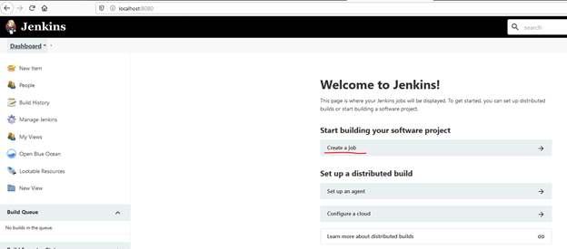
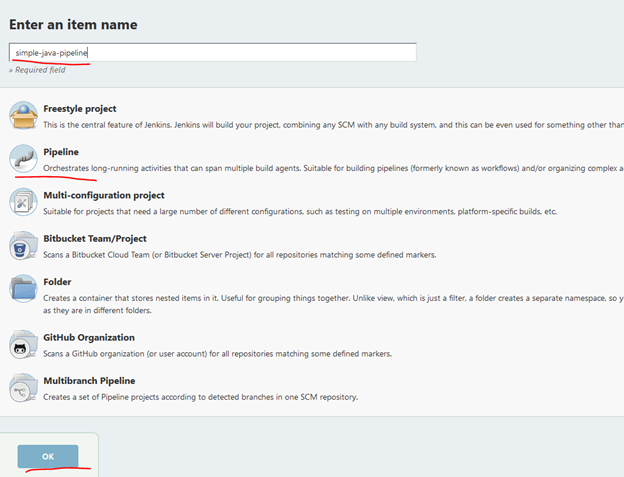
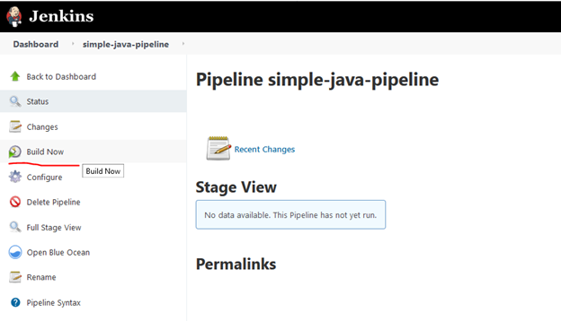
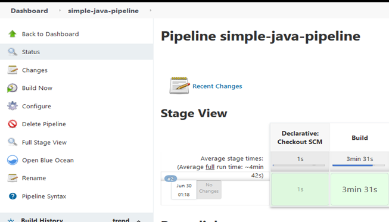
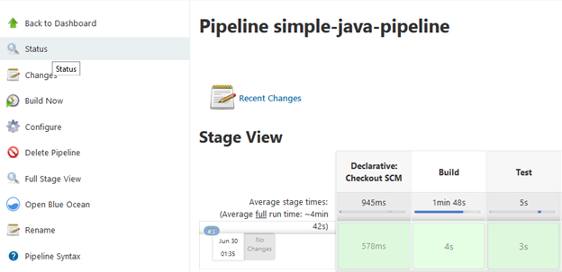

## Jenkins based CI/CD Pipeline

Jenkins is an open-source continuous integration server for orchestrating the CI/CD pipelines. It supports integration with several components, infrastructure such as git, cloud etc. that helps in complete software development life cycle.

In this hands-on lab, let us:
* Create a build pipeline (CI) for a simple java application.
* Adding Test stage to build pipeline

This hands-on is based on the Jenkins running on docker on your local workstation, designed for Windows OS. For Linux OS, please follow the [demo](https://www.jenkins.io/doc/tutorials/build-a-java-app-with-maven/)

**Note:** The hands-on lab is designed with Jenkins on the docker. However, the steps are applicable for the direct docker installation on your windows workstation as well.

### Installing Git, Docker and Jenkins:
* Install git command line tool on your workstation. (Follow [this](https://suwebdev.github.io/wats-lab-faq/first-question.html#download-and-install-git) to install Git Locally·) 
* Docker Desktop for windows is installed on the workstation. Follow the [instructions](https://docs.docker.com/docker-for-windows/install/#install-docker-desktop-on-windows) to install docker. 
* Ensure that your Docker for Windows installation is configured to run Linux Containers rather than Windows Containers. See the Docker documentation for instructions to switch to Linux containers.
* [Refer](https://www.jenkins.io/doc/tutorials/build-a-java-app-with-maven/#on-windows) this to run and setup the Jenkins on docker.
* Configure Jenkins with initial steps such as create an admin user etc. Follow Setup wizard.
* If you have installed the Jenkins on your local workstation, make sure the maven tool is installed. Follow [this](https://maven.apache.org/install.html) to installl maven.

### Forking Sample java application:

For this hands-on, let us fork a simple java application from the GitHub [simple-java-maven-app](https://github.com/jenkins-docs/simple-java-maven-app).
1.	Sign up for the GitHub account [Join GitHub · GitHub](https://github.com/signup?source=login). Once signed up, proceed to [login](https://github.com/login).
2.	Open the simple-java-maven-app by clicking on this [link](https://github.com/jenkins-docs/simple-java-maven-app) 
3.	On the top right corner, click on the ‘Fork’ to create a copy of the project to your GitHub account. (Refer [Fork A Repo](https://help.github.com/articles/fork-a-repo/))
4.	Once forked, clone this repository to your local workstation. 

### Create Jenkins Project:

1.	Login to the Jenkins portal at [http://localhost:8080](http://localhost:8080) using the admin account created earlier during Jenkins’s setup.
2.	On your first login, the following screen will appear. Click on “**Create a Job**”.



*Fig 4: Jenkins - Create a Job*

3.	On the next screen, type *simple-java-pipeline* in the **Enter an Item Name** field. Select *Pipeline* from the list of items and click *OK*.



*Fig 5: Jenkins - Create Pipeline*

4.	Click the **Pipeline** tab at the top of the page to scroll down to the *Pipeline* section.
5.	From the **Definition** field, choose the *Pipeline script from SCM* option. This option instructs Jenkins to obtain your Pipeline from Source Control Management (SCM), which will be your locally cloned Git repository.
6.	From the **SCM** field, choose *Git*.
7.	In the **Repository URL** field, specify the directory path of your locally cloned repository from the [Forking Sample Java application](#forking-sample-java-application:) section above.

Screen looks like below after entering the details.


*Fig 6: Jenkins - Pipeline Configuration*

### Create Build pipeline using the Jenkinsfile:

**Jenkinsfile** is a script file containing the pipeline configuration and the stages and other instructions to Jenkins to create a pipeline from the file. This file will be saved at the root of the code repository.
1.	Using your favorite text editor or IDE, create and save a new text file with the name *Jenkinsfile* at the root of your local *simple-java-maven-app* Git repository.
2.	Copy the following declarative pipeline code and paste it into the empty *Jenkinsfile*. 

```
pipeline {
    agent {
        docker {
            image 'maven:3.8.1-adoptopenjdk-11' 
            args '-v /root/.m2:/root/.m2' 
        }
    }
    stages {
        stage('Build') { 
            steps {
                sh 'mvn -B -DskipTests clean package' 
            }
        }
    }
}
```
**Note:** If you are running Jenkins on your local workstation without the docker, please change the agent to **any** as shown below so that it runs on the localhost. Please ensure that the maven tool is installed on your local workstation.

```
pipeline {
    agent any
    
    stages {
        stage('Build') { 
            steps {
                sh 'mvn -B -DskipTests clean package' 
            }
        }
    }
}
```

In the above Jenkinsfile: 
* We specified an agent where the pipeline should run. 'docker’ in the agent section indicates to run a new docker container with the specified image.
* In the stages section, we can define multiple steps as different stages. Here, we have a stage called ‘Build’, with the maven command for building the java application.

3.	Save your Jenkinsfile and commit and push to your forked repository. Run the following commands from the command prompt.
```
cd <your local simple-java-maven-app repo cloned folder>
git add .
git commit -m "Add initial Jenkinsfile"
git push origin master
```

4.	Go to Jenkins portal on your browser and click on the **Dashboard**. Open the [simple-java-pipeline](http://localhost:8080/job/simple-java-pipeline/) and from the left-menu, click on **Build Now**.



*Fig 7: Jenkins - Building the Pipeline*

5.	Notice the build running under the **Build History** menu. Click on the *build number* and it shows the stages.



*Fig 8: Jenkins - View Running Builds*

6.	We have successfully created a build pipeline with single stage and ran it. We can check the logs by clicking on the **Console Output** menu.

### Additional stages in the build pipeline:

In the previous section, we have created the pipeline with a single stage. Typically, your CI pipeline contains multiple stages such as Build, Test and other optional stages such Code scanning etc. In this section, let us add a Test stage to the build pipeline and run.

1.	Go back to your text editor/IDE and open Jenkinsfile and the Test stage shown below.

```
stage('Test') {
            steps {
                sh 'mvn test'
            }
            post {
                always {
                    junit 'target/surefire-reports/*.xml'
                }
            }
        }
```

The Jenkinsfile looks like below after adding the Test stage.

```
pipeline {
    agent {
        docker {
            image 'maven:3.8.1-adoptopenjdk-11' 
            args '-v /root/.m2:/root/.m2' 
        }
    }
    stages {
        stage('Build') { 
            steps {
                sh 'mvn -B -DskipTests clean package' 
            }
        }
        stage('Test') {
            steps {
                sh 'mvn test'
            }
            post {
                always {
                    junit 'target/surefire-reports/*.xml'
                }
            }
        }
    }
}
```

* Here the stage ‘Test’ is added which runs the maven command test.
* The **post -> always** section ensures that this step is executed always after the steps are completed. The test report is available through Jenkins’s interface.

**Note:** If you are running Jenkins on your local workstation without the docker, please change the agent to **any** so that it runs on the localhost. Please ensure that the maven tool is installed on your local workstation.

```
pipeline {
    agent any
    
    stages {…

    }
}
```
2.	Save your Jenkinsfile and commit and push to your forked repository. Run the following commands from the command prompt.

```
cd <your local simple-java-maven-app repo cloned folder>
git add .
git commit -m "Test stage is added to Jenkinsfile"
git push origin master
```
3.	Go to Jenkins portal on your browser and click on the **Dashboard**. Open the *simple-java-pipeline* and from the left-menu, click on Build Now.
4.	Notice the Build and Test stages are showing in the Build screen. 



*Fig 9: Jenkins - Viewing the Running Builds with Test stage Included*

We have now successfully created CI pipeline with two stages: Build and Test stages.