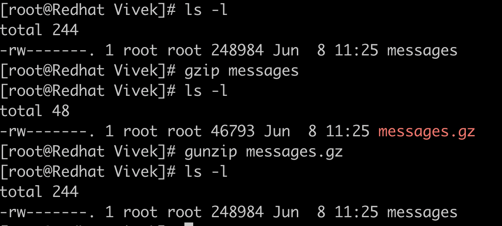
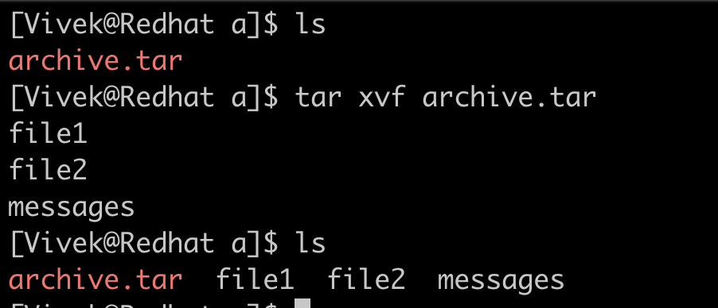

# Archiving and Backup

## Introduction
One of the things SREs make sure of is the services are up all the time (at least 99.99% of the time), but the amount of data generated at each server running those services are immense. This data could be logs, user data in the database, or any other kind of metadata. Hence we need to compress, archive, rotate, and Backup the data in a timely manner for data safety and to make sure we don’t run out of space.

## Archiving

We usually archive the data that are no longer needed but are kept mostly for compliance purposes. This helps in storing the data into compressed format saving a lot of space. Below section is to familiarize with the archiving tools and commands.

## gzip

gzip is a program used to [<u>compress</u>](https://en.wikipedia.org/wiki/Data_compression) one or more files, it replaces the original file with a compressed version of the original file.

Here we can see that the *messages* log file is compressed to almost one-fifth of the original size and replaced with messages.gz. We can uncompress this file using [*<u>gunzip</u>*](https://linux.die.net/man/1/gunzip) command.

## tar

*tar* program is a tool for archiving files and directories into a single file (often called tarball). This tool is usually used to prepare archives of files before it is transferred to a long term backup server. *tar* doesn’t replace the existing files and folders but creates a new file with extension *.tar* . It provides lot of flag to choose from for archiving

| Flags  | Description |
| --- | --- |
| -c  | Creates archive |
| -x  | Extracts the archive |
| -f  | Creates archive with the given filename |
| -t  | Displays or lists files in archived file |
| -u  | Archives and adds to an existing archive file |
| -v  | Displays verbose information |
| -A  | Concatenates the archived file |
| -z  | Compresses the tar file using gzip |
| -j  | Compresses the tar file using bzip2 |
| -W  | Verifies an archive file |
| -r  | Updates or adds file or directory in already existing .tar file |

### Create an archive with files and folder

Flag `c` is used for creating the archive where `f` is the filename.

### Listing files in the archive

We can use flag `t` for listing out what an archive contains.

### Extract files from the archive

We can use flag `x` to unarchive the archive.

## Backup

Backup is a process of copying/duplicating the existing data, This backup can be used to restore the dataset in case of data loss. Data backup also becomes critical when the data is not needed in a day to day job but can be referred to as a source of truth and for compliance reasons in future. Different types of backup are :

### Incremental backup

Incremental backup is the backup of data since the last backup, this reduces data redundancy and storage efficiency.

### Differential backup

Sometimes our data keeps on modifying/updating. In that case we take backup of changes that occurred since the last backup called differential backup.

### Network backup

Network backup refers to sending out data over the network from the source to a backup destination in a client-server model. This backup destination can be centralized or decentralized. Decentralized backups are useful for disaster recovery scenarios.

`rsync` is one of the linux command which sync up file from one server to the destination server over the network.

The syntax for *rsync* goes like `rsync \[options\] <source> <destination>`. We can locate the file on the path specified after `:` (colon) in the “*destination”*. If nothing is specified the default path is the home directory of the user used for backup. `/home/azureuser` in this case. You can always look for different options for rsync using the `man rsync` command.

### Cloud Backup

There are various third parties which provide the backup of data to the cloud. These cloud backups are much more reliable than stored backups on local machines or any server without RAID configuration as these providers manage redundancy of data, data recovery along with the data security. Two most widely used cloud backup options are Azure backup (from Microsoft) and Amazon Glacier backup (from AWS).

