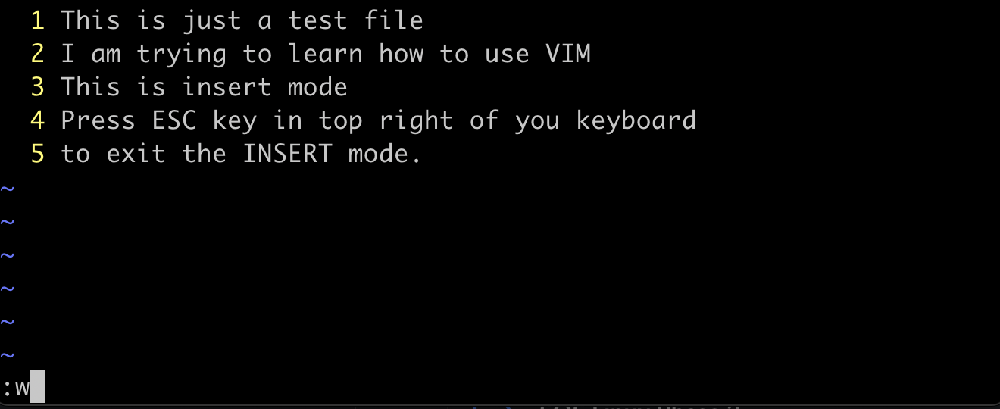

# Introduction to Vim

## Introduction
As an SRE we several times log into into the servers and make changes to the config file, edit and modify scripts and the editor which comes handy and available in almost all linux distribution is Vim. Vim is an open-source and free command line editor, widely accepted and used. We will see some basics of how to use vim for creating and editing files. This knowledge will help us in understanding the next section, Scripting.

## Opening a file and using insert mode

We use the command *`vim filename`* to open a file *`filename`*. The terminal will open an editor but once you start writing, it won’t work. It’s because we are not in "INSERT" mode in vim.

Press ***`i`*** and get into insert mode and start writing.

You will see on the bottom left “INSERT” after pressing “***i***” . You can use *`ESC`” key to get back to normal mode.

## Saving a file

After you insert your text in INSERT mode press ESC(escape) key on your keyboard to get out of it. Press `:`(colon shift +;) and press ***`w`*** and hit enter, the text you entered will get written in the file.

## Exiting the VIM editor

Exiting vim can get real challenging for the beginners. There are various ways you can exit the Vim like exit without saving the work, exit with saving the work.

Try below commands after exiting insert mode and pressing ***`:`***(colon).

| Vim Commands | Description |
| --- | --- |
| **:q** | Exit the file but won’t exit if file has unsaved changes |
| **:wq** | Write(save) and exit the file. |
| **:q!** | Exit without saving the changes. |

This is basic we would be needing in bash scripting in the next section. You can always visit tutorial for learning more. For quick practice of vim commands visit: [<u>https://www.openvim.com/</u>](https://www.openvim.com/)

