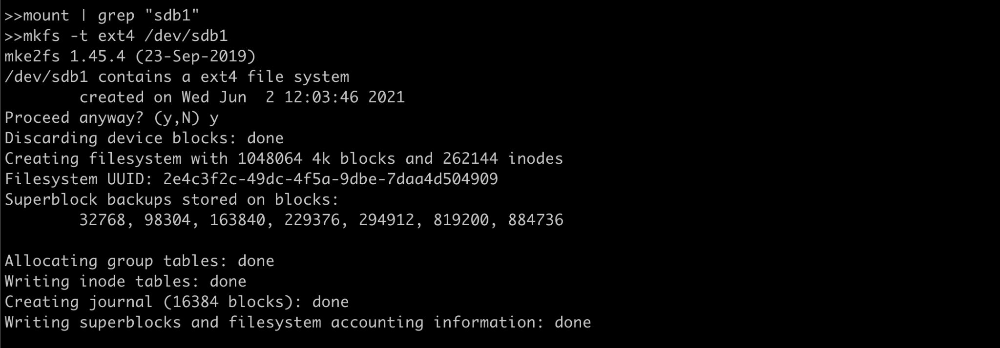
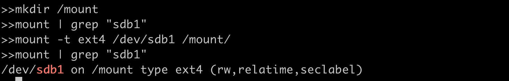
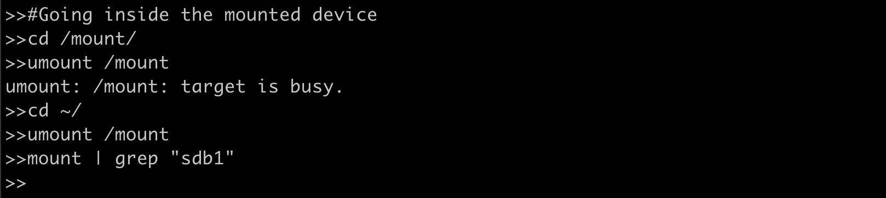
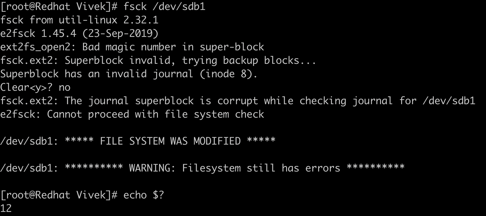
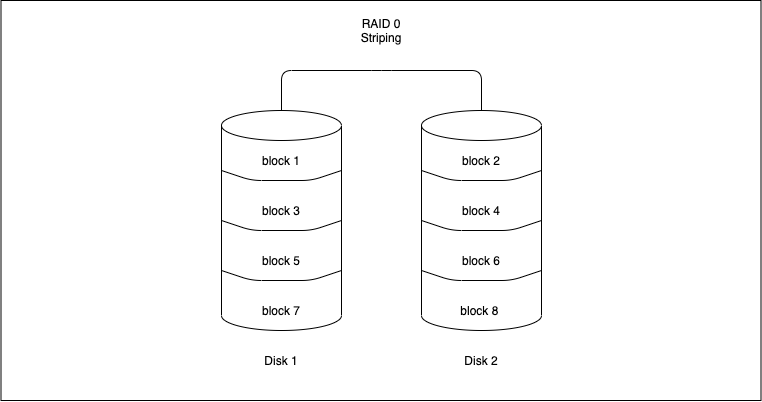
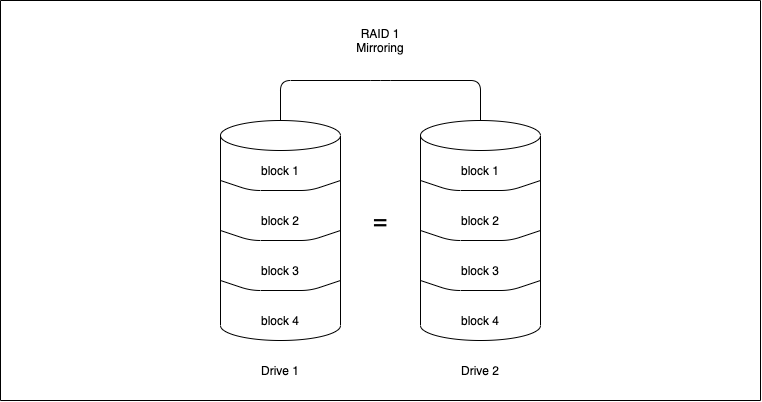
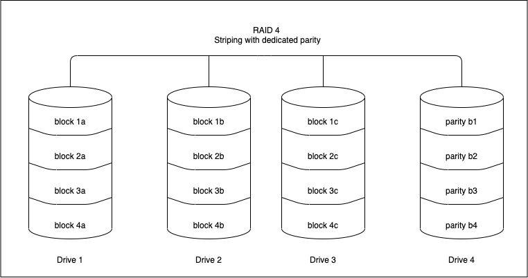
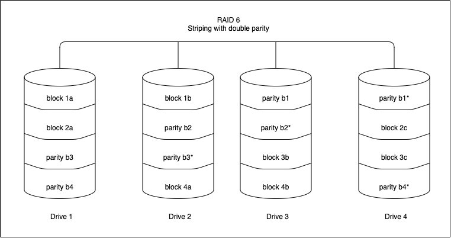
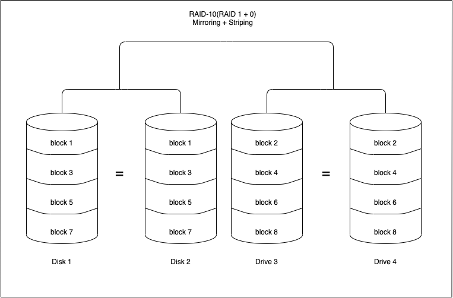

# Storage Media
## Introduction

Storage media are devices which are used to store data and information. Linux has amazing capabilities when it comes to handling external devices including storage devices. There are many kinds of storage devices physical storage devices like hard drives, virtual storage devices like RAID or LVM, network storage and so on.

In this section we will learn to work with any storage device and configure it to our needs.

## Listing the mounted storage devices:

We can use command **`mount`** to list all the storage devices mounted to your computer.


The format in which we see above output is:

*`device`* on *`mount_point`* type *`file\_system\_type (options)`*

For example in the first line the device virtual *sysfs* is mounted at */sys* path and has a *sysfs* file system. Now let’s see what and how a filesystem is created.

## Creating a FileSystem

Imagine a disk where all the data stored in the disk is in the form of one large chunk, there is nothing to figure out where one piece of data starts and ends, which piece of data is located at which place of the whole chunk of data and hence the File System comes into picture. File System(fs) is responsible for data storage, indexing and retrieval on any storage device.

Below are the most popularly used file systems:

| FS Type | Description |
| --- | --- |
| FAT | File Allocation Table, initially used on DOS and Microsoft Windows and now widely used for portable USB storage |
| NTFS | (New Technology File System) Used on Microsoft’s Windows based operating systems |
| ext | Extended file system, designed for Linux systems. |
| ext4 | Fourth extended filesystem, is a journaled file system that is commonly used by the Linux kernel. |
| HFS | Hierarchical File System, in use until HFS+ was introduced on Mac OS 8.1. |
| HFS+ | Supports file system journaling, enabling recovery of data after a system crash. |
| NFS | Network File System originally from Sun Microsystems is the standard in UNIX-based networks. |

We will try to create an *ext4* file system which is linux native fs using [*<u>mkfs</u>*](https://man7.org/linux/man-pages/man8/mkfs.8.html).

**Discalimer: Run this command on empty disk as this will wipe out the existing data.**



Here the device */dev/sdb1* is formatted and it’s filesystem is changed to *ext4*.

## Mounting the device:

In Linux systems all files are arranged in a tree structure with (/) as root. Mounting a fs simply means making that fs accessible to a certain point in the Linux directory tree.

We need a mount point(location) where we want to mount the above formatted device.



We created a mount point */mount* and used the *[<u>mount</u>](https://man7.org/linux/man-pages/man8/mount.8.html)* command to attach the filesystem. Here *-t* flag specifies what is the fs type and after that the */dev/sdb1* (device name) and /mount (mount point we created earlier).

## Unmounting the device:

Now let’s see how we can unmount the device, which is equally important if we have removable storage media and want to mount on another host. We use [***<u>umount</u>***](https://man7.org/linux/man-pages/man8/umount.8.html) for unmounting the device.



Our first attempt did not unmount the /sdb1 because we were inside the storage device and it was being used. Once we jumped back to the home directory we were successfully able to unmount the device.

## Making it easier with /etc/fstab file?

In our production environment, we can have servers with many storage devices that need to be mounted, and it is not feasible to mount each device using the command every time we reboot the system. To ease this burden, we can make use of configuration table called “fstab” usually found in ***`/etc/fstab`*** on Linux systems.


Here on the first line we have */dev/mapper/rootvg-rootlv (storage device*) mounted on */ (root mount point) which has the xfs filesystem type* followed by options.

We can run *`mount -a`* to reload this file after making changes.

## Checking and Repairing FS

Filesystems encounter issues in case of any hardware failure, power failure and sometimes due to improper shutdown. Linux usually checks and repairs the corrupted disk if any during startup. We can also manually check for filesystem corruption using the command [***<u>fsck</u>***](https://man7.org/linux/man-pages/man8/fsck.8.html).



We can repair the same filesystem using *`fsck -y /dev/sdb1`*.

There are error codes attached to each kind of file system error ,and A sum of active errors is returned.

| Error Codes | Description |
| --- | --- |
| 0   | No errors |
| 1   | Filesystem errors corrected |
| 2   | System should be rebooted |
| 4   | Filesystem errors left uncorrected |
| 8   | Operational error |
| 16  | Usage or syntax error |
| 32  | Checking canceled by user request |
| 128 | Shared-library error |

In the above fs check we got return code as 12 which is the sum of error code 8(operational error) and 4(uncorrected FS error).

## RAID

RAID or “Redundant Arrays of Independent Disks” is a technique that distributes I/O across multiple disks to achieve increased performance and data redundancy. RAID has the ability to increase overall disk performance and survive disk failures. Software RAID uses the computer’s CPU to carry out RAID operations whereas hardware RAID uses specialized processors, on disk controllers, to manage the disks. Three essential features of RAID are mirroring, striping and parity.

## RAID levels

The below section discusses the RAID levels that are commonly used. For information on all RAID levels, please refer to [<u>here</u>](https://en.wikipedia.org/wiki/RAID) .

### RAID 0 (Striping)

Striping is the method by which data is split up into “blocks” and written across all the disks present in the array. By spreading data across multiple drives, it means multiple disks can access the file, resulting in faster read/write speeds. The first disk in the array is not reused until an equal amount of data is written to each of the other disks in the array.



Advantages

- It can be easily implemented.
    
- Bottlenecks caused due to I/O operations from the same disk are avoided, increasing the performance of such operations.
    

Disadvantages

- It does not offer any kind of redundancy. If any one of the disks fails, then the data of the entire disk is lost and cannot be recovered.

Use cases

RAID 0 can be used for systems with non-critical data that has to be read at high speed, such as a video/audio editing station or gaming environments.

### RAID 1(Mirroring)

Mirroring writes a copy of data to each disk which is part of the array. This means that the data is written as many times as disks in the array . It stores an exact replica of all data on a separate disk or disks. As expected, this would result in a slow write performance compared to that of a single disk. On the other hand, read operations can be done parallelly improving read performance.



Advantages

- RAID 1 offers a better read performance than RAID 0 or single disk.
    
- It can survive multiple disk failures without the need for special data recovery algorithms
    

Disadvantages

- It is costly since the effective storage capacity is only half of the number of disks due to replication of data.

Use cases

Applications that require low downtime but can have a slight hit on write performance.

### RAID 4(Striping with dedicated parity)

RAID 4 works uses block-level striping (data can be striped in blocks of a variety of sizes depending on the applications and data to be stored) and a dedicated drive used to store parity information.The parity information is generated by an algorithm every time data is written to an array disk. The use of a parity bit is a way of adding checksums into data that can enable the target device to determine whether the data has been received correctly. In the event of a drive failure , the algorithm can be reversed and missing data can be generated based on the remaining data and parity information.



Advantages

- Each drive in a RAID 4 array operates independently so I/O requests take place in parallel, speeding up performance over previous RAID levels.
    
- It can survive multiple disk failures without the need for special data recovery algorithms
    

Disadvantages

- A minimum of 3 disks is required for setup.
    
- It needs hardware support for parity calculation.
    
- Write speeds are slow since parity relies on a single disk drive and carry out modifications of parity blocks for each I/O session.
    

Use cases

Operations dealing with really large files – when sequential read and write data process is used

### RAID 5(Striping with distributed parity)

RAID 5 is similar to RAID 4, except that the parity information is spread across all drives in the array. This helps reduce the bottleneck inherent in writing parity information to a single drive during each write operation. RAID 5 is the most common secure RAID level.


Advantages

- Read data transactions are fast as compared to write data transactions that are somewhat slow due to the calculation of parity.
    
- Data remains accessible even after drive failure and during replacement of a failed hard drive because the storage controller rebuilds the data on the new drive.
    

Disadvantages

- RAID 5 requires a minimum of 3 drives and can work up to a maximum of 16 drives
    
- It needs hardware support for parity calculation.
    
- More than two drive failures can cause data loss.
    

Use cases

File storage and application servers, such as email, general storage servers, etc.

### RAID 6(Striping with double parity)

RAID 6 is similar to RAID 5 with an added advantage of double distributed parity, which provides fault tolerance up to two failed drives.



Advantages

- Read data transactions are fast.
    
- This provides a fault tolerance up to 2 failed drives.
    
- RAID 6 is more resilient than RAID 5.
    

Disadvantages

- Write data transactions are slow due to double parity.
    
- Rebuilding the RAID array takes a longer time because of complex structure.
    

Use cases

Office automation, online customer service, and applications that require very high availability.

### RAID 10(RAID 1+0 : Mirroring and Striping)

RAID 10 is a combination of RAID 0 and RAID 1. It means that both mirroring and striping in one single RAID array.



Advantages

- Rebuilding the RAID array is fast.
    
- Read and write operations performance are good.
    

Disadvantages

- Just like RAID 1, only half the drive capacity is available.
    
- It can be expensive to implement RAID 10.
    

Use cases

Transactional databases with sensitive information that require high performance and high data security.

## Commands to monitor RAID

The command `cat /proc/mdstat` will give the status of a software RAID. Let us examine the output of the command:

```
Personalities : [raid1]

md0 : active raid1 sdb1[2] sda1[0]

10476544 blocks super 1.1 [2/2] [UU]

bitmap: 0/1 pages [0KB], 65536KB chunk

md1 : active raid1 sdb2[2] sda2[0]

10476544 blocks super 1.1 [2/2] [UU]

bitmap: 1/1 pages [4KB], 65536KB chunk

md2 : active raid1 sdb3[2]

41909248 blocks super 1.1 [2/1] [_U]

bitmap: 1/1 pages [4KB], 65536KB chunk
```

The “personalities” gives us the raid level that the raid is configured. In the above example, the raid is configured with `RAID 1. md0 : active raid1 sdb1[2] sda1[0]` tells us that there is an active raid of RAID 1 between sdb1(which is device 2) and sda1(which is device 0).An inactive array generally means that one of the disks are faulty. Md2 in the above example shows that we have `41909248 blocks super 1.1 [2/1] [_U]` , this means that one disk is down in this particular raid.

The command `mdadm --detail /dev/<raid-array>` gives detailed information about that particular array.
```
sudo mdadm --detail /dev/md0

/dev/md0:

Version : 1.1

Creation Time : Fri Nov 17 11:49:20 2019

Raid Level : raid1

Array Size : 10476544 (9.99 GiB 10.32 GB)

Used Dev Size : 10476544 (9.99 GiB 10.32 GB)

Raid Devices : 2

Total Devices : 2

Persistence : Superblock is persistent

Intent Bitmap : Internal

Update Time : Sun Dec 2 01:00:53 2019

State : clean

Active Devices : 2

Working Devices : 2

Failed Devices : 0

Spare Devices : 0

UUID : xxxxxxx:yyyyyy:zzzzzz:ffffff

Events : 987

Number Major Minor RaidDevice State

0 8 1 0 active sync /dev/sda1

1 8 49 1 active sync /dev/sdb1
```
Incase of a missing disk in the above example, the State of the raid would be ‘dirty’ and Active Devices and Working Devices would be reduced to one. One of the entries(either /dev/sda1 or /dev/sdb1 depending on the missing disk) would have their RaidDevice changed to faulty.

## LVM

LVM stands for Logical Volume Management. In the above section we saw how we can create FS and use individual disks according to our need the traditional way but using LVM we can achieve more flexibility in storage allocation like we can stitch three 2TB disks to make one single partition of 6TB, or we can attach another physical disk of 4TB to the server and add that disk to the logical volume group to make it 10TB in total.

Refer to know more about LVM: [<u>https://www.redhat.com/sysadmin/lvm-vs-partitioning</u>](https://www.redhat.com/sysadmin/lvm-vs-partitioning)

