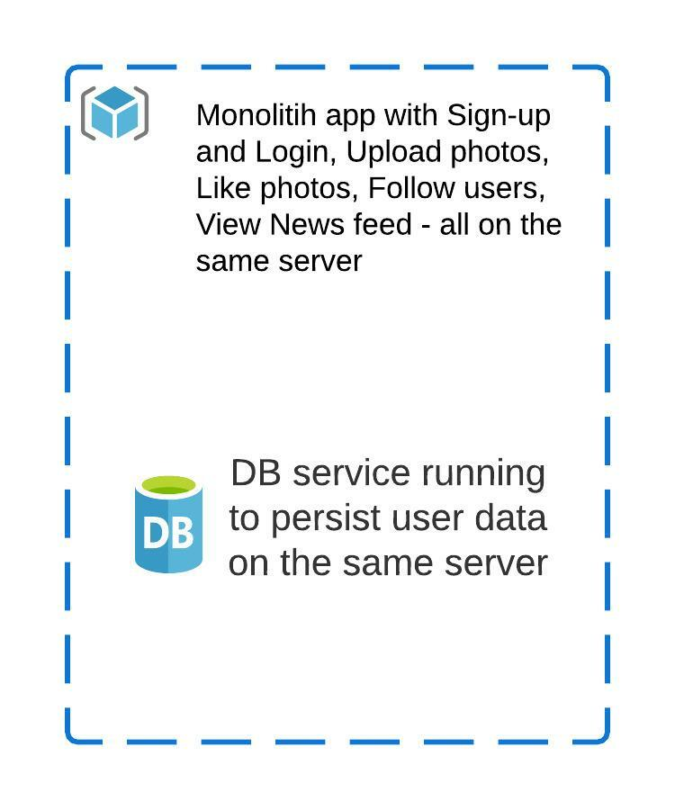

# System Design

## Prerequisites

- [School of SRE - System Design - Phase I](https://linkedin.github.io/school-of-sre/level101/systems_design/intro/)

## What to expect from this course 

 The aim is to empower the reader to understand the building blocks of a well-designed system, evaluate existing systems, understand the trade-offs, come up with their own design, and to explore the various tools available to implement such a system. In phase one of this module, we talked about the fundamentals of system design including concepts like scalability, availability and reliability. We continue to build on those fundamentals in this phase.

 Throughout the course, there are callout sections that appear like
 this, and talk about things that are closely related to the system
 design process, but don’t form a part of the system itself. They also have information about some common issues that crop up in system design. Watch out for them.

## What is not covered under this course 

While this course covers many aspects of system design, it does not
cover the most fundamental concepts. For such topics, it is advised to
go through the prerequisites.

In general, this module will not go into actually implementing the architecture - we will not talk about choosing a hosting/cloud provider or an orchestration setup or a CI/CD
system. Instead, we try to focus on the fundamental considerations that need to go into system design.

## Course Contents

- [Introduction](https://linkedin.github.io/school-of-sre/level102/system_design/intro/)
- [Large system Design](https://linkedin.github.io/school-of-sre/level102/system_design/large-system-design/)
- [Scaling](https://linkedin.github.io/school-of-sre/level102/system_design/scaling/)
- [Scaling beyond the datacentre](https://linkedin.github.io/school-of-sre/level102/system_design/scaling-beyond-the-datacenter/)
- [Design patterns for resiliency](https://linkedin.github.io/school-of-sre/level102/system_design/resiliency/)
- [Conclusion](https://linkedin.github.io/school-of-sre/level102/system_design/conclusion/)

## Introduction

We talked about building a basic photo sharing application in the previous phase of this course. Our basic requirements for the application were that

1.  It should work for a reasonably large number of users
2.  Avoid service failures/cluster crash in case of any issues

In other words, we wanted to build a system that was available, scalable and fault tolerant. We will continue designing that application, and cover additional concepts in the course of doing so.

The photo sharing application is a web application that will handle everything from user sign up, log in, uploads, feed generation, user interaction and interaction with uploaded content. Also a database to store this information. In the simplest design, both the web app and the database can run on the same server. Recall this initial design from Phase 1.

Building on that, we will talk about performance elements in system design - setting the right performance measurement metrics and using them to drive our design decisions, improving performance using caching, Content Delivery Networks (CDNs), etc. We will also talk about how to design for resilience by looking at some system design patterns -
graceful degradation, time-outs and circuit breakers.

<h4>Cost</h4>
System design considerations like availability, scalability cannot exist in isolation. When operating outside the lab, we have other considerations / the existing considerations take on a different hue. One such consideration is cost. Real world systems almost always have budget constraints. System design, implementation and continued operation needs to have predictable costs per unit output. The output is usually the business problem you are trying to solve. Striking a balance between the two is very important.

<h4> Understanding the capabilities of your system </h4>
A well designed system requires understanding the building blocks intimately in terms of their capabilities. Not all components are created equal, and understanding what a single component can do is very important - for e.g., in the photo upload application it is important to know what a single database instance is capable of, in terms of read or write transactions per second and what would be a reasonable expectation be. This helps in building systems that are appropriately weighted - and will eliminate obvious sources of bottlenecks.
 
 
On a lower level, even understanding the capabilities of the underlying hardware (or a VM instance if you are on cloud) is important. For eg., all disks don’t perform the same, and all disks don’t perform the same per dollar. If we are planning to have an API that is expected to return a response in 100ms under normal circumstances, then it is important to know how much of it will be spent in which parts of the system. The following link will help in getting a sense of each component’s performance, all the way from the CPU cache to the network link to our end user.
 
 
<a href="https://colin-scott.github.io/personal_website/research/interactive_latency.html">Numbers every programmer should know</a>

