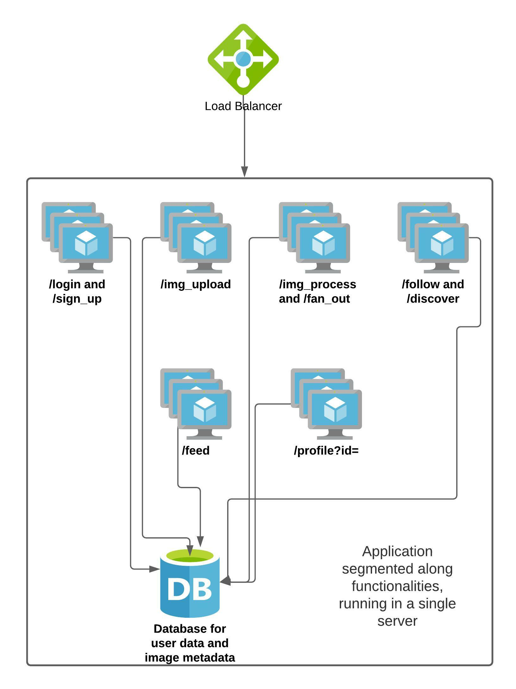

Designing a system usually starts out to be abstract - we have large functional blocks that need to work together and are abstracted away into frontend, backend and database layers. However, when it is time to implement the system, especially as an SRE we have no other choice but to think in specific terms. Servers have a fixed amount of memory, storage capacity and processing power. So we need to think about the realistic expectations from our system, assess the requirements, translate them into specific requirements from each component of the system like network, storage and compute. This is typically how almost
all large scale systems are built. The folks over at Google have formalized this approach to designing systems as ‘Non abstract large system design’ (NALSD). According to the Google site reliability workbook,
> “Practically, NALSD combines elements of capacity planning, component isolation, and graceful system degradation that are crucial to highly available production systems.” 

We will be using an approach similar to this to build our system.

## Application requirements

Let us define our application requirements in more concrete terms i.e.,
specific functions:

Our photo sharing application must let the user

-   Sign up to become a member, and login to the application

-   Upload photographs, and optionally add a description and tag location and/or people

-   Follow other users on the platform

-   See a feed comprising of photos from other users that they follow

-   View their own profile page, and manage who they follow

Let us define expectations for the application’s performance for a
better user experience. We also need to define the health of the system.
SLIs and SLOs help us do just that.

## SLIs and SLOs

The Google SRE book defines service level indicator(SLI) as “a carefully
defined quantitative measure of some aspect of the level of service that
is provided.” For our application, we can define multiple SLIs. One
indicator can be the response time for loading the feed for our photo
sharing application. Picking the right set of SLIs is very important
since they essentially help us define the health of the system as a
whole using concrete data. SLIs for an application are defined by the
owners of the service, in consultation with the SREs.

Service level objective (SLO) is defined as “a target value or range of
values for a service level that is measured by an SLI”. SLO is a way for
us to anchor ourselves to an optimal user experience by defining SLI
boundaries. If our application takes a long time to load the feed, users
might not open it very often. As a result, an example of SLO can be that
at least 99% of the users should see their feed loaded within 1 second.

Now that we have defined SLIs and SLOs, let us define the application’s
scalability, reliability and performance characteristics in terms of
specific SLI and SLO levels.

## Defining application requirements in terms of SLIs and SLOs

The following can be some of the expectations for our application:

-   Once the user successfully uploads the image, it should be accessible to the user and their followers 100% of the time, barring user elected deletion.

-   At least 50000 unique visitors should be able to visit the site at any given time and view their feed.

-   99% of the users should be able to view their feeds in less than 1 second.

-   Upon uploading a new image, it should show up in the feed of the user’s followers within 15 minutes.

-   Users should be able to upload potentially thousands of images. (as long as they are not abusing the service)

Since our ultimate aim is to learn system design, we will arbitrarily limit the functionalities of the system. This will help us keep sight of our aim, and keep us focussed.

Having defined the functionalities and expectations for our system, let us quickly sketch an initial design.



As of now, all the functionalities are residing on a single server,
which has endpoints for all of these functions. We will attempt to build
a system that satisfies our SLOs, is able to serve 50k concurrent users,
and about a million total users. In the course of this attempt, we will
discuss a string of concepts, some of which we have already seen in
Phase 1 of this course.

<div class="callout callout-danger">
<h4>Caution</h4>
Note that the numbers we have picked in the following sections are completely arbitrary. They have been chosen to demonstrate thinking about system design in a non-abstract manner. They have not been benchmarked, and bear no real world resemblance. Do not use them in any real world systems that you may be designing. You should come up with your own numbers, using the guiding principles we have relied upon here.
</div>

## Estimating resource requirements

**Single Computer**

If we wished to run the application on a single server, we would need to
perform all the above functionalities from the diagram on this server
itself. Let us perform some calculations to figure out what kind of
resources we will need.

Before anything else, we need to store the data about users, their
uploads, follower information and any other metadata. We will choose a
relational DB to store this information, like MySQL. Do note that we can also choose to use a NOSQL solution here. That would require a similar approach to calculate the requirements. Let us represent the users like so:
```
UserID(int)
UserName(varchar)
DisplayName(varchar)
YearOfBirth(year)
Email(varchar)
```
Photos can be represented like this:

```
PhotoID(int)
PhotoHash(varchar)
Uploadtime(datetime)
Location(varchar)
OptionalFlag(varchar)
```

Followers can be represented like this:

```
Follower(int)
Followee(int)
```

Let us quickly estimate the storage needed for a hundred million total
users. A single user would need 4B + 32B + 32B + 4B + 32B = 104 bytes. A
hundred million users would need 10.4 GB storage. A single photo would
need about 4B + 20B + 4B + 32B + 4B = 64 bytes of storage to store the metadata related to the photo. Assuming a
million photos uploaded in one day, we would need about 64 MB of storage
per day, just for the metadata. For the photo storage itself, we will need about 300GB per day,
assuming 300KB average photo size.

A single visitor opening our application simply hits our /get_feed
endpoint upon logging in to the application. Let us quickly calculate
the resources needed to serve this request. Assuming the initial feed
loads 5 images (of 300 KB size on an average) and then does lazy loading
to infinitely scroll, we will need to send about 1.5 megabytes of images
to the user for his initial call. With a 1000 Mbps\* network link to the
server, we can send only about (1000/8)/1.5 or about 83 users all
loading the feed at the same time, before we saturate the network link.
If we needed to serve 50k concurrent users every second, we would need
1.5\*50000\*8 = 600000 Mbps network throughput needed for every 5 images
sent, assuming we send out all 5 images in a single second. If we are
reading all of it from disk, we would likely hit disk throughput limits
far before approaching anywhere near this amount of traffic.

So in order to meet our application requirements, we would need a server
that has ~310GB storage for the database and the images of one day, and
about 600 Gbps link to serve 50k users concurrently, along with CPU
required to perform all this. Clearly not the task for a single server.

And do note that we have severely limited the information we are storing
in the database. We would likely need an order of magnitude more
information to be stored.

While we clearly do not have any real world server that has the
resources we calculated above, this exercise provides us some valuable
data points about what the resource cost is. Armed with this
information, let us work on scaling our system through system design to
get us as close as possible to our goals for the application.

\* Modern servers even have multi-gigabit links, but it is highly
unlikely that such a huge server will be serving our application alone.
Modern cloud providers have VMs that also boast several gigabits of
bandwidth, but they usually end up being throttled after certain limits.


## References:
1. [SQL vs NoSQL databases](https://www.mongodb.com/nosql-explained/nosql-vs-sql) 
2. [Introducing Non-Abstract Large System Design](https://sre.google/workbook/non-abstract-design/)
