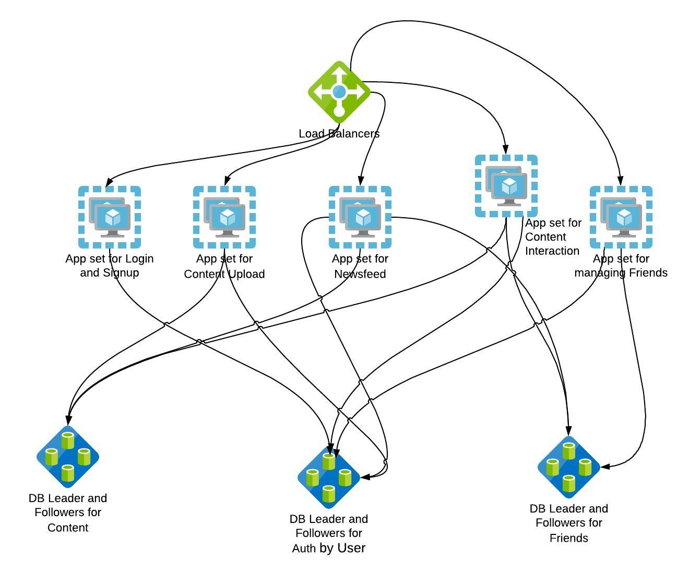

In the Phase 1 of this course, we had seen AKF [scale cube](https://akfpartners.com/growth-blog/scale-cube) and how it can help in segmenting services, defining microservices and scaling the overall application. We will use a similar strategy to scale our application - while using the estimates from the previous section, so that we can have a data driven design rather than arbitrarily choosing scaling patterns.

## Splitting the application

Considering the huge volume of traffic that might be generated by our application, and the related resource requirements in terms of memory and CPU, let us split the application into smaller chunks. One of the simplest ways to do this would be to simply divide the application along the endpoints, and spin them up as separate instances. In reality, this decision would probably be a little more complicated, and you might end up having multiple endpoints running from the same instance.

The images can be stored in an [object store](https://en.wikipedia.org/wiki/Object_storage) that can be scaled independently, rather than locating it on the servers where the application or the database resides. This would reduce the resource requirements for the servers.

## Stateful vs Stateless services

A stateless process or service doesn’t rely on stored data of it’s past invocations. A stateful service on the other hand stores its state in a datastore, and typically uses the state on every call or transaction. In some cases, there are options for us to design services in such a way that certain components can be made stateless and this helps in multiple ways. Applications can be containerized easily if they are stateless. Containerized applications are also easier to scale. Stateful services require you to scale the datastore
with the state as well. However, containerizing databases or scaling databases is out of the scope of this module.

<!--You are encouraged to refer to the containerisation module [here]()-->

The resulting design after such distribution of workloads might look
something like this.

You might notice that the diagram also has multiple databases. We will see more about this in the following sharding section.

Now that we have split the application into smaller services, we need to
look at scaling up the capacity of each of these endpoints. The popular
Pareto principle states that “80% of consequences come from 20% of the
causes”. Modifying it slightly, we can say that 80% of the traffic will
be for 20% of images. The no. of images uploaded vs the no. of images
seen by the user is going to be similarly skewed. An user is much more
likely to view images on a daily basis than they are to upload new ones.

In our simple design, generating the feed page with initial 5 images
will be a matter of choosing 5 recently uploaded images from fellow
users whom this user follows. While we can dynamically fetch the images
from the database and generate the page on the fly once the user logs
on, we might soon overwhelm the database in case a large number of users
choose to login at the same time and load their feeds. There are two
things we can do here, one is caching, and the other one is ahead of
time generation of user feeds.

An user with a million followers can potentially lead to hundreds of
thousands of calls to the DB, simply to fetch the latest photoID that
the user has uploaded. This can quickly overwhelm any DB, and can
potentially bring down the DB itself.

## Sharding

One way to solve the problem of DB limitation is scaling up the DB write
and reads. Sharding is one way to scale the DB writes, where the DB
would be split into parts that reside in different instances of the DB
running on separate machines. DB reads can be scaled up similarly by
using read replicas as we had seen in Phase 1 of this module.

Compared to the number of images the popular user uploads, the number of
views generated would be massive. In that case, we should cache the
photoIDs of the user’s uploads, to be returned without having to perform
a potentially expensive call to the DB.

Let us consider another endpoint in our application named
`/get_user_details`. It simply returns the page an user would see upon
clicking another user’s name. This endpoint will return a list of posts
that the user has created. Normally, a call to that endpoint will
involve the application talking to the DB, fetching a list of all the
posts by the user and returning the result. If someone’s profile is
viewed thousands of times that means there are thousands of calls to the
DB - which may result in issues like hot keys and hot partitions. As
with all other systems, an increase in load may result in worsening
response times, resulting in inconsistent and potentially bad user
experience. A simple solution here would be a cache layer - one that
would return the user’s profile with posts without having to call the DB everytime.

## Caching

A cache is used for the temporary storage of data that is likely to be
accessed again, often repetitively. When the data requested is found in
the cache, it is termed as a \`cache hit’. A ‘cache miss’ is the obvious
complement. A well positioned cache can greatly reduce the query
response time as well as improve the scalability of a system. Caches can
be placed at multiple levels between the user and the application. In
Phase 1, we saw how we could use caches / CDNs to service static
resources of the application, resulting in quicker response times as
well as lesser burden on the application servers. Let us look at more
situations where caching can play a role.

### In-memory caching:

In memory caching is when the information to be cached is kept in the
main memory of the server, allowing it to be retrieved much faster than
a DB residing on a disk. We cache arbitrary text (which can be HTML
fragments or may be JSON objects) and fetch it back really fast. An in
memory cache is the quickest way to add a layer of fast cache that can
optionally be persisted to disk as well.

While caching can aid significantly in scaling up and improving
performance, there are situations where cache is suddenly not in place.
It might be that the cache was accidentally wiped, leading to all the
queries falling through to the DB layer, often multiple calls for the
same piece of information. It is important to be aware of this potential
‘thundering herd’ problem and design your system accordingly.

**Caching proxies:**

There are cases where you may want to cache entire webpages / responses
of other upstream resources that you need to respond to requests. There
are also cases where you want to let your upstream tell you what to
cache and how long to cache it for. In such cases, it might be a good
idea to have a caching solution that understands Cache related HTTP
headers. One example for our usecase can be when users search for a
specific term in our application - if there is a frequent enough search
for a user or a term, it might be more efficient to cache the responses
for some duration rather than performing the search anew everytime.  
  
Let’s recap one of the goals - Atleast 50000 unique visitors should be
able to visit the site at any given time and view their feed. With the
implementation of caching, we have removed one potential bottleneck -
the DB. We also decomposed the monolith into smaller chunks that provide
individual services. Another step closer to our goal is to simply
horizontally scale the services needed for feed viewing and putting them
behind a load balancer. Please recall the scaling concepts discussed in
Phase 1 of this module.

## Cache managment

While caching sounds like a simple, easy solution for a hard problem, an
even harder problem is to manage the cache efficiently. Like most things
in your system, the cache layer is not infinite. Effective cache
management means removing things from the cache at the right time, to
ensure the cache hit rate remains high. There are many strategies to
invalidate cache after a certain time period or below certain usage
thresholds. It is important to keep an eye on cache-hit rate and fine
tune your caching strategy accordingly.

## References
1. There are many object storage solutions available.  [Minio](https://github.com/minio/minio) is one self hosted solution. There are also vendor-specific solutions for the cloud like [Azure Blob storage](https://docs.microsoft.com/en-us/azure/storage/blobs/storage-blobs-introduction) and [Amazon S3](https://docs.aws.amazon.com/AmazonS3/latest/userguide/Welcome.html).
2. Microservices architecture style - [Azure architecture guide](https://docs.microsoft.com/en-us/azure/architecture/guide/architecture-styles/microservices)
3. There are many in-memory caching solutions. Some of the most popular ones include [redis](https://redis.io) and [memcached](https://memcached.org). Cloud vendors also have their managed cache solutions. 
4. Some of the most popular proxies include [squid](https://www.squid-cache.org) and [Apache Traffic Server](https://trafficserver.apache.org)
5. Thundering herd problem - how instagram [tackled it](https://instagram-engineering.com/thundering-herds-promises-82191c8af57d).