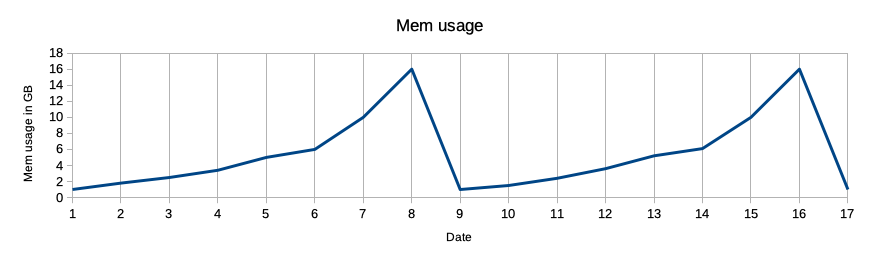
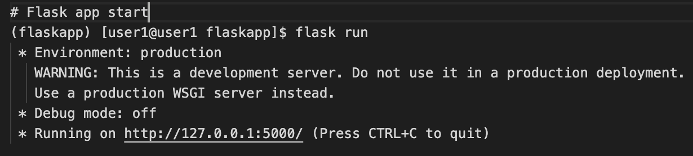
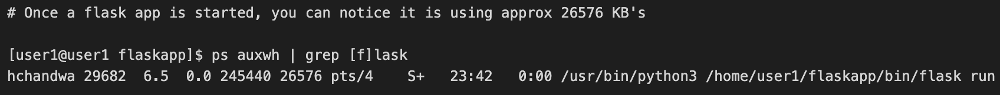
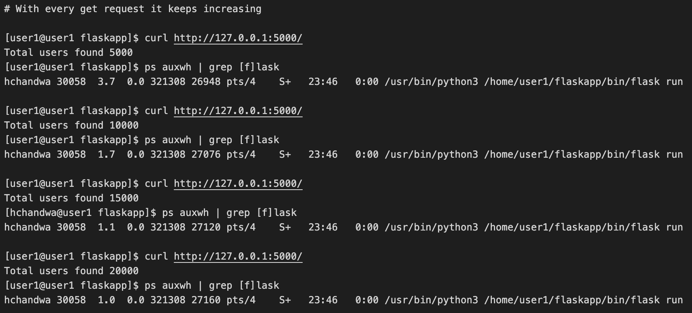
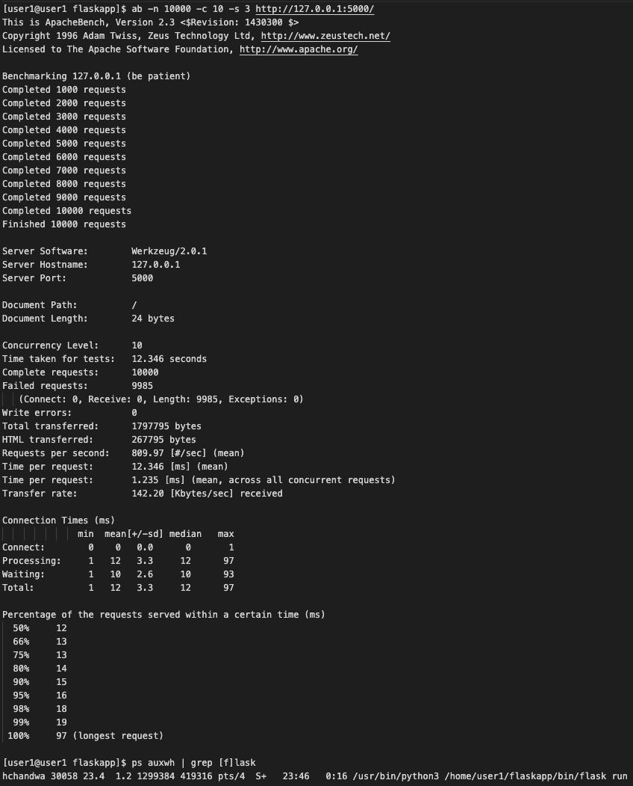
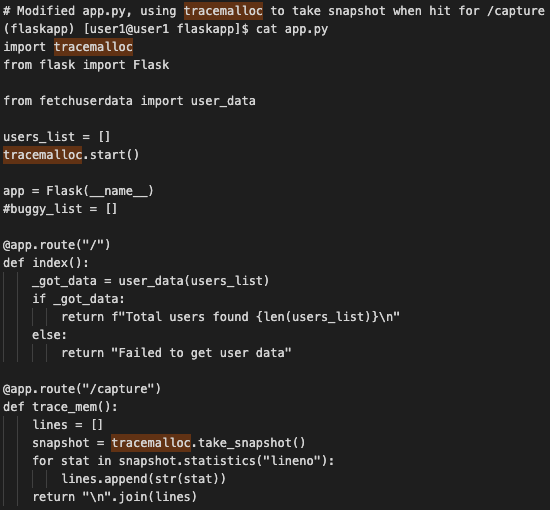
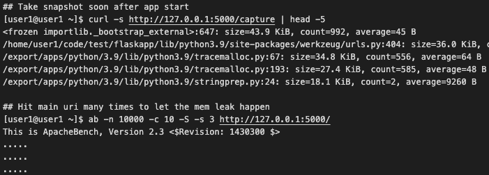

In this section we will see an example of an issue and try to troubleshoot it, and at the end a few famous troubleshooting stories are shared, which were shared by LinkedIn engineers earlier.

### Example - Memory leak :
Often memory leak issues go unnoticed until the service becomes unresponsive after running for some time (days, week or even month) until service is restarted or bug is fixed, In such cases, service memory usage will reflect in increasing order in the metric graph, something like this graph.

Memory leak is mismanagement of memory allocations by application, where unneeded memory is not released, over the period of time objects continue to pile up in memory resulting in service crash. Generally such non-released objects get sorted by [garbage collector](https://en.wikipedia.org/wiki/Garbage_collection_(computer_science)) automatically, but sometimes due to a bug it fails. Debugging helps in figuring where much of the application storage memory is being applied. Then, you start tracking and filter everything based on usage. In case, you find objects that aren’t in use, but are referenced, you can get rid of them by deleting them to avoid memory leaks. In the case of python applications, it comes with inbuilt features like [tracemalloc](https://docs.python.org/3/library/tracemalloc.html). This module can help pinpoint where an object was allocated first. Almost every language comes with a set of tools/libraries (inbuilt or external) which helps find memory issues. Similarly for Java there is a famous memory leak detection tool called [Java VisualVM](http://visualvm.java.net/intro.html).

Let’s see how a dummy flask based web app with a memory leak bug, with every request its memory usage keeps increasing, and how we can use tracemalloc to capture the leak.

Assumption -: A python virtual environment is created, and flask is installed in it.

**A bare minimum flask code with bug, read comments for more info**

**Starting flask app**

**On start, Its memory usage is around 26576 kb, i.e approx 26MB**

**Now with every subsequent GET request, We can notice that process memory usage continues to increase slowly.**

**Now lets try 10000 requests, to see if memory usage increases heavily.**
To hit a high number of requests, we use an Apache benchmarking tool called [“ab”](https://httpd.apache.org/docs/2.4/programs/ab.html). After 10000 hits, we can notice memory usage of flask app is jumped almost 15 times, i.e from initial **26576 KB to 419316 KB, i.e from roughly 26 MB to 419 MB**, That’s a huge jump for such a small webapp.

**Lets try the python [tracemalloc](https://docs.python.org/3/library/tracemalloc.html) module to try to understand the application memory allocations.** Tracemalloc takes memory snapshots at a particular point, performing various statistics on the same. 

Adding a bare minimum code to our app.py file, no change in fetchuserdata.py file, it will allow us to capture tracemalloc snapshots whenever we will hit /capture uri.

**After restart of app.py (flask run)**, we will
- First hit http://127.0.0.1:5000/capture
- Then hit http://127.0.0.1:5000/ 10000 times, for memory leak/s to take place.
- Finally hit http://127.0.0.1:5000/capture again to take a snapshot to know which line has the most allocation.

In the final snapshot, we noticed the exact module and lineno where most allocation happened. I.e fetchuserdata.py, line no 6, after 10000 hits, it is holding 419 MB of memory.

**Summary**

Above example shows how a bug can lead to memory leak, and how we can use [tracemalloc](https://docs.python.org/3/library/tracemalloc.html) to understand where it is. In real world applications are way more complex than the above dummy example, you must understand that using tracemalloc might degrade application performance somebit, due to tracemalloc own overheads. Be mindful about its use in production environments.

If you are interested in digging deeper into Python Object Memory Allocation Internals and debugging memory leak, have a look at an Interesting talk by [Sanket Patel](https://www.linkedin.com/in/sanketplus/) in PyCon India 2019, [Debug Memory Leak In Python Flask | Python Object Memory Allocation Internals](https://www.youtube.com/watch?v=s9kAghWpzoE)

