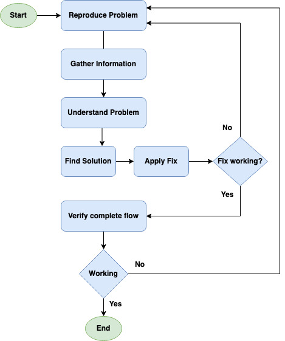

Troubleshooting system failures can be tricky or tedious at times. In this practice we need to examine the end-to-end flow of a service, all its downstreams, analysing logs, memory leak, CPU usage, disk IO, network failures, hosts issues, etc. Knowing certain practices and tools can help figure & mitigate failures faster. Here’s the high level troubleshooting flowchart -:

### Troubleshooting Flowchart

### General Practices
Different systems require different approaches for finding issues. Scope of this is limited and given a problem, there can be many more points which can be looked into. Following points will look at some high level practices towards finding webapp failures and finding fixes for the same.

**Reproduce problem**

* Try the broken request to reproduce the issue, Like try Hit http/s request which fails.
* Check the end to end flow of request and look for return codes, mostly [3xx, 4xx or 5xx](https://en.wikipedia.org/wiki/List_of_HTTP_status_codes). 3xx are mostly about redirections, 4xx are about unauthorized, bad request, forbidden, etc, And 5xx is mostly about server side issues. Based on the return code you can look for the next step.
* Client side issues are mainly about missing or buggy static contents, like javascript issues, bad image, broken json from an async call etc, such can result in incorrect page rendering on browsers.

**Gather Information**

* Look for errors/exceptions in application logs, Like "Can’t Allocate Memory" or OutOfMemoryError, Or Something like "disk I/O error", Or a DNS resolution error.
* Check application and host metrics, Look for anomalies in service and hosts graphs. Since when CPU usage has increased, since when memory usage increased, since when disk space is reduced Or Disk I/O is increased, when load average start shooting up etc. Please read the School of SRE link for more detail around [metrics and monitoring](https://linkedin.github.io/school-of-sre/level101/metrics_and_monitoring/introduction).
* Look for recent code or config changes which possibly are breaking the system.

**Understand the problem**

* Try correlating gathered data with recent actions, like an exception showing up in logs after config/code deployment.
* Is it due to the [QPS](https://en.wikipedia.org/wiki/Queries_per_second) increase? Is it bad SQL queries? Do recent code changes demand better or more hardware?

**Find a solution and apply a fix**

* Based on the above findings, look for a quick fix if possible, For example like rolling back changes if errors/exceptions correlate.
* Try patching or [hotfixing](https://en.wikipedia.org/wiki/Hotfix) the code, probably in staging setup if you want to fix forward.
* Try to scale up the system, if high QPS is the reason for system failure, then try adding resources (compute, storage, memory, etc) as necessary.
* Optimize SQL queries if needed.

**Verify complete request flow**

* Hit requests again and ensure returns are successful (return code 2xx).
* Check Logs ensure no more exceptions/errors, as found earlier.
* Ensure metrics are back to normal.

### General Host issues

To Know if host health is fine or not, look for any hardware failures or its performance issues, one can try following -:

* Dmesg -: Shows recent errors / failures thrown by kernel. This help with knowing  hardware failures if any
* ls commands -: lspci, lsblk, lscpu, lsscsi, These commands list out pci, disk, cpu information.
* /var/log/messages -: Shows system app/service related errors/warnings, also shows kernel issues.
* Smartd -: check disk health.

