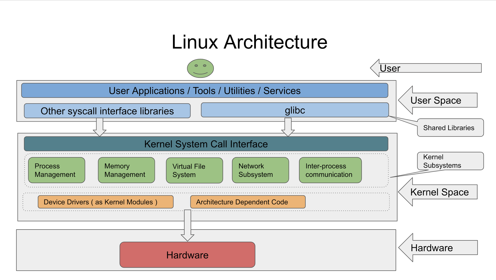

# Linux Basics

## Introduction
### Prerequisites

- Comfortable using any operating systems like Windows, Linux or Mac
- Fundamental knowledge of operating systems

## What to expect from this course

This course is divided into three parts. In the first part, we cover the
fundamentals of Linux operating systems. We will talk about Linux architecture,
Linux distributions and uses of Linux operating systems. We will also talk about the
difference between GUI and CLI.

In the second part, we cover some basic commands used in Linux. 
We will focus on commands used for navigating the file system, viewing and manipulating files,
I/O redirection etc.

In the third part, we cover Linux system administration. This includes day to day tasks 
performed by Linux admins, like managing users/groups, managing file permissions, 
monitoring system performance, log files etc.

In the second and third part, we will be taking examples to understand the concepts.

## What is not covered under this course

We are not covering advanced Linux commands and bash scripting in this
course. We will also not be covering Linux internals. 

## Course Contents

The following topics has been covered in this course:

-  [Introduction to Linux](https://linkedin.github.io/school-of-sre/linux_basics/intro/)
    -  [What are Linux Operating Systems](https://linkedin.github.io/school-of-sre/linux_basics/intro/#what-are-linux-operating-systems)
    -  [What are popular Linux distributions](https://linkedin.github.io/school-of-sre/linux_basics/intro/#what-are-popular-linux-distributions)
    -  [Uses of Linux Operating Systems](https://linkedin.github.io/school-of-sre/linux_basics/intro/#uses-of-linux-operating-systems)
    -  [Linux Architecture](https://linkedin.github.io/school-of-sre/linux_basics/intro/#linux-architecture)
    -  [Graphical user interface (GUI) vs Command line interface (CLI)](https://linkedin.github.io/school-of-sre/linux_basics/intro/#graphical-user-interface-gui-vs-command-line-interface-cli)
-  [Command Line Basics](https://linkedin.github.io/school-of-sre/linux_basics/command_line_basics/)
    -  [Lab Environment Setup](https://linkedin.github.io/school-of-sre/linux_basics/command_line_basics/#lab-environment-setup)
    -  [What is a Command](https://linkedin.github.io/school-of-sre/linux_basics/command_line_basics/#what-is-a-command)
    -  [File System Organization](https://linkedin.github.io/school-of-sre/linux_basics/command_line_basics/#file-system-organization)
    -  [Navigating File System](https://linkedin.github.io/school-of-sre/linux_basics/command_line_basics/#commands-for-navigating-the-file-system)
    -  [Manipulating Files](https://linkedin.github.io/school-of-sre/linux_basics/command_line_basics/#commands-for-manipulating-files)
    -  [Viewing Files](https://linkedin.github.io/school-of-sre/linux_basics/command_line_basics/#commands-for-viewing-files)
    -  [Echo Command](https://linkedin.github.io/school-of-sre/linux_basics/command_line_basics/#echo-command)
    -  [Text Processing Commands](https://linkedin.github.io/school-of-sre/linux_basics/command_line_basics/#text-processing-commands)
    -  [I/O Redirection](https://linkedin.github.io/school-of-sre/linux_basics/command_line_basics/#io-redirection)
-  [Linux system administration](https://linkedin.github.io/school-of-sre/linux_basics/linux_server_administration/)
    -  [Lab Environment Setup](https://linkedin.github.io/school-of-sre/linux_basics/linux_server_administration/#lab-environment-setup)
    -  [User/Groups management](https://linkedin.github.io/school-of-sre/linux_basics/linux_server_administration/#usergroup-management)
    -  [Becoming a Superuser](https://linkedin.github.io/school-of-sre/linux_basics/linux_server_administration/#becoming-a-superuser)
    -  [File Permissions](https://linkedin.github.io/school-of-sre/linux_basics/linux_server_administration/#file-permissions)
    -  [SSH Command](https://linkedin.github.io/school-of-sre/linux_basics/linux_server_administration/#ssh-command)
    -  [Package Management](https://linkedin.github.io/school-of-sre/linux_basics/linux_server_administration/#package-management)
    -  [Process Management](https://linkedin.github.io/school-of-sre/linux_basics/linux_server_administration/#process-management)
    -  [Memory Management](https://linkedin.github.io/school-of-sre/linux_basics/linux_server_administration/#memory-management)
    -  [Daemons and Systemd](https://linkedin.github.io/school-of-sre/linux_basics/linux_server_administration/#daemons)
    -  [Logs](https://linkedin.github.io/school-of-sre/linux_basics/linux_server_administration/#logs)
-  [Conclusion](https://linkedin.github.io/school-of-sre/linux_basics/conclusion)
    -  [Applications in SRE Role](https://linkedin.github.io/school-of-sre/linux_basics/conclusion/#applications-in-sre-role)
    -  [Useful Courses and tutorials](https://linkedin.github.io/school-of-sre/linux_basics/conclusion/#useful-courses-and-tutorials)

## What are Linux operating systems

Most of us are familiar with the Windows operating system used in more than
 75% of the personal computers. The Windows operating systems
are based on Windows NT kernel. 

A kernel is the most important part of
an operating system - it performs important functions like process
management, memory management, filesystem management etc.

Linux operating systems are based on the Linux kernel. A Linux based
operating system will consist of Linux kernel, GUI/CLI, system libraries
and system utilities. The Linux kernel was independently developed and
released by Linus Torvalds. The Linux kernel is free and open-source -
[https://github.com/torvalds/linux](https://github.com/torvalds/linux)

History of Linux -
[https://en.wikipedia.org/wiki/History_of_Linux](https://en.wikipedia.org/wiki/History_of_Linux)

## What are popular Linux distributions

A Linux distribution(distro) is an operating system based on
the Linux kernel and a package management system. A package management
system consists of tools that help in installing, upgrading,
configuring and removing softwares on the operating system.

Software are usually adopted to a distribution and are packaged in a
distro specific format. These packages are available through a distro
specific repository. Packages are installed and managed in the operating
system by a package manager.

**List of popular Linux distributions:**

- Fedora

- Ubuntu

- Debian

- Centos

- Red Hat Enterprise Linux

- Suse

- Arch Linux

| Packaging systems      | Distributions                              | Package manager
| ---------------------- | ------------------------------------------ | -----------------
| Debian style (.deb)    |   Debian, Ubuntu                          |   APT
| Red Hat style (.rpm)   |   Fedora, CentOS, Red Hat Enterprise Linux |  YUM

## Linux Architecture

- The Linux kernel is monolithic in nature.

- System calls are used to interact with the Linux kernel space.

- Kernel code can only be executed in the kernel mode. Non-kernel code is executed in the user mode.

- Device drivers are used to communicate with the hardware devices.

## Uses of Linux Operating Systems

Operating system based on Linux kernel are widely used in:

- Personal computers

- Servers

- Mobile phones - Android is based on Linux operating system

- Embedded devices - watches, televisions, traffic lights etc

- Satelites

- Network devices - routers, switches etc.

## Graphical user interface (GUI) vs Command line interface (CLI)

A user interacts with a computer with the help of user interfaces. The
user interface can be either GUI or CLI.

Graphical user interface allows a user to interact with the computer
using graphics such as icons and images. When a user clicks on an icon
to open an application on a computer, he or she is actually using the
GUI. It's easy to perform tasks using GUI.

Command line interface allows a user to interact with the computer using
commands. A user types the command in a terminal and the system helps in
executing these commands. A new user with experience on GUI may find it 
difficult to interact with CLI as he/she needs to be aware of the commands
to perform a particular operation.

## Shell vs Terminal

Shell is a program that takes commands from the
users and gives them to the operating system for processing. Shell is an
example of a CLI(command line interface). Bash is one of the most popular shell
programs available on Linux servers. Other popular shell programs are
zsh, ksh and tcsh.

Terminal is a program that opens a window and lets you interact with the
shell. Some popular examples of terminals are gnome-terminal, xterm,
konsole etc.

Linux users do use the terms shell, terminal, prompt, console etc.
interchangeably. In simple terms, these all refer to a way of taking
commands from the user.
