# Linux Server Administration

In this course will try to cover some of the common tasks that a linux
server administrator performs. We will first try to understand what a
particular command does and then try to understand the commands using
examples. Do keep in mind that it's very important to practice the linux
commands on your own.

## Lab Environment Setup

- Install docker on your system - [https://docs.docker.com/engine/install/](https://docs.docker.com/engine/install/)

- We will be running all the commands on Red Hat Enterprise Linux (RHEL) 8 system.

  

- We will run most of the commands used in this module in the above docker container.

## Multi-User Operating Systems

An operating system is considered as multi-user if it allows multiple people/users to use a computer and not affect each other files and preferences. Linux based operating systems are multi-user in nature as it allows multiple users to access the system at the same time. A typical computer will only have one keyboard and monitor but multiple users can log in via ssh if the computer is connected to the network. We will cover more about ssh later.

As a server administrator, we are mostly concerned with the linux servers which are physically present at a very large distance from us. We can connect to these servers with the help of remote login methods like ssh.

Since linux supports multiple users, we need to have a method which can protect the users from each other. One user should not be able to access and modify files of other users

## User/Group Management in Linux

- Each user in linux has an associated user ID called UID attached to him

- Each user also has a home directory and a login shell associated with him/her

- A group is a collection of one or more users. A group makes it easier to share permissions among a group of users.

- Each group has a group ID called GID associated with it.

### id command in linux

id command can be used to find the uid and gid associated with an user.
It also lists down the groups to which the user belongs to.

The uid and gid associated with the root user is 0.

A good way to find out the current user in linux is to use the whoami
command.

**"root" user or superuser is the most privileged user with**
**unrestricted access to all the resources on the system. It has UID 0**

### Important files associated with users/groups

| /etc/passwd  |  Stores the user name, the uid, the gid, the home directory, the login shell etc |
| -------------| ---------------------------------------------------------------------------------
| /etc/shadow  | Stores the password associated with the users |
| /etc/group   | Stores information about different groups on the system |

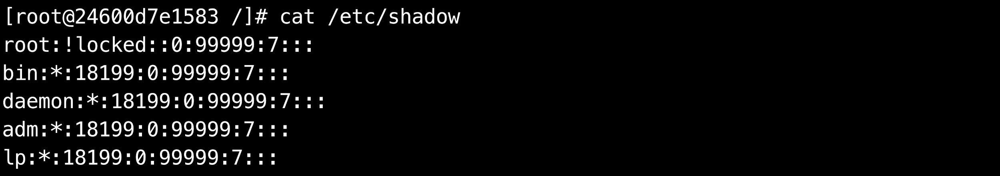

If you want to understand each filed discussed in the above outputs, you can go
through below links:

- [https://tldp.org/LDP/lame/LAME/linux-admin-made-easy/shadow-file-formats.html](https://tldp.org/LDP/lame/LAME/linux-admin-made-easy/shadow-file-formats.html)

- [https://tldp.org/HOWTO/User-Authentication-HOWTO/x71.html](https://tldp.org/HOWTO/User-Authentication-HOWTO/x71.html)

## Important commands for managing users

Some of the commands which are used frequently to manage users/groups
on linux are following:

- useradd - Creates a new user

- passwd - Adds or modifies passwords for a user

- usermod - Modifies attributes of an user

- userdel - Deletes an user

### useradd

The useradd command adds a new user in linux.

We will create a new user 'shivam'. We will also verify that the user
has been created by tailing the /etc/passwd file. The uid and gid are
1000 for the newly created user. The home directory assigned to the user
is /home/shivam and the login shell assigned is /bin/bash. Do note that
the user home directory and login shell can be modified later on.

If we do not specify any value for attributes like home directory or
login shell, default values will be assigned to the user. We can also
override these default values when creating a new user.

### passwd

The passwd command is used to create or modify passwords for a user.

In the above examples, we have not assigned any password for users
'shivam' or 'amit' while creating them.

\"!!\" in an account entry in shadow means the account of an user has
been created, but not yet given a password.

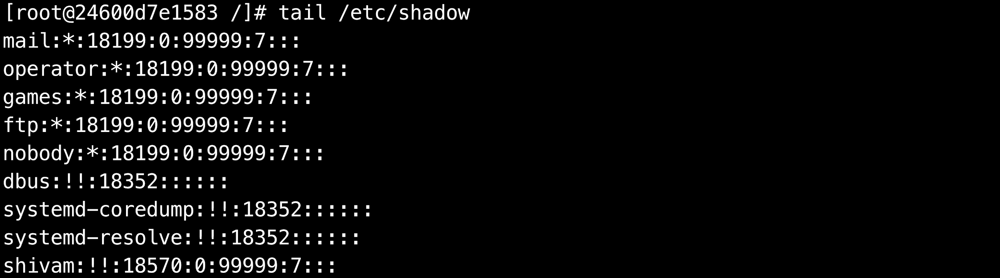

Let's now try to create a password for user "shivam".

Do remember the password as we will be later using examples
where it will be useful.

Also, let's change the password for the root user now. When we switch
from a normal user to root user, it will request you for a password.
Also, when you login using root user, the password will be asked.

### usermod

The usermod command is used to modify the attributes of an user like the
home directory or the shell.

Let's try to modify the login shell of user "amit" to "/bin/bash".

In a similar way, you can also modify many other attributes for a user.
Try 'usermod -h' for a list of attributes you can modify.

### userdel

The userdel command is used to remove a user on linux. Once we remove a
user, all the information related to that user will be removed.

Let's try to delete the user "amit". After deleting the user, you will
not find the entry for that user in "/etc/passwd" or "/etc/shadow" file.

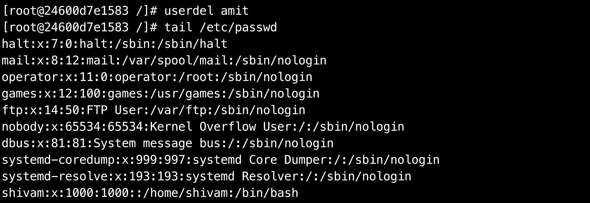

## Important commands for managing groups

Commands for managing groups are quite similar to the commands used for managing users. Each command is not explained  in detail here as they are quite similar. You can try running these commands on your system.

| groupadd \<group_name\>  | Creates a new group            |
| ------------------------ | ------------------------------- |
| groupmod \<group_name\>  | Modifies attributes of a group |
| groupdel \<group_name\>  | Deletes a group |
| gpasswd \<group_name\>   | Modifies password for group |

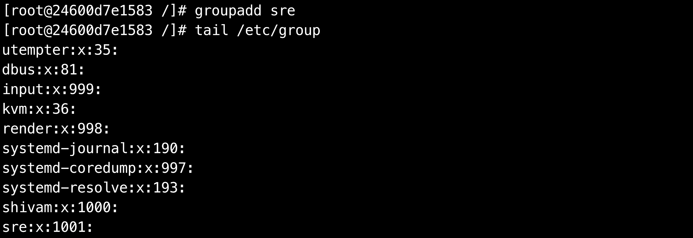

We will now try to add user "shivam" to the group we have created above.

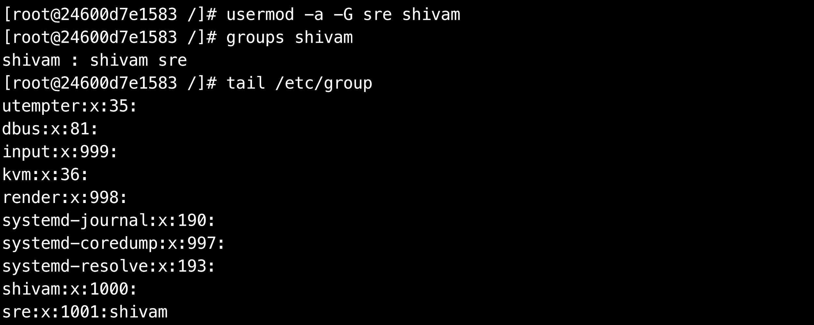

## Becoming a Superuser in Linux

**Before running the below commands, do make sure that you have set up a
password for user "shivam" and user "root" using the passwd command
described in the above section.**

The su command can be used to switch users in linux. Let's now try to
switch to user "shivam".

Let's now try to open the "/etc/shadow" file.

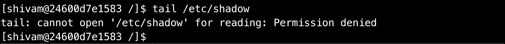

The operating system didn't allow the user "shivam" to read the content
of the "/etc/shadow" file. This is an important file in linux which
stores the passwords of users. This file can only be accessed by root or
users who have the superuser privileges.

**The sudo command allows a** **user to run commands with the security
privileges of the root user.** Do remember that the root user has all
the privileges on a system. We can also use su command to switch to the
root user and open the above file but doing that will require the
password of the root user. An alternative way which is preferred on most
modern operating systems is to use sudo command for becoming a
superuser. Using this way, a user has to enter his/her password and they
need to be a part of the sudo group.

**How to provide superpriveleges to other users ?**

Let's first switch to the root user using su command. Do note that using
the below command will need you to enter the password for the root user.

In case, you forgot to set a password for the root user, type "exit" and
you will be back as the root user. Now, set up a password using the
passwd command.

**The file /etc/sudoers holds the names of users permitted to invoke
sudo**. In redhat operating systems, this file is not present by
default. We will need to install sudo.

We will discuss the yum command in detail in later sections.

Try to open the "/etc/sudoers" file on the system. The file has a lot of
information. This file stores the rules that users must follow when
running the sudo command. For example, root is allowed to run any
commands from anywhere.

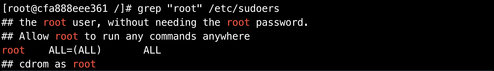

One easy way of providing root access to users is to add them to a group
which has permissions to run all the commands. "wheel" is a group in
redhat linux with such privileges.

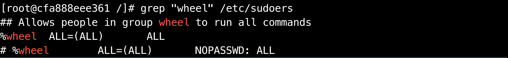

Let's add the user "shivam" to this group so that it also has sudo
privileges.

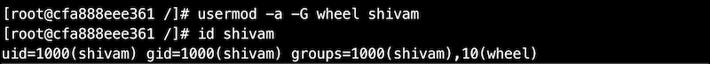

Let's now switch back to user "shivam" and try to access the
"/etc/shadow" file.

We need to use sudo before running the command since it can only be
accessed with the sudo privileges. We have already given sudo privileges
to user “shivam” by adding him to the group “wheel”.

## File Permissions in Linux

On a linux operating system, each file and directory is assigned access
permissions for the owner of the file, the members of a group of related
users and everybody else. This is to make sure that one user is not
allowed to access the files and resources of another user.

To see the permissions of a file, we can use the ls command. Let's look
at the permissions of /etc/passwd file.

Let's go over some of the important fields in the output that are
related to file permissions.

### Chmod command in linux

The chmod command is used to modify files and directories permissions in
linux.

The chmod command accepts permissions in as a numerical argument. We can
think of permission as a series of bits with 1 representing True or
allowed and 0 representing False or not allowed.

| Permission               | rwx     | Binary  |   Decimal |
| -------------------------| ------- | ------- | --------- |
| Read, write and execute  | rwx     | 111     | 7         |
| Read and write           | rw-     | 110     | 6         |
| Read and execute         | r-x     | 101     | 5         |
| Read only                | r--     | 100     | 4         |
| Write and execute        | -wx     | 011     | 3         |
| Write only               | -w-     | 010     | 2         |
| Execute only             | --x     | 001     | 1         |
| None                     | ---     | 000     | 0         |

We will now create a new file and check the permission of the file.

The group owner doesn't have the permission to write to this file. Let's
give the group owner or root the permission to write to it using chmod
command.

Chmod command can be also used to change the permissions of a directory
in the similar way.

### Chown command in linux

The chown command is used to change the owner of files or
directories in linux.

Command syntax: chown \<new_owner\> \<file_name\>

**In case, we do not have sudo privileges, we need to use sudo
command**. Let's switch to user 'shivam' and try changing the owner. We
have also changed the owner of the file to root before running the below
command.

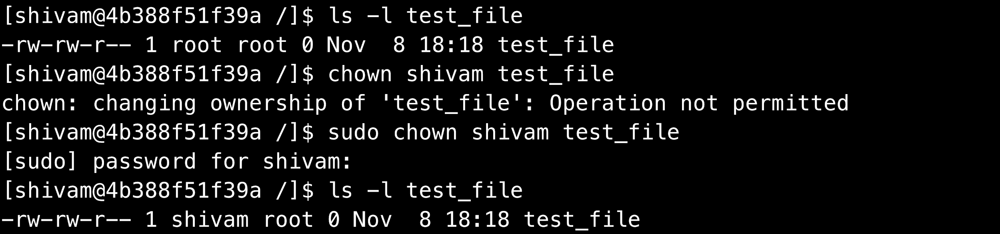

Chown command can also be used to change the owner of a directory in the
similar way.

### Chgrp command in linux

The chgrp command can be used to change the group ownership of files or
directories in linux. The syntax is very similar to that of chown
command.

Chgrp command can also be used to change the owner of a directory in the
similar way.

## SSH Command

The ssh command is used for logging into the remote systems, transfer files between systems and for executing commands on a remote machine. SSH stands for secure shell and is used to provide an encrypted secured connection between two hosts over an insecure network like the internet.

Reference:
[https://www.ssh.com/ssh/command/](https://www.ssh.com/ssh/command/)

We will now discuss passwordless authentication which is secure and most
commonly used for ssh authentication.

### Passwordless Authentication Using SSH

Using this method, we can ssh into hosts without entering the password.
This method is also useful when we want some scripts to perform
ssh-related tasks.

Passwordless authentication requires the use of a public and private key pair. As the name implies, the public key can be shared with anyone but the private key should be kept private.
Lets not get  into the details of how this authentication works. You can read more about it
[here](https://www.digitalocean.com/community/tutorials/understanding-the-ssh-encryption-and-connection-process)

Steps for setting up a passwordless authentication with a remote host:

1. Generating public-private key pair  

    **If we already have a key pair stored in \~/.ssh directory, we will not need to generate keys again.**

    Install openssh package which contains all the commands related to ssh.

    

    Generate a key pair using the ssh-keygen command. One can choose the
    default values for all prompts.

    

    After running the ssh-keygen command successfully, we should see two
    keys present in the \~/.ssh directory. Id_rsa is the private key and
    id_rsa.pub is the public key. Do note that the private key can only be
    read and modified by you.

    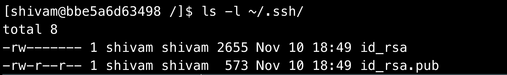

2. Transferring the public key to the remote host

    There are multiple ways to transfer the public key to the remote server.
    We will look at one of the most common ways of doing it using the
    ssh-id-copy command.

    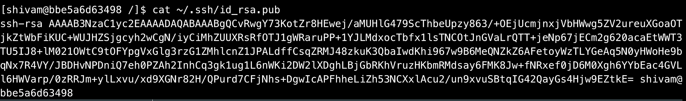

    Install the openssh-clients package to use ssh-id-copy command.

    

    Use the ssh-id-copy command to copy your public key to the remote host.

    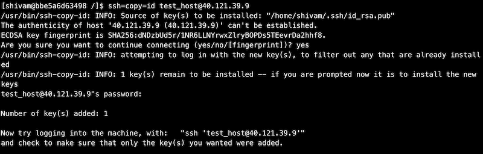

    Now, ssh into the remote host using the password authentication.

    

    Our public key should be there in \~/.ssh/authorized_keys now.

    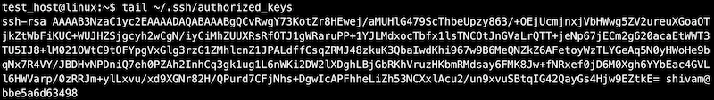

    \~/.ssh/authorized_key contains a list of public keys. The users
    associated with these public keys have the ssh access into the remote
    host.

### How to run commands on a remote host ?

General syntax: ssh \<user\>@\<hostname/hostip\> \<command\>

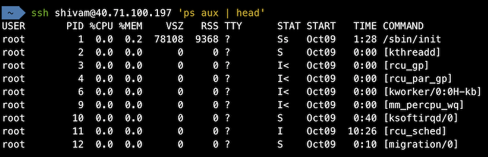

### How to transfer files from one host to another host ?

General syntax: scp \<source\> \<destination\>

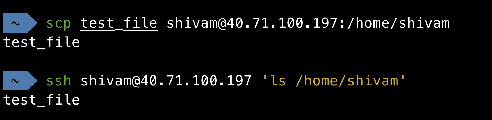

## Package Management

Package management is the process of installing and managing software on
the system. We can install the packages which we require from the linux
package distributor. Different distributors use different packaging
systems.
  
| Packaging systems      | Distributions                              |
| ---------------------- | ------------------------------------------ |
| Debian style (.deb)    |   Debian, Ubuntu                           |
| Red Hat style (.rpm)   |   Fedora, CentOS, Red Hat Enterprise Linux |

**Popular Packaging Systems in Linux**

|Command                        | Description                                         |
| ----------------------------- | --------------------------------------------------- |
| yum install \<package_name\>  | Installs a package on your system                   |
| yum update \<package_name\>   | Updates a package to it's latest available version  |
| yum remove \<package_name\>   | Removes a package from your system                  |
| yum search \<keyword\>        | Searches for a particular keyword                   |

[DNF](https://docs.fedoraproject.org/en-US/quick-docs/dnf/) is
the successor to YUM which is now used in Fedora for installing and
managing packages. DNF may replace YUM in the future on all RPM based
linux distributions.

We did find an exact match for the keyword httpd when we searched using
yum search command. Let's now install the httpd package.

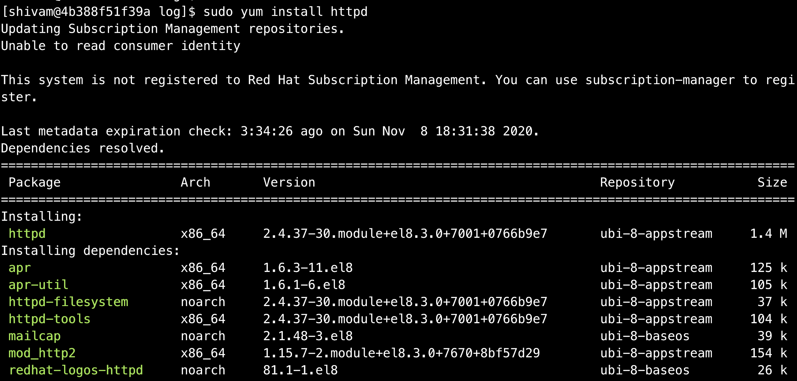

After httpd is installed, we will use the yum remove command to remove
httpd package.

## Process Management

In this section, we will study about some useful commands that can be
used to monitor the processes on linux systems.

### ps (process status)

The ps command is used to know the information of a process or list of
processes.

If you get an error "ps command not found" while running ps command, do
install **procps** package.

ps without any arguments is not very useful. Let's try to list all the
processes on the system by using the below command.

Reference:
[https://unix.stackexchange.com/questions/106847/what-does-aux-mean-in-ps-aux](https://unix.stackexchange.com/questions/106847/what-does-aux-mean-in-ps-aux)

We can use an additional argument with ps command to list the
information about the process with a specific process ID.

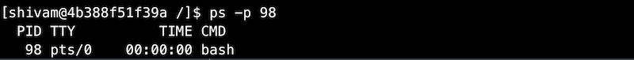

We can use grep in combination with ps command to list only specific
processes.

### top

The top command is used to show information about linux processes
running on the system in real time. It also shows a summary of the
system information.

For each process, top lists down the process ID, owner, priority, state,
cpu utilization, memory utilization and much more information. It also
lists down the memory utilization and cpu utilization of the system as a
whole along with system uptime and cpu load average.

## Memory Management

In this section, we will study about some useful commands that can be
used to view information about the system memory.

### free

The free command is used to display the memory usage of the system. The
command displays the total free and used space available in the RAM
along with space occupied by the caches/buffers.

free command by default shows the memory usage in kilobytes. We can use
an additional argument to get the data in human-readable format.

### vmstat

The vmstat command can be used to display the memory usage along with
additional information about io and cpu usage.

## Checking Disk Space in Linux

In this section, we will study about some useful commands that can be
used to view disk space on linux.

### df (disk free)

The df command is used to display the free and available space for each
mounted file system.

### du (disk usage)

The du command is used to display disk usage of files and directories on
the system.

The below command can be used to display the top 5 largest directories
in the root directory.

## Daemons

A computer program that runs as a background process is called a daemon.
Traditionally, the name of daemon processes ended with d - sshd, httpd
etc. We cannot interact with a daemon process as they run in the
background.

Services and daemons are used interchangeably most of the time.

## Systemd

Systemd is a system and service manager for Linux operating systems.
Systemd units are the building blocks of systemd. These units are
represented by unit configuration files.

The below examples shows the unit configuration files available at
/usr/lib/systemd/system which are distributed by installed RPM packages.
We are more interested in the configuration file that ends with service
as these are service units.

### Managing System Services

Service units end with .service file extension. Systemctl command can be
used to start/stop/restart the services managed by systemd.

| Command                         | Description                            |
| ------------------------------- | -------------------------------------- |
| systemctl start name.service    | Starts a service                       |
| systemctl stop name.service     | Stops a service                        |
| systemctl restart name.service  | Restarts a service                     |
| systemctl status name.service   | Check the status of a service          |
| systemctl reload name.service   | Reload the configuration of a service  |

## Logs 

In this section, we will talk about some important files and directories
which can be very useful for viewing system logs and applications logs
in linux. These logs can be very useful when you are troubleshooting on
the system.

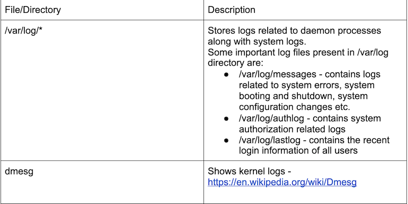

## Applications in SRE Role

- Different users will have different permissions depending on their
  roles. We will also not want everyone in the company to access our 
  servers for security reasons. Users permissions can be restricted 
  with chown, chmod and chgrp commands.

- SSH is one of the most frequently used commands for a SRE. Logging
  into servers and troubleshooting along with performing basic
  administration tasks will only be possible if we are able to login
  into the server.

- What if we want to run an apache server or nginx on a server ? We
  will first install it using the package manager. Package
  management commands become important here.

- Managing services on servers is another critical responsibility of a
  SRE. Systemd related commands can help in troubleshooting issues.
  If a service goes down, we can start it using systemctl start
  command. We can also stop a service in case it is not needed.

- Monitoring is another core responsibility of a SRE. Memory and CPU
  are two important system level metrics which should be monitored.
  Commands like top and free are quite helpful here.

- If a service is throwing an error, how do we find out the root cause
  of the error ? We will certainly need to check logs to find out
  the whole stack trace of the error. The log file will also tell us
  the number of times the error has occurred along with time when it
  started.

## Useful courses and tutorials

- Edx Red Hat Enterprise Linux Course - [https://courses.edx.org/courses/course-v1:RedHat+RH066x+2T2017/course/](https://courses.edx.org/courses/course-v1:RedHat+RH066x+2T2017/course/)
