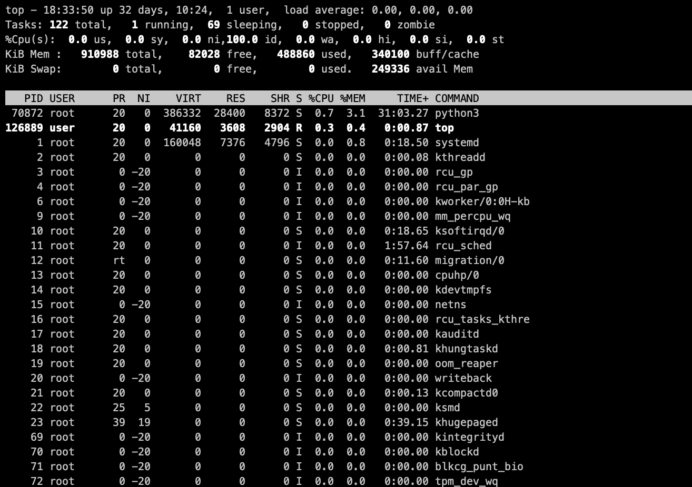
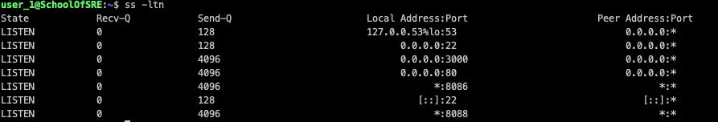
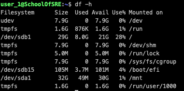

##

# Command-line tools
Most of the Linux distributions today come with a set of tools that
monitor the system's performance. These tools help you measure and
understand various subsystem statistics (CPU, memory, network, and so
on). Let's look at some of the tools that are predominantly used.

-   `ps/top `-- The process status command (ps) displays information
     about all the currently running processes in a Linux system. The
     top command is similar to the ps command, but it periodically
     updates the information displayed until the program is terminated.
     An advanced version of top, called htop, has a more user-friendly
     interface and some additional features. These command-line
     utilities come with options to modify the operation and output of
     the command. Following are some important options supported by the
     ps command.

    -   `-p <pid1, pid2,...>` -- Displays information about processes
         that match the specified process IDs. Similarly, you can use
         `-u <uid>` and `-g <gid>` to display information about
         processes belonging to a specific user or group.

    -   `-a` -- Displays information about other users' processes, as well
         as one's own.

    -   `-x` -- When displaying processes matched by other options,
         includes processes that do not have a controlling terminal.

  
 
 Figure 2: Results of top command 

-   `ss` -- The socket statistics command (ss) displays information
     about network sockets on the system. This tool is the successor of
     [netstat](https://man7.org/linux/man-pages/man8/netstat.8.html),
     which is deprecated. Following are some command-line options
     supported by the ss command:

    -   `-t` -- Displays the TCP socket. Similarly, `-u` displays UDP
         sockets, `-x` is for UNIX domain sockets, and so on.

    -   `-l` -- Displays only listening sockets.

    -   `-n` -- Instructs the command to not resolve service names.
         Instead displays the port numbers.

 
 Figure
3: List of listening sockets on a system 

-   `free` -- The free command displays memory usage statistics on the
     host like available memory, used memory, and free memory. Most often,
     this command is used with the `-h` command-line option, which
     displays the statistics in a human-readable format.

 

 Figure 4: Memory statistics on a host in human-readable form 

-   `df --` The df command displays disk space usage statistics. The
     `-i` command-line option is also often used to display
     [inode](https://en.wikipedia.org/wiki/Inode) usage
     statistics. The `-h` command-line option is used for displaying
     statistics in a human-readable format.

 

 Figure 5:
 Disk usage statistics on a system in human-readable form 

-   `sar` -- The sar utility monitors various subsystems, such as CPU
     and memory, in real time. This data can be stored in a file
     specified with the `-o` option. This tool helps to identify
     anomalies.

-   `iftop` -- The interface top command (`iftop`) displays bandwidth
     utilization by a host on an interface. This command is often used
     to identify bandwidth usage by active connections. The `-i` option
     specifies which network interface to watch.

 
  
 Figure 6: Network bandwidth usage by
active connection on the host 

-   `tcpdump` -- The tcpdump command is a network monitoring tool that
     captures network packets flowing over the network and displays a
     description of the captured packets. The following options are
     available:

    -   `-i <interface>` -- Interface to listen on

    -   `host <IP/hostname>` -- Filters traffic going to or from the
         specified host

    -   `src/dst` -- Displays one-way traffic from the source (src) or to
         the destination (dst)

    -   `port <port number>` -- Filters traffic to or from a particular
         port

 

 Figure 7: *tcpdump* of packets on *docker0*
interface on a host 
