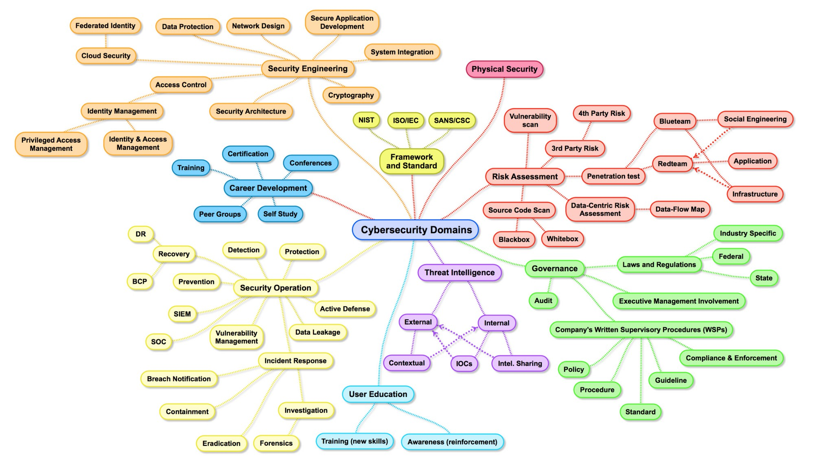
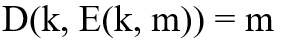
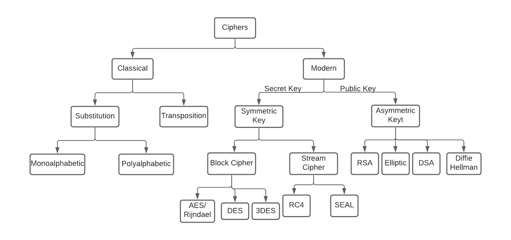
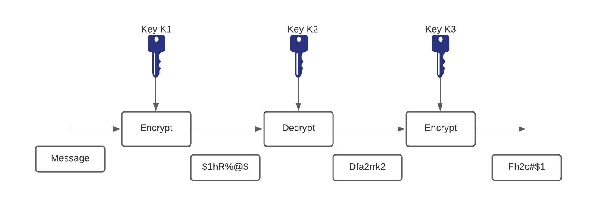
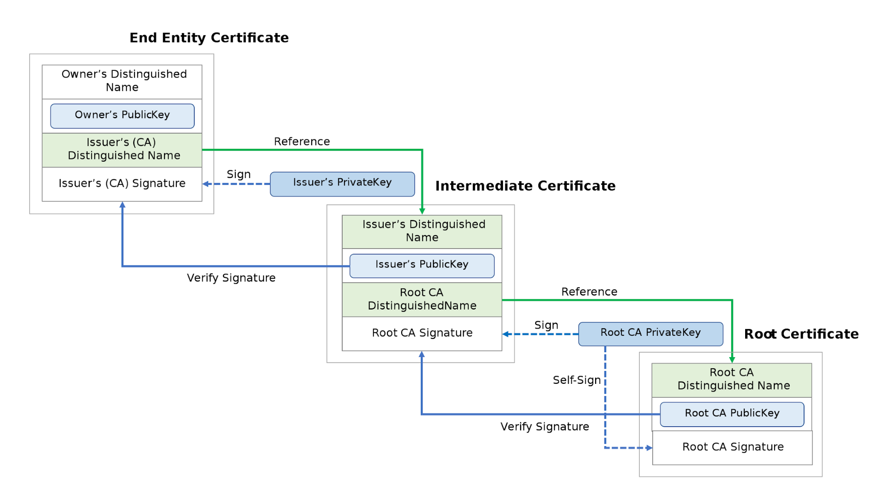

# Part I: Fundamentals

## Introduction to Security Overview for SRE

- If you look closely, both Site Reliability Engineering and Security Engineering are concerned with keeping a system usable.
  - Issues like broken releases, capacity shortages, and misconfigurations can make a system unusable (at least temporarily).
  - Security or privacy incidents that break the trust of users also undermine the usefulness of a system.
  - Consequently, system security should be top of mind for SREs.

- SREs should be involved in both significant design discussions and actual system changes.
  - They have quite a big role in System design & hence are quite sometimes the first line of defense.
  - SRE’s help in preventing bad design & implementations which can affect the overall security of the infrastructure.  
- Successfully designing, implementing, and maintaining systems requires a commitment to **the full system lifecycle**. This commitment is possible only when security and reliability are central elements in the architecture of systems.
- Core Pillars of Information Security :
  - **Confidentiality** – only allow access to data for which the user is permitted
  - **Integrity** – ensure data is not tampered or altered by unauthorized users
  - **Availability** – ensure systems and data are available to authorized users when they need it

- Thinking like a Security Engineer
  - When starting a new application or re-factoring an existing application, you should consider each functional feature, and consider:
    - Is the process surrounding this feature as safe as possible? In other words, is this a flawed process?
    - If I were evil, how would I abuse this feature? Or more specifically failing to address how a feature can be abused can cause design flaws.
    - Is the feature required to be on by default? If so, are there limits or options that could help reduce the risk from this feature?

- Security Principles By OWASP (Open Web Application Security Project)
  - Minimize attack surface area :
    - Every feature that is added to an application adds a certain amount of risk to the overall application. The aim for secure development is to reduce the overall risk by reducing the attack surface area.
    - For example, a web application implements online help with a search function. The search function may be vulnerable to SQL injection attacks. If the help feature was limited to authorized users, the attack likelihood is reduced. If the help feature’s search function was gated through centralized data validation routines, the ability to perform SQL injection is dramatically reduced. However, if the help feature was re-written to eliminate the search function (through better user interface, for example), this almost eliminates the attack surface area, even if the help feature was available to the Internet at large.
  - Establish secure defaults:
    - There are many ways to deliver an “out of the box” experience for users. However, by default, the experience should be secure, and it should be up to the user to reduce their security – if they are allowed.
    - For example, by default, password aging and complexity should be enabled. Users might be allowed to turn these two features off to simplify their use of the application and increase their risk.
    - Default Passwords of routers, IOT devices should be changed
  - Principle of Least privilege
    - The principle of least privilege recommends that accounts have the least amount of privilege required to perform their business processes. This encompasses user rights, resource permissions such as CPU limits, memory, network, and file system permissions.
    - For example, if a middleware server only requires access to the network, read access to a database table, and the ability to write to a log, this describes all the permissions that should be granted. Under no circumstances should the middleware be granted administrative privileges.
  - Principle of Defense in depth
    - The principle of defense in depth suggests that where one control would be reasonable, more controls that approach risks in different fashions are better. Controls, when used in-depth, can make severe vulnerabilities extraordinarily difficult to exploit and thus unlikely to occur.
    - With secure coding, this may take the form of tier-based validation, centralized auditing controls, and requiring users to be logged on all pages.
    - For example, a flawed administrative interface is unlikely to be vulnerable to an anonymous attack if it correctly gates access to production management networks, checks for administrative user authorization, and logs all access.
  - Fail securely
    - Applications regularly fail to process transactions for many reasons. How they fail can determine if an application is secure or not.

    
    - If either codeWhichMayFail() or isUserInRole fails or throws an exception, the user is an admin by default. This is obviously a security risk.

  - Don’t trust services
    - Many organizations utilize the processing capabilities of third-party partners, who more than likely have different security policies and posture than you. It is unlikely that you can influence or control any external third party, whether they are home users or major suppliers or partners.
    - Therefore, the implicit trust of externally run systems is not warranted. All external systems should be treated in a similar fashion.
    - For example, a loyalty program provider provides data that is used by Internet Banking, providing the number of reward points and a small list of potential redemption items. However, the data should be checked to ensure that it is safe to display to end-users, and that the reward points are a positive number, and not improbably large.
  - Separation of duties
    - The key to fraud control is the separation of duties. For example, someone who requests a computer cannot also sign for it, nor should they directly receive the computer. This prevents the user from requesting many computers and claiming they never arrived.
    - Certain roles have different levels of trust than normal users. In particular, administrators are different from normal users. In general, administrators should not be users of the application.
    - For example, an administrator should be able to turn the system on or off, set password policy but shouldn’t be able to log on to the storefront as a super privileged user, such as being able to “buy” goods on behalf of other users.
  - Avoid security by obscurity
    - Security through obscurity is a weak security control, and nearly always fails when it is the only control. This is not to say that keeping secrets is a bad idea, it simply means that the security of systems should not be reliant upon keeping details hidden.
    - For example, the security of an application should not rely upon knowledge of the source code being kept secret. The security should rely upon many other factors, including reasonable password policies, defense in depth, business transaction limits, solid network architecture, and fraud, and audit controls.
    - A practical example is Linux. Linux’s source code is widely available, and yet when properly secured, Linux is a secure and robust operating system.
  - Keep security simple
    - Attack surface area and simplicity go hand in hand. Certain software engineering practices prefer overly complex approaches to what would otherwise be a relatively straightforward and simple design.
    - Developers should avoid the use of double negatives and complex architectures when a simpler approach would be faster and simpler.
    - For example, although it might be fashionable to have a slew of singleton entity beans running on a separate middleware server, it is more secure and faster to simply use global variables with an appropriate mutex mechanism to protect against race conditions.
  - Fix security issues correctly
    - Once a security issue has been identified, it is important to develop a test for it and to understand the root cause of the issue. When design patterns are used, it is likely that the security issue is widespread amongst all codebases, so developing the right fix without introducing regressions is essential.
    - For example, a user has found that they can see another user’s balance by adjusting their cookie. The fix seems to be relatively straightforward, but as the cookie handling code is shared among all applications, a change to just one application will trickle through to all other applications. The fix must, therefore, be tested on all affected applications.
  - Reliability & Security
    - Reliability and security are both crucial components of a truly trustworthy system,but building systems that are both reliable and secure is difficult. While the requirements for reliability and security share many common properties, they also require different design considerations. It is easy to miss the subtle interplay between reliability and security that can cause unexpected outcomes
    - Ex: A password management application failure was triggered by a reliability problem i.e poor load-balancing and load-shedding strategies and its recovery was later complicated by multiple measures (HSM mechanism which needs to be plugged into server racks , which works as an authentication & the HSM token supposedly locked inside a case.. & the problem can be further elongated ) designed to increase the security of the system.

---

## Authentication vs Authorization

- **Authentication** is the act of validating that users are who they claim to be. Passwords are the most common authentication factor—if a user enters the correct password, the system assumes the identity is valid and grants access.
  - Other technologies such as One-Time Pins, authentication apps, and even biometrics can also be used to authenticate identity. In some instances, systems require the successful verification of more than one factor before granting access. This multi-factor authentication (MFA) requirement is often deployed to increase security beyond what passwords alone can provide.
- **Authorization** in system security is the process of giving the user permission to access a specific resource or function. This term is often used interchangeably with access control or client privilege. Giving someone permission to download a particular file on a server or providing individual users with administrative access to an application are good examples. In secure environments, authorization must always follow authentication, users should first prove that their identities are genuine before an organization’s administrators grant them access to the requested resources.

### Common authentication flow (local authentication)

- The user registers using an identifier like username/email/mobile
- The application stores user credentials in the database
- The application sends a verification email/message to validate the registration
- Post successful registration, the user enters credentials for logging in
- On successful authentication, the user is allowed access to specific resources

### OpenID/OAuth

***OpenID*** is an authentication protocol that allows us to authenticate users without using a local auth system. In such a scenario, a user has to be registered with an OpenID Provider and the same provider should be integrated with the authentication flow of your application. To verify the details, we have to forward the authentication requests to the provider. On successful authentication, we receive a success message and/or profile details with which we can execute the necessary flow.

***OAuth*** is an authorization mechanism that allows your application user access to a provider(Gmail/Facebook/Instagram/etc). On successful response, we (your application) receive a token with which the application can access certain APIs on behalf of a user. OAuth is convenient in case your business use case requires some certain user-facing APIs like access to Google Drive or sending tweets on your behalf. Most OAuth 2.0 providers can be used for pseudo authentication. Having said that, it can get pretty complicated if you are using multiple OAuth providers to authenticate users on top of the local authentication system.

---

## Cryptography

- It is the science and study of hiding any text in such a way that only the intended recipients or authorized persons can read it and that any text can even use things such as invisible ink or the mechanical cryptography machines of the past.

- Cryptography is necessary for securing critical or proprietary information and is used to encode private data messages by converting some plain text into ciphertext. At its core, there are two ways of doing this, more advanced methods are all built upon.

### Ciphers

- Ciphers are the cornerstone of cryptography. A cipher is a set of algorithms that performs encryption or decryption on a message. An encryption algorithm (E) takes a secret key (k) and a message (m), and produces a ciphertext (c). Similarly, a Decryption algorithm (D) takes a secret key (K) and the previous resulting Ciphertext (C). They are represented as follows:

    

- This also means that in order for it to be a cipher, it must satisfy the consistency equation as follows, making it possible to decrypt.

    

Stream Ciphers:

- The message is broken into characters or bits and enciphered with a key or keystream(should be random and generated independently of the message stream) that is as long as the plaintext bitstream.
- sIf the keystream is random, this scheme would be unbreakable unless the keystream was acquired, making it unconditionally secure. The keystream must be provided to both parties in a secure way to prevent its release.

Block Ciphers:

- Block ciphers — process messages in blocks, each of which is then encrypted or decrypted.
- A block cipher is a symmetric cipher in which blocks of plaintext are treated as a whole and used to produce ciphertext blocks. The block cipher takes blocks that are b bits long and encrypts them to blocks that are also b bits long. Block sizes are typically 64 or 128 bits long. 

    
    

Encryption

- **Secret Key (Symmetric Key)**: the same key is used for encryption and decryption
- **Public Key (Asymmetric Key)** in an asymmetric, the encryption and decryption keys are different but related. The encryption key is known as the public key and the decryption key is known as the private key. The public and private keys are known as a key pair.

Symmetric Key Encryption

DES

- The Data Encryption Standard (DES) has been the worldwide encryption standard for a long time. IBM developed DES in 1975, and it has held up remarkably well against years of cryptanalysis. DES is a symmetric encryption algorithm with a fixed key length of 56 bits. The algorithm is still good, but because of the short key length, it is susceptible to brute-force attacks that have sufficient resources.

- DES usually operates in block mode, whereby it encrypts data in 64-bit blocks. The same algorithm and key are used for both encryption and decryption.

- Because DES is based on simple mathematical functions, it can be easily implemented and accelerated in hardware.

Triple DES

- With advances in computer processing power, the original 56-bit DES key became too short to withstand an attacker with even a limited budget. One way of increasing the effective key length of DES without changing the well-analyzed algorithm itself is to use the same algorithm with different keys several times in a row.

- The technique of applying DES three times in a row to a plain text block is called Triple DES (3DES). The 3DES technique is shown in Figure. Brute-force attacks on 3DES are considered unfeasible today. Because the basic algorithm has been tested in the field for more than 25 years, it is considered to be more trustworthy than its predecessor.

AES

- On October 2, 2000, The U.S. National Institute of Standards and Technology (NIST) announced the selection of the Rijndael cipher as the AES algorithm. This cipher, developed by Joan Daemen and Vincent Rijmen, has a variable block length and key length. The algorithm currently specifies how to use keys with a length of 128, 192, or 256 bits to encrypt blocks with a length of 128, 192, or 256 bits (all nine combinations of key length and block length are possible). Both block and key lengths can be extended easily to multiples of 32 bits.

- AES was chosen to replace DES and 3DES because they are either too weak (DES, in terms of key length) or too slow (3DES) to run on modern, efficient hardware. AES is more efficient and much faster, usually by a factor of 5 compared to DES on the same hardware. AES is also more suitable for high throughput, especially if pure software encryption is used. However, AES is a relatively young algorithm, and as the golden rule of cryptography states, “A more mature algorithm is always more trusted.”

Asymmetric Key Algorithm

- In a symmetric key system, Alice first puts the secret message in a box and then padlocks the box using a lock to which she has a key. She then sends the box to Bob through regular mail. When Bob receives the box, he uses an identical copy of Alice's key (which he has obtained previously) to open the box and read the message.

- In an asymmetric key system, instead of opening the box when he receives it, Bob simply adds his own personal lock to the box and returns the box through public mail to Alice. Alice uses her key to remove her lock and returns the box to Bob, with Bob's lock still in place. Finally, Bob uses his key to remove his lock and reads the message from Alice.
- The critical advantage in an asymmetric system is that Alice never needs to send a copy of her key to Bob. This reduces the possibility that a third party (for example, an unscrupulous postmaster) can copy the key while it is in transit to Bob, allowing that third party to spy on all future messages sent by Alice. In addition, if Bob is careless and allows someone else to copy his key, Alice's messages to Bob are compromised, but Alice's messages to other people remain secret

**NOTE**: In terms of TLS key exchange, this is the common approach.

Diffie-Hellman

- The protocol has two system parameters, p and g. They are both public and may be used by everybody. Parameter p is a prime number, and parameter g (usually called a generator) is an integer that is smaller than p, but with the following property: For every number n between 1 and p – 1 inclusive, there is a power k of g such that n = gk mod p.
- Diffie Hellman algorithm is an asymmetric algorithm used to establish a shared secret for a symmetric key algorithm. Nowadays most of the people use hybrid cryptosystem i.e, combination of symmetric and asymmetric encryption. Asymmetric Encryption is used as a technique in key exchange mechanism to share secret key and after the key is shared between sender and receiver, the communication will take place using symmetric encryption. The shared secret key will be used to encrypt the communication.
- Refer: <https://medium.com/@akhigbemmanuel/what-is-the-diffie-hellman-key-exchange-algorithm-84d60025a30d>

RSA

- The RSA algorithm is very flexible and has a variable key length where, if necessary, speed can be traded for the level of security of the algorithm. The RSA keys are usually 512 to 2048 bits long. RSA has withstood years of extensive cryptanalysis. Although those years neither proved nor disproved RSA's security, they attest to a confidence level in the algorithm. RSA security is based on the difficulty of factoring very large numbers. If an easy method of factoring these large numbers were discovered, the effectiveness of RSA would be destroyed.
- Refer : <https://medium.com/curiositypapers/a-complete-explanation-of-rsa-asymmetric-encryption-742c5971e0f>

    **NOTE** : RSA Keys can be used for key exchange just like Deffie Hellman

Hashing Algorithms

- Hashing is one of the mechanisms used for data integrity assurance. Hashing is based on a one-way mathematical function, which is relatively easy to compute but significantly harder to reverse.

- A hash function, which is a one-way function to input data to produce a fixed-length digest (fingerprint) of output data. The digest is cryptographically strong; that is, it is impossible to recover input data from its digest. If the input data changes just a little, the digest (fingerprint) changes substantially in what is called an avalanche effect.

- More:
  - <https://medium.com/@rauljordan/the-state-of-hashing-algorithms-the-why-the-how-and-the-future-b21d5c0440de>
  - <https://medium.com/@StevieCEllis/the-beautiful-hash-algorithm-f18d9d2b84fb>

MD5

- MD5 is a one-way function with which it is easy to compute the hash from the given input data, but it is unfeasible to compute input data given only a hash.

SHA-1

- MD5 is considered less secure than SHA-1 because MD5 has some weaknesses.
- HA-1 also uses a stronger, 160-bit digest, which makes MD5 the second choice as hash methods are concerned.
- The algorithm takes a message of less than 264 bits in length and produces a 160-bit message digest. This algorithm is slightly slower than MD5.

   **NOTE**: SHA-1 is also recently demonstrated to be broken, Minimum current recommendation is SHA-256

Digital Certificates

- Digital signatures, provide a means to digitally authenticate devices and individual users. In public-key cryptography, such as the RSA encryption system, each user has a key-pair containing both a public key and a private key. The keys act as complements, and anything encrypted with one of the keys can be decrypted with the other. In simple terms, a signature is formed when data is encrypted with a user's private key. The receiver verifies the signature by decrypting the message with the sender's public key.

- Key management is often considered the most difficult task in designing and implementing cryptographic systems. Businesses can simplify some of the deployment and management issues that are encountered with secured data communications by employing a Public Key Infrastructure (PKI). Because corporations often move security-sensitive communications across the Internet, an effective mechanism must be implemented to protect sensitive information from the threats presented on the Internet.

- PKI provides a hierarchical framework for managing digital security attributes. Each PKI participant holds a digital certificate that has been issued by a CA (either public or private). The certificate contains a number of attributes that are used when parties negotiate a secure connection. These attributes must include the certificate validity period, end-host identity information, encryption keys that will be used for secure communications, and the signature of the issuing CA. Optional attributes may be included, depending on the requirements and capability of the PKI.
- A CA can be a trusted third party, such as VeriSign or Entrust, or a private (in-house) CA that you establish within your organization.
- The fact that the message could be decrypted using the sender's public key means that the holder of the private key created the message. This process relies on the receiver having a copy of the sender's public key and knowing with a high degree of certainty that it really does belong to the sender and not to someone pretending to be the sender.
- To validate the CA's signature, the receiver must know the CA's public key. Normally, this is handled out-of-band or through an operation performed during installation of the certificate. For instance, most web browsers are configured with the root certificates of several CAs by default.

CA Enrollment process

1. The end host generates a private-public key pair.
2. The end host generates a certificate request, which it forwards to the CA.
3. Manual human intervention is required to approve the enrollment request, which is received by the CA.
4. After the CA operator approves the request, the CA signs the certificate request with its private key and returns the completed certificate to the end host.
5. The end host writes the certificate into a nonvolatile storage area (PC hard disk or NVRAM on Cisco routers).

**Refer**: <https://www.ssh.com/manuals/server-zos-product/55/ch06s03s01.html>

## Login Security

### SSH

- SSH, the Secure Shell, is a popular, powerful, software-based approach to network security. 
- Whenever data is sent by a computer to the network, SSH automatically encrypts (scrambles) it. Then, when the data reaches its intended recipient, SSH automatically decrypts (unscrambles) it. 
- The result is transparent encryption: users can work normally, unaware that their communications are safely encrypted on the network. In addition, SSH can use modern, secure encryption algorithms based on how it's being configured and is effective enough to be found within mission-critical applications at major corporations.
- SSH has a client/server architecture
- An SSH server program, typically installed and run by a system administrator, accepts or rejects incoming connections to its host computer. Users then run SSH client programs, typically on other computers, to make requests of the SSH server, such as “Please log me in,” “Please send me a file,” or “Please execute this command.” All communications between clients and servers are securely encrypted and protected from modification.

  

What SSH is not:

- Although SSH stands for Secure Shell, it is not a true shell in the sense of the Unix Bourne shell and C shell. It is not a command interpreter, nor does it provide wildcard expansion, command history, and so forth. Rather, SSH creates a channel for running a shell on a remote computer, with end-to-end encryption between the two systems.

The major features and guarantees of the SSH protocol are:

- Privacy of your data, via strong encryption
- Integrity of communications, guaranteeing they haven’t been altered
- Authentication, i.e., proof of identity of senders and receivers
- Authorization, i.e., access control to accounts
- Forwarding or tunneling to encrypt other TCP/IP-based sessions

### Kerberos

- According to Greek mythology Kerberos (Cerberus) was the gigantic, three-headed dog that guards the gates of the underworld to prevent the dead from leaving.
- So when it comes to Computer Science, Kerberos is a network authentication protocol, and is currently the default authentication technology used by Microsoft Active Directory to authenticate users to services within a local area network.

- Kerberos uses symmetric key cryptography and requires trusted third-party authentication service to verify user identities. So they used the name of Kerberos for their computer network authentication protocol as the three heads of the Kerberos represent:
  - a client : A user/ a service
  - a server : Kerberos protected hosts reside

    
  - a Key Distribution Center (KDC), which acts as the trusted third-party authentication service.

The KDC includes following two servers:

- Authentication Server (AS) that performs the initial authentication and issues ticket-granting tickets (TGT) for users.
- Ticket-Granting Server (TGS) that issues service tickets that are based on the initial ticket-granting tickets (TGT).

    

### Certificate Chain

The first part of the output of the OpenSSL command shows three certificates numbered 0, 1, and 2(not 2 anymore). Each certificate has a subject, s, and an issuer, i. The first certificate, number 0, is called the end-entity certificate. The subject line tells us it’s valid for any subdomain of google.com because its subject is set to *.google.com. 

`$ openssl s_client -connect www.google.com:443 -CApath /etc/ssl/certs
CONNECTED(00000005)
depth=2 OU = GlobalSign Root CA - R2, O = GlobalSign, CN = GlobalSign
verify return:1
depth=1 C = US, O = Google Trust Services, CN = GTS CA 1O1
verify return:1
depth=0 C = US, ST = California, L = Mountain View, O = Google LLC, CN = www.google.com
verify return:1`
`---
Certificate chain
 0 s:/C=US/ST=California/L=Mountain View/O=Google LLC/CN=www.google.com
   i:/C=US/O=Google Trust Services/CN=GTS CA 1O1
 1 s:/C=US/O=Google Trust Services/CN=GTS CA 1O1
   i:/OU=GlobalSign Root CA - R2/O=GlobalSign/CN=GlobalSign
---`
`Server certificate`

- The issuer line indicates it’s issued by Google Internet Authority G2, which also happens to be the subject of the second certificate, number 1
- What the OpenSSL command line doesn’t show here is the trust store that contains the list of CA certificates trusted by the system OpenSSL runs on.
- The public certificate of GlobalSign Authority must be present in the system’s trust store to close the verification chain. This is called a chain of trust, and figure below summarizes its behavior at a high level.

    

- High-level view of the concept of chain of trust applied to verifying the authenticity of a website. The Root CA in the Firefox trust store provides the initial trust to verify the entire chain and trust the end-entity certificate.

### TLS Handshake

1. The client sends a HELLO message to the server with a list of protocols and algorithms it supports.
2. The server says HELLO back and sends its chain of certificates. Based on the capabilities of the client, the server picks a cipher suite.
3. If the cipher suite supports ephemeral key exchange, like ECDHE does(ECDHE is an algorithm known as the Elliptic Curve Diffie-Hellman Exchange), the server and the client negotiate a pre master key with the Diffie-Hellman algorithm. The pre master key is never sent over the wire.
4. The client and server create a session key that will be used to encrypt the data transiting through the connection.

At the end of the handshake, both parties possess a secret session key used to encrypt data for the rest of the connection. This is what OpenSSL refers to as Master-Key

**NOTE**

- There are 3 versions of TLS , TLS 1.0, 1.1 & 1.2
- TLS 1.0 was released in 1999, making it a nearly two-decade-old protocol. It has been known to be vulnerable to attacks—such as BEAST and POODLE—for years, in addition to supporting weak cryptography, which doesn’t keep modern-day connections sufficiently secure.
- TLS 1.1 is the forgotten “middle child.” It also has bad cryptography like its younger sibling. In most software it was leapfrogged by TLS 1.2 and it’s rare to see TLS 1.1 used.

    

### “Perfect” Forward Secrecy

- The term “ephemeral” in the key exchange provides an important security feature mis-named perfect forward secrecy (PFS) or just “Forward Secrecy”.
- In a non-ephemeral key exchange, the client sends the pre-master key to the server by encrypting it with the server’s public key. The server then decrypts the pre-master key with its private key. If, at a later point in time, the private key of the server is compromised, an attacker can go back to this handshake, decrypt the pre-master key, obtain the session key, and decrypt the entire traffic. Non-ephemeral key exchanges are vulnerable to attacks that may happen in the future on recorded traffic. And because people seldom change their password, decrypting data from the past may still be valuable for an attacker.
- An ephemeral key exchange like DHE, or its variant on elliptic curve, ECDHE, solves this problem by not transmitting the pre-master key over the wire. Instead, the pre-master key is computed by both the client and the server in isolation, using nonsensitive information exchanged publicly. Because the pre-master key can’t be decrypted later by an attacker, the session key is safe from future attacks: hence, the term perfect forward secrecy.
- Keys are changed every X blocks along the stream. That prevents an attacker from simply sniffing the stream and applying brute force to crack the whole thing. "Forward secrecy" means that just because I can decrypt block M, does not mean that I can decrypt block Q
- Downside:
  - The downside to PFS is that all those extra computational steps induce latency on the handshake and slow the user down. To avoid repeating this expensive work at every connection, both sides cache the session key for future use via a technique called session resumption. This is what the session-ID and TLS ticket are for: they allow a client and server that share a session ID to skip over the negotiation of a session key, because they already agreed on one previously, and go directly to exchanging data securely.