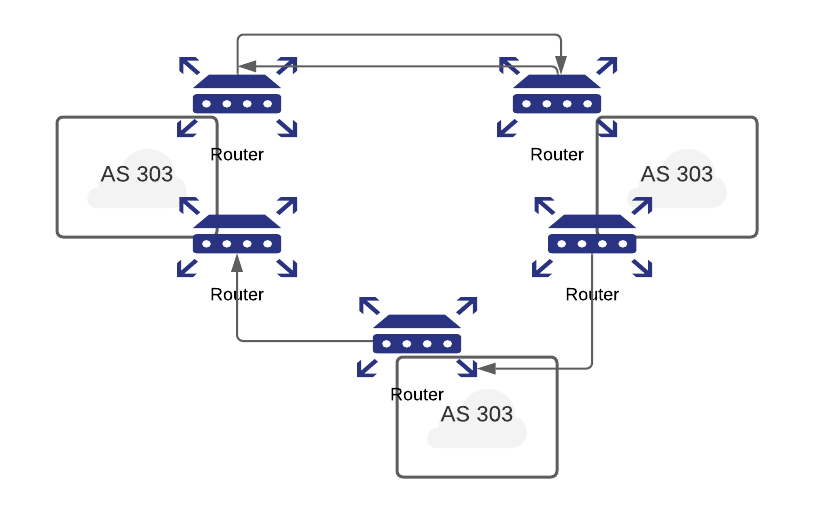

# Part III: Threats, Attacks & Defense

## DNS Protection

### Cache Poisoning Attack

- Since DNS responses are cached, a quick response can be provided for repeated translations.
DNS negative queries are also cached, e.g., misspelt words, and all cached data periodically times out.
Cache poisoning is an issue in what is known as pharming. This term is used to describe a hacker’s attack in which a website’s traffic is redirected to a bogus website by forging the DNS mapping. In this case, an attacker attempts to insert a fake address record for an Internet domain into the DNS.
If the server accepts the fake record, the cache is poisoned and subsequent requests for the address of the domain are answered with the address of a server controlled by the attacker. As long as the fake entry is cached by the server, browsers or e-mail servers will automatically go to the address provided by the compromised DNS server.
the typical time to live (TTL) for cached entries is a couple of hours, thereby permitting ample time for numerous users to be affected by the attack.

### DNSSEC (Security Extension)

- The long-term solution to these DNS problems is authentication. If a resolver cannot distinguish between valid and invalid data in a response, then add source authentication to verify that the data received in response is equal to the data entered by the zone administrator
- DNS Security Extensions (DNSSEC) protects against data spoofing and corruption and provides mechanisms to authenticate servers and requests, as well as mechanisms to establish authenticity and integrity.
- When authenticating DNS responses, each DNS zone signs its data using a private key. It is recommended that this signing be done offline and in advance. The query for a particular record returns the requested resource record set (RRset) and signature (RRSIG) of the requested resource record set. The resolver then authenticates the response using a public key, which is pre-configured or learned via a sequence of key records in the DNS hierarchy.
- The goals of DNSSEC are to provide authentication and integrity for DNS responses without confidentiality or DDoS protection.

### BGP

- BGP stands for border gateway protocol. It is a routing protocol that exchanges routing information among multiple Autonomous Systems (AS)
  - An Autonomous System is a collection of routers or networks with the same network policy usually under single administrative control.
- BGP tells routers which hop to use in order to reach the destination network.
- BGP is used for both communicating information among routers in an AS (interior) and between multiple ASes (exterior).

  

## How BGP Works

- BGP is responsible for finding a path to a destination router & the path it chooses should be the shortest and most reliable one.
- This decision is done through a protocol known as Link state. With the link-state protocol, each router broadcasts to all other routers in the network the state of its links and IP subnets. Each router then receives information from the other routers and constructs a complete topology view of the entire network. The next-hop routing table is based on this topology view.
- The link-state protocol uses a famous algorithm in the field of computer science, Dijkstra’s shortest path algorithm:
  - We start from our router considering the path cost to all our direct neighbours.
  - The shortest path is then taken
  - We then re-look at all our neighbours that we can reach and update our link state table with the cost information. We then continue taking the shortest path until every router has been visited.

## BGP Vulnerabilities

- By corrupting the BGP routing table we are able to influence the direction traffic flows on the internet! This action is known as BGP hijacking.
- Injecting bogus route advertising information into the BGP-distributed routing database by malicious sources, accidentally or routers can disrupt Internet backbone operations. 
- Blackholing traffic:
  - Blackhole route is a network route, i.e., routing table entry, that goes nowhere and packets matching the route prefix are dropped or ignored. Blackhole routes can only be detected by monitoring the lost traffic.
  - Blackhole routes are the best defence against many common viral attacks where the traffic is dropped from infected machines to/from command & control hosts.
  - Infamous BGP Injection attack on Youtube

- EX: In 2008, Pakistan decided to block YouTube by creating a BGP route that led into a black hole. Instead, this routing information got transmitted to a hong kong ISP and from there accidentally got propagated to the rest of the world meaning millions were routed through to this black hole and therefore unable to access YouTube.
- Potentially, the greatest risk to BGP occurs in a denial of service attack in which a router is flooded with more packets than it can handle. Network overload and router resource exhaustion happen when the network begins carrying an excessive number of BGP messages, overloading the router control processors, memory, routing table and reducing the bandwidth available for data traffic.
- Refer: <https://medium.com/bugbountywriteup/bgp-the-weak-link-in-the-internet-what-is-bgp-and-how-do-hackers-exploit-it-d899a68ba5bb>
- Router flapping is another type of attack. Route flapping refers to repetitive changes to the BGP routing table, often several times a minute. Withdrawing and re-advertising at a high-rate can cause a serious problem for routers since they propagate the announcements of routes. If these route flaps happen fast enough, e.g., 30 to 50 times per second, the router becomes overloaded, which eventually prevents convergence on valid routes. The potential impact for Internet users is a slowdown in message delivery, and in some cases, packets may not be delivered at all.

BGP Security

- Border Gateway Protocol Security recommends the use of BGP peer authentication since it is one of the strongest mechanisms for preventing malicious activity.
  - The authentication mechanisms are Internet Protocol Security (IPsec) or BGP MD5.
- Another method, known as prefix limits, can be used to avoid filling router tables. In this approach, routers should be configured to disable or terminate a BGP peering session, and issue warning messages to administrators when a neighbour sends in excess of a preset number of prefixes.
- IETF is currently working on improving this space

## Web-Based Attacks

### HTTP Response Splitting Attacks

- HTTP response splitting attack may happen where the server script embeds user data in HTTP response headers without appropriate sanitation.
- This typically happens when the script embeds user data in the redirection URL of a redirection response (HTTP status code 3xx), or when the script embeds user data in a cookie value or name when the response sets a cookie.
- HTTP response splitting attacks can be used to perform web cache poisoning and cross-site scripting attacks.
- HTTP response splitting is the attacker’s ability to send a single HTTP request that forces the webserver to form an output stream, which is then interpreted by the target as two HTTP responses instead of one response.

### Cross-Site Request Forgery (CSRF or XSRF)

- A Cross-Site Request Forgery attack tricks the victim’s browser into issuing a command to a vulnerable web application.
- Vulnerability is caused by browsers automatically including user authentication data, session ID, IP address, Windows domain credentials, etc. with each request.
- Attackers typically use CSRF to initiate transactions such as transfer funds, login/logout user, close account, access sensitive data, and change account details.
- The vulnerability is caused by web browsers that automatically include credentials with each request, even for requests caused by a form, script, or image on another site. CSRF can also be dynamically constructed as part of a payload for a cross-site scripting attack
- All sites relying on automatic credentials are vulnerable. Popular browsers cannot prevent cross-site request forgery. Logging out of high-value sites as soon as possible can mitigate CSRF risk. It is recommended that a high-value website must require a client to manually provide authentication data in the same HTTP request used to perform any operation with security implications. Limiting the lifetime of session cookies can also reduce the chance of being used by other malicious sites.
- OWASP recommends website developers include a required security token in HTTP requests associated with sensitive business functions in order to mitigate CSRF attacks

### Cross-Site Scripting (XSS) Attacks

- Cross-Site Scripting occurs when dynamically generated web pages display user input, such as login information, that is not properly validated, allowing an attacker to embed malicious scripts into the generated page and then execute the script on the machine of any user that views the site.
- If successful, Cross-Site Scripting vulnerabilities can be exploited to manipulate or steal cookies, create requests that can be mistaken for those of a valid user, compromise confidential information, or execute malicious code on end-user systems.
- Cross-Site Scripting (XSS or CSS) attacks involve the execution of malicious scripts on the victim’s browser. The victim is simply a user’s host and not the server. XSS results from a failure to validate user input by a web-based application.

### Document Object Model (DOM) XSS Attacks

- The Document Object Model (DOM) based XSS does not require the webserver to receive the XSS payload for a successful attack. The attacker abuses the runtime by embedding their data on the client-side. An attacker can force the client (browser) to render the page with parts of the DOM controlled by the attacker. 
- When the page is rendered and the data is processed by the page, typically by a client-side HTML-embedded script such as JavaScript, the page’s code may insecurely embed the data in the page itself, thus delivering the cross-site scripting payload. There are several DOM objects which can serve as an attack vehicle for delivering malicious script to victims browser.

### Clickjacking

- The technique works by hiding malicious link/scripts under the cover of the content of a legitimate site.
- Buttons on a website actually contain invisible links, placed there by the attacker. So, an individual who clicks on an object they can visually see is actually being duped into visiting a malicious page or executing a malicious script.
- When mouseover is used together with clickjacking, the outcome is devastating. Facebook users have been hit by a clickjacking attack, which tricks people into “liking” a particular Facebook page, thus enabling the attack to spread since Memorial Day 2010.
- There is not yet effective defence against clickjacking, and disabling JavaScript is the only viable method

## DataBase Attacks & Defenses

### SQL injection Attacks

- It exploits improper input validation in database queries.
- A successful exploit will allow attackers to access, modify, or delete information in the database.
- It permits attackers to steal sensitive information stored within the backend databases of affected websites, which may include such things as user credentials, email addresses, personal information, and credit card numbers

```
SELECT USERNAME,PASSWORD from USERS where USERNAME='<username>' AND PASSWORD='<password>';

Here the username & password is the input provided by the user. Suppose an attacker gives the input as " OR '1'='1'" in both fields. Therefore the SQL query will look like:

SELECT USERNAME,PASSWORD from USERS where USERNAME='' OR '1'='1' AND PASSOWRD='' OR '1'='1';

This query results in a true statement & the user gets logged in. This example depicts the bost basic type of SQL injection
```


### SQL Injection Attack Defenses

- SQL injection can be protected by filtering the query to eliminate malicious syntax, which involves the employment of some tools in order to (a) scan the source code.
- In addition, the input fields should be restricted to the absolute minimum, typically anywhere from 7-12 characters, and validate any data, e.g., if a user inputs an age make sure the input is an integer with a maximum of 3 digits.

## VPN

A virtual private network (VPN) is a service that offers a secure, reliable connection over a shared public infrastructure such as the Internet. Cisco defines a VPN as an encrypted connection between private networks over a public network. To date, there are three types of VPNs:

- Remote access
- Site-to-site
- Firewall-based

## Security Breach

In spite of the most aggressive steps to protect computers from attacks, attackers sometimes get through. Any event that results in a violation of any of the confidentiality, integrity, or availability (CIA) security tenets is a security breach.

### Denial of Service Attacks

- Denial of service (DoS) attacks result in downtime or inability of a user to access a system. DoS attacks impact the availability of tenet of information systems security. A DoS attack is a coordinated attempt to deny service by occupying a computer to perform large amounts of unnecessary tasks. This excessive activity makes the system unavailable to perform legitimate operations
- Two common types of DoS attacks are as follows:
  - Logic attacks—Logic attacks use software flaws to crash or seriously hinder the performance of remote servers. You can prevent many of these attacks by installing the latest patches to keep your software up to date.
  - Flooding attacks—Flooding attacks overwhelm the victim computer’s CPU, memory, or network resources by sending large numbers of useless requests to the machine.
- Most DoS attacks target weaknesses in the overall system architecture rather than a software bug or security flaw
- One popular technique for launching a packet flood is a SYN flood.
- One of the best defences against DoS attacks is to use intrusion prevention system (IPS) software or devices to detect and stop the attack.

### Distributed Denial of Service Attacks

- DDoS attacks differ from regular DoS attacks in their scope. In a DDoS attack, attackers hijack hundreds or even thousands of Internet computers, planting automated attack agents on those systems. The attacker then instructs the agents to bombard the target site with forged messages. This overloads the site and blocks legitimate traffic. The key here is strength in numbers. The attacker does more damage by distributing the attack across multiple computers.


### Wiretapping

- Although the term wiretapping is generally associated with voice telephone communications, attackers can also use wiretapping to intercept data communications.

- Attackers can tap telephone lines and data communication lines. Wiretapping can be active, where the attacker makes modifications to the line. It can also be passive, where an unauthorized user simply listens to the transmission without changing the contents. Passive intrusion can include the copying of data for a subsequent active attack.
- Two methods of active wiretapping are as follows:
  - Between-the-lines wiretapping—This type of wiretapping does not alter the messages sent by the legitimate user but inserts additional messages into the communication line when the legitimate user pauses.
  - Piggyback-entry wiretapping—This type of wiretapping intercepts and modifies the original message by breaking the communications line and routing the message to another computer that acts as a host.

### Backdoors

- Software developers sometimes include hidden access methods, called backdoors, in their programs. Backdoors give developers or support personnel easy access to a system without having to struggle with security controls. The problem is that backdoors don’t always stay hidden. When an attacker discovers a backdoor, he or she can use it to bypass existing security controls such as passwords, encryption, and so on. Where legitimate users log on through front doors using a user ID and password, attackers use backdoors to bypass these normal access controls.

## Malicious Attacks

### Birthday Attack

- Once an attacker compromises a hashed password file, a birthday attack is performed. A birthday attack is a type of cryptographic attack that is used to make a brute-force attack of one-way hashes easier. It is a mathematical exploit that is based on the birthday problem in probability theory.
- Further Reading:
  - <https://www.sciencedirect.com/topics/computer-science/birthday-attack>
  - <https://www.internetsecurity.tips/birthday-attack/>

### Brute-Force Password Attacks

- In a brute-force password attack, the attacker tries different passwords on a system until one of them is successful. Usually, the attacker employs a software program to try all possible combinations of a likely password, user ID, or security code until it locates a match. This occurs rapidly and in sequence. This type of attack is called a brute-force password attack because the attacker simply hammers away at the code. There is no skill or stealth involved—just brute force that eventually breaks the code.
- Further Reading:
  - <https://owasp.org/www-community/attacks/Brute_force_attack>
  - <https://owasp.org/www-community/controls/Blocking_Brute_Force_Attacks>

### Dictionary Password Attacks

- A dictionary password attack is a simple attack that relies on users making poor password choices. In a dictionary password attack, a simple password-cracker program takes all the words from a dictionary file and attempts to log on by entering each dictionary entry as a password.
- Further Reading:
https://capec.mitre.org/data/definitions/16.html

### Replay Attacks

- Replay attacks involve capturing data packets from a network and retransmitting them to produce an unauthorized effect. The receipt of duplicate, authenticated IP packets may disrupt service or have some other undesired consequence. Systems can be broken through replay attacks when attackers reuse old messages or parts of old messages to deceive system users. This helps intruders to gain information that allows unauthorized access into a system.
- Further reading:
<https://study.com/academy/lesson/replay-attack-definition-examples-prevention.html>

### Man-in-the-Middle Attacks

- A man-in-the-middle attack takes advantage of the multihop process used by many types of networks. In this type of attack, an attacker intercepts messages between two parties before transferring them on to their intended destination.
- Web spoofing is a type of man-in-the-middle attack in which the user believes a secure session exists with a particular web server. In reality, the secure connection exists only with the attacker, not the webserver. The attacker then establishes a secure connection with the webserver, acting as an invisible go-between. The attacker passes traffic between the user and the webserver. In this way, the attacker can trick the user into supplying passwords, credit card information, and other private data.
- Further Reading:
  - <https://owasp.org/www-community/attacks/Man-in-the-middle_attack>

### Masquerading

- In a masquerade attack, one user or computer pretends to be another user or computer. Masquerade attacks usually include one of the other forms of active attacks, such as IP address spoofing or replaying. Attackers can capture authentication sequences and then replay them later to log on again to an application or operating system. For example, an attacker might monitor usernames and passwords sent to a weak web application. The attacker could then use the intercepted credentials to log on to the web application and impersonate the user.
- Further Reading: <https://dl.acm.org/doi/book/10.5555/2521792> <https://ieeexplore.ieee.org/document/1653228>


### Eavesdropping

- Eavesdropping, or sniffing, occurs when a host sets its network interface on promiscuous mode and copies packets that pass by for later analysis. Promiscuous mode enables a network device to intercept and read each network packet(of course given some conditions) given sec, even if the packet’s address doesn’t match the network device. It is possible to attach hardware and software to monitor and analyze all packets on that segment of the transmission media without alerting any other users. Candidates for eavesdropping include satellite, wireless, mobile, and other transmission methods.

### Social Engineering

- Attackers often use a deception technique called social engineering to gain access to resources in an IT infrastructure. In nearly all cases, social engineering involves tricking authorized users into carrying out actions for unauthorized users. The success of social engineering attacks depends on the basic tendency of people to want to be helpful.

### Phreaking

- Phone phreaking, or simply phreaking, is a slang term that describes the activity of a subculture of people who study, experiment with, or explore telephone systems, telephone company equipment, and systems connected to public telephone networks. Phreaking is the art of exploiting bugs and glitches that exist in the telephone system.

### Phishing

- Phishing is a type of fraud in which an attacker attempts to trick the victim into providing private information such as credit card numbers, passwords, dates of birth, bank account numbers, automated teller machine (ATM) PINs, and Social Security numbers.

### Pharming

- Pharming is another type of attack that seeks to obtain personal or private financial information through domain spoofing. A pharming attack doesn’t use messages to trick victims into visiting spoofed websites that appear legitimate, however. Instead, pharming “poisons” a domain name on the domain name server (DNS), a process known as DNS poisoning. The result is that when a user enters the poisoned server’s web address into his or her address bar, that user navigates to the attacker’s site. The user’s browser still shows the correct website, which makes pharming difficult to detect—and therefore more serious. Where phishing attempts to scam people one at a time with an email or instant message, pharming enables scammers to target large groups of people at one time through domain spoofing.
