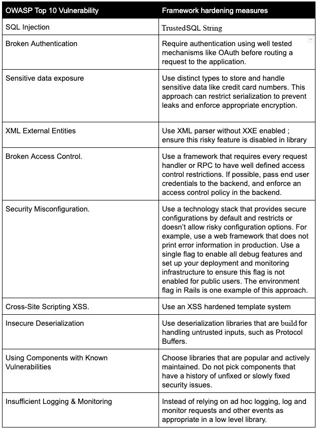

# PART IV: Writing Secure Code & More

The first and most important step in reducing security and reliability issues is to educate developers. However, even the best-trained engineers make mistakes, security experts can write insecure code and SREs can miss reliability issues. It’s difficult to keep the many considerations and tradeoffs involved in building secure and reliable systems in mind simultaneously, especially if you’re also responsible for producing software.

## Use frameworks to enforce security and reliability while writing code

- A better approach is to handle security and reliability in common frameworks, languages, and libraries. Ideally, libraries only expose an interface that makes writing code with common classes of security vulnerabilities impossible.
- Multiple applications can use each library or framework. When domain experts fix an issue, they remove it from all the applications the framework supports, allowing this engineering approach to scale better.

## Common Security Vulnerabilities

- In large codebases, a handful of classes account for the majority of security vulnerabilities, despite ongoing efforts to educate developers and introduce code review. OWASP and SANS publish lists of common vulnerability classes

  

## Write Simple Code

 Try to keep your code clean and simple.

### Avoid Multi-Level Nesting

- Multilevel nesting is a common anti-pattern that can lead to simple mistakes. If the error is in the most common code path, it will likely be captured by the unit tests. However, unit tests don’t always check error handling paths in multilevel nested code. The error might result in decreased reliability (for example, if the service crashes when it mishandles an error) or a security vulnerability (like a mishandled authorization check error).

### Eliminate YAGNI Smells

- Sometimes developers overengineer solutions by adding functionality that may be useful in the future, “just in case.” This goes against the YAGNI (You Aren’t Gonna Need It) principle, which recommends implementing only the code that you need. YAGNI code adds unnecessary complexity because it needs to be documented, tested, and maintained.
- To summarize, avoiding YAGNI code leads to improved reliability, and simpler code leads to fewer security bugs, fewer opportunities to make mistakes, and less developer time spent maintaining unused code.

### Repay Technical Debt

- It is a common practice for developers to mark places that require further attention with TODO or FIXME annotations. In the short term, this habit can accelerate the delivery velocity for the most critical functionality, and allow a team to meet early deadlines—but it also incurs technical debt. Still, it’s not necessarily a bad practice, as long as you have a clear process (and allocate time) for repaying such debt.

### Refactoring

- Refactoring is the most effective way to keep a codebase clean and simple. Even a healthy codebase occasionally needs to be
- Regardless of the reasons behind refactoring, you should always follow one golden rule: never mix refactoring and functional changes in a single commit to the code repository. Refactoring changes are typically significant and can be difficult to understand.
- If a commit also includes functional changes, there’s a higher risk that an author or reviewer might overlook bugs.

### Unit Testing

- Unit testing can increase system security and reliability by pinpointing a wide range of bugs in individual software components before a release. This technique involves breaking software components into smaller, self-contained “units” that have no external dependencies, and then testing each unit.

### Fuzz Testing

- Fuzz testing is a technique that complements the previously mentioned testing techniques. Fuzzing involves using a fuzzing engine to generate a large number of candidate inputs that are then passed through a fuzz driver to the fuzz target. The fuzzer then analyzes how the system handles the input. Complex inputs handled by all kinds of software are popular targets for fuzzing - for example, file parsers, compression algorithms, network protocol implementation and audio codec.

### Integration Testing

- Integration testing moves beyond individual units and abstractions, replacing fake or stubbed-out implementations of abstractions like databases or network services with real implementations. As a result, integration tests exercise more complete code paths. Because you must initialize and configure these other dependencies, integration testing may be slower and flakier than unit testing—to execute the test, this approach incorporates real-world variables like network latency as services communicate end-to-end. As you move from testing individual low-level units of code to testing how they interact when composed together, the net result is a higher degree of confidence that the system is behaving as expected.

### Last But not the least

- Code Reviews
- Rely on Automation
- Don’t check in Secrets
- Verifiable Builds
