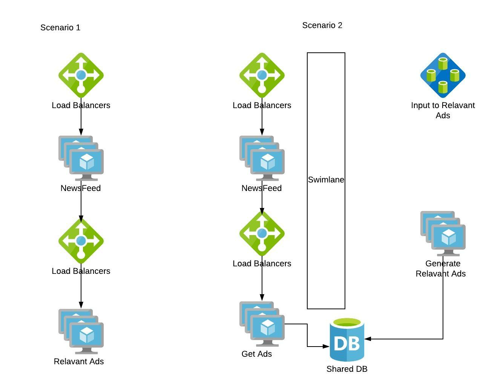
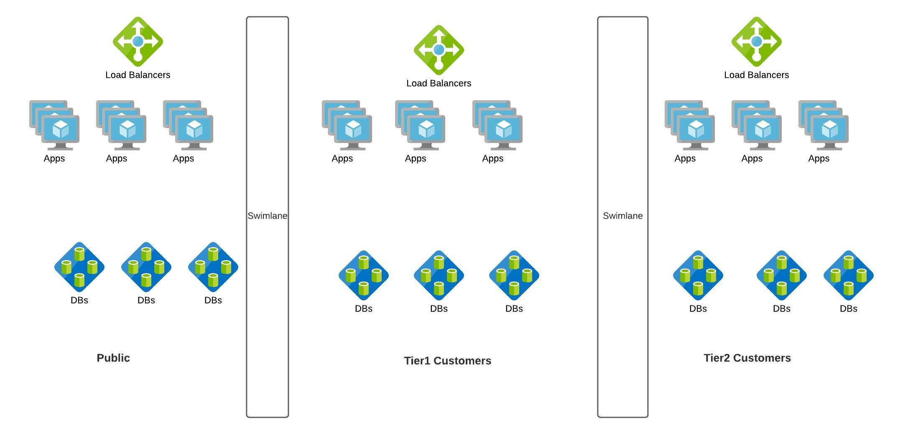

# Fault Tolerance

Failures are not avoidable in any system and will happen all the time, hence we need to build systems that can tolerate failures or recover from them.

- In systems, failure is the norm rather than the exception.
- "Anything that can go wrong will go wrong” -- Murphy’s Law
- “Complex systems contain changing mixtures of failures latent within them” -- How Complex Systems Fail.

### Fault Tolerance - Failure Metrics

Common failure metrics that get measured and tracked for any system.

**Mean time to repair (MTTR):** The average time to repair and restore a failed system. 

**Mean time between failures (MTBF):** The average operational time between one device failure or system breakdown and the next. 

**Mean time to failure (MTTF):** The average time a device or system is expected to function before it fails. 

**Mean time to detect (MTTD):** The average time between the onset of a problem and when the organization detects it. 

**Mean time to investigate (MTTI):** The average time between the detection of an incident and when the organization begins to investigate its cause and solution. 

**Mean time to restore service (MTRS):** The average elapsed time from the detection of an incident until the affected system or component is again available to users.

**Mean time between system incidents (MTBSI):** The average elapsed time between the detection of two consecutive incidents. MTBSI can be calculated by adding MTBF and MTRS (MTBSI = MTBF + MTRS).

**Failure rate:** Another reliability metric, which measures the frequency with which a component or system fails. It is expressed as a number of failures over a unit of time.

#### Refer
- https://www.splunk.com/en_us/data-insider/what-is-mean-time-to-repair.html

### Fault Tolerance - Fault Isolation Terms
Systems should have a short circuit. Say in our content sharing system, if “Notifications” is not working, the site should gracefully handle that failure by removing the functionality instead of taking the whole site down. 

Swimlane is one of the commonly used fault isolation methodology. Swimlane adds a barrier to the service from other services so that failure on either of them won’t affect the other. Say we roll out a new feature ‘Advertisement’ in our content sharing app.
We can have two architectures

If Ads are generated on the fly synchronously during each Newsfeed request, the faults in Ads feature gets propagated to Newsfeed feature. Instead if we swimlane “Generation of Ads” service and use a shared storage to populate Newsfeed App, Ads failures won’t cascade to Newsfeed and worst case if Ads don’t meet SLA , we can have Newsfeed without Ads.

Let's take another example, we come up with a new model for our Content sharing App. Here we roll out enterprise content sharing App where enterprises pay for the service and the content should never be shared outside the enterprise. 

### Swimlane Principles

**Principle 1:** Nothing is shared (also known as “share as little as possible”). The less that is shared within a swim lane, the more fault isolative the swim lane becomes. (as shown in Enterprise usecase)

**Principle 2:** Nothing crosses a swim lane boundary. Synchronous (defined by expecting a request—not the transfer protocol) communication never crosses a swim lane boundary; if it does, the boundary is drawn incorrectly. (as shown in Ads feature)

### Swimlane Approaches
**Approach 1:** Swim lane the money-maker. Never allow your cash register to be compromised by other systems. (Tier 1  vs Tier 2 in enterprise use case)

**Approach 2:** Swim lane the biggest sources of incidents. Identify the recurring causes of pain and isolate them.(if Ads feature is in code yellow, swim laning it is the best option)

**Approach 3:** Swim lane natural barriers. Customer boundaries make good swim lanes.(Public vs Enterprise customers)

#### Refer
- https://learning.oreilly.com/library/view/the-art-of/9780134031408/ch21.html#ch21

### SRE Use cases:
1. Work with the DC tech or cloud team to distribute infrastructure such that its immune to switch or power failures by creating fault zones within a Data Center
https://docs.microsoft.com/en-us/azure/virtual-machines/manage-availability#use-availability-zones-to-protect-from-datacenter-level-failures
2. Work with the partners and design interaction between services such that one service breakdown is not amplified in a cascading fashion to all upstreams

