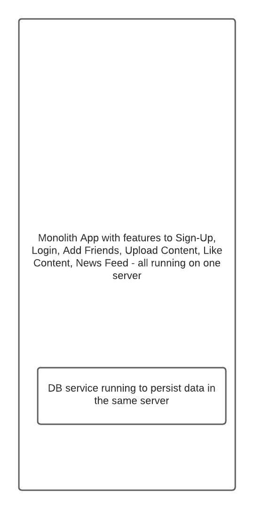

# Systems Design

## Prerequisites

Fundamentals of common software system components:

- [Linux Basics](https://linkedin.github.io/school-of-sre/linux_basics/intro/)
- [Linux Networking](https://linkedin.github.io/school-of-sre/linux_networking/intro/)
- Databases RDBMS
- [NoSQL Concepts](https://linkedin.github.io/school-of-sre/databases_nosql/intro/)

## What to expect from this course

Thinking about and designing for scalability, availability, and reliability of large scale software systems.

## What is not covered under this course

Individual software components’ scalability and reliability concerns like e.g. Databases, while the same scalability principles and thinking can be applied, these individual components have their own specific nuances when scaling them and thinking about their reliability.

More light will be shed on concepts rather than on setting up and configuring components like Loadbalancers to achieve scalability, availability and reliability of systems

## Course Contents

- [Introduction](https://linkedin.github.io/school-of-sre/systems_design/intro/#backstory)
- [Scalability](https://linkedin.github.io/school-of-sre/systems_design/scalability/)
- [High Availability](https://linkedin.github.io/school-of-sre/systems_design/availability/)
- [Fault Tolerance](https://linkedin.github.io/school-of-sre/systems_design/fault-tolerance/)

## Introduction

So, how do you go about learning to design a system?

*” Like most great questions, it showed a level of naivety that was breathtaking. The only short answer I could give was, essentially, that you learned how to design a system by designing systems and finding out what works and what doesn’t work.”
Jim Waldo, Sun Microsystems, On System Design*

	
As software and hardware systems have multiple moving parts, we need to think about how those parts will grow, their failure modes, their inter-dependencies, how it will impact the users and the business.

There is no one-shot method or way to learn or do system design, we only learn to design systems by designing and iterating on them.

This course will be a starter to make one think about scalability, availability, and fault tolerance during systems design.

## Backstory

Let’s design a simple content sharing application where users can share photos, media in our application which can be liked by their friends. Let’s start with a simple design of the application and evolve it as we learn system design concepts

